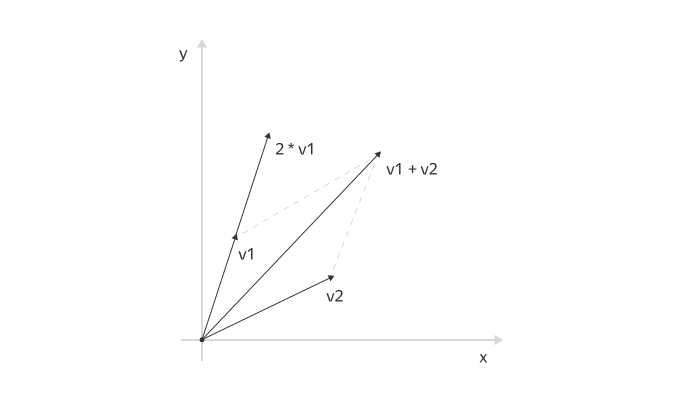

# Определение операторов

Почти любой оператор Python можно определить и для типов данных, которые мы сами создаем с помощью классов. Это делается с помощью специальных методов. О них и пойдет речь в этом уроке.

## Специальные методы

На предыдущем занятии мы обсудили полиморфизм на примере оператора `+`. Оператор `+` работает для многих встроенных типов данных: чисел, строк, списков, кортежей. Однако возможность определять операторы есть не только у встроенных типов данных.

Специальные методы имеют для интерпретатора особое значение. Имена специальных методов и их смысл определены создателями языка: создавать новые нельзя, можно только реализовывать существующие. Названия всех специальных методов начинаются и заканчиваются на два подчеркивания.

Пример такого метода — уже знакомый нам `__init__`. Он предназначен для инициализации экземпляров и автоматически вызывается интерпретатором после создания экземпляра объекта.

Остальные специальные методы также вызываются в строго определенных ситуациях. Большинство из них отвечает за реализацию операторов. Так, например, всякий раз, когда интерпретатор встречает запись вида `x + y`, он заменяет ее на `x.__add__(y)`, и для реализации сложения нам достаточно определить в классе экземпляра `x` метод `__add__`.

```python
class Time:
    def __init__(self, minutes, seconds):
        self.minutes = minutes
        self.seconds = seconds

 
    def __add__(self, other):
        m = self.minutes + other.minutes
        s = self.seconds + other.seconds
        m += s // 60
        s = s % 60
        return Time(m, s)

 
    def info(self):
        return '{}:{}'.format(self.minutes, self.seconds)


t1 = Time(5, 50)
print(t1.info())  # 5:50
t2 = Time(3, 20)
print(t2.info())  # 3:20
t3 = t1 + t2
print(t3.info())  # 9:10
print(id(t1), id(t2), id(t3))  # Все объекты разные
```

Обратите внимание: в методе `__add__` мы создаем новый экземпляр с результатом сложения, а не изменяем уже существующий. Для арифметических операторов мы будем поступать так почти всегда, ведь при выполнении `z = x + y` ни `x`, ни `y` изменяться не должны. Должен создаваться новый объект `z` с результатом операции.

Кстати, именно поэтому в некоторых случаях запись `a = a + b` отличается от `a += b`. В первом случае вызывается метод `__add__`, а во втором — `__iadd__`, для чисел эти методы работают одинаково, а для списков нет.

Так как объекты класса Time относятся к изменяемым, при вызове `__iadd__` должен изменяться сам объект. Давайте добавим этот метод в наш класс и посмотрим, как он работает.

```python
class Time:
    def __init__(self, minutes, seconds):
        self.minutes = minutes
        self.seconds = seconds


    def __add__(self, other):
        m = self.minutes + other.minutes
        s = self.seconds + other.seconds
        m += s // 60
        s = s % 60
        return Time(m, s)


    def __iadd__(self, other):
        m = self.minutes + other.minutes
        s = self.seconds + other.seconds
        m += s // 60
        s = s % 60
        self.minutes = m
        self.seconds = s
        return self
 
    def info(self):
        return '{}:{}'.format(self.minutes, self.seconds)


t1 = Time(5, 50)
print(t1.info())  # 5:50
t2 = Time(3, 20)
print(t2.info())  # 3:20
print(id(t1))
t1 += t2
print(t1.info())  # 9:10
print(id(t1))  # id объекта не поменяется
```

Обратите внимание: мы не только изменяем атрибуты объекта в методе `__iadd__`, но и после всех преобразований возвращаем `self` — сам объект (если мы ничего не вернем, в переменной будет `None`).

Другой специальный метод позволяет избавиться от вызовов метода `info` перед передачей данных в `print`.

## Метод __str__

Перед выводом аргументов на печать функция `print` преобразует их в строки с помощью функции `str`. Но функция `str` делает это не сама, а вызывает метод `__str__` своего аргумента. Так что вызов `str(x)` эквивалентен `x.__str__()`.

Если мы сейчас попытаемся распечатать экземпляры `Time` просто с помощью `print(t1)`, получим что-то вроде:

```python
<__main__.Time object at 0x7fa021586f98>
```

Это сработала реализация метода `__str__` по умолчанию из класса `object`. Дело в том, что при создании класса можно указать так называемый суперкласс, от которого наш класс получит всю функциональность. Такой процесс называется **наследованием**. Об этом механизме мы поговорим на следующем уроке.

Если суперкласс не указать, по умолчанию наследуется класс `object`, содержащий некоторую базовую функциональность, в том числе метод `__str__`.

Если мы определим в своем классе собственный метод `__str__`, он заменит тот, что был унаследован от `object`.

```python
class Time:
    def __init__(self, minutes, seconds):
        self.minutes = minutes
        self.seconds = seconds

 
    def __add__(self, other):
        m = self.minutes + other.minutes
        s = self.seconds + other.seconds
        m += s // 60
        s = s % 60
        return Time(m, s)

 
    def __str__(self):
        return '{}:{}'.format(self.minutes, self.seconds)


t1 = Time(5, 50)
print(t1)  # 5:50
t2 = Time(3, 20)
print(t2)  # 3:20
t3 = t1 + t2
print(t3)  # 9:10
```

## Метод __repr__

Давайте проведем эксперимент: создадим несколько объектов типа `Time`, положим их в список, а затем попытаемся вывести его на печать.

```python
li = [Time(5, 50), Time(3, 20)]
print(li)

[<__main__.Time object at 0x7ff15c76e4e0>, <__main__.Time object at 0x7ff15c76e550>]
```

Но почему такое произошло? Мы же добавили метод для преобразования к строке! Оказывается, кроме метода `__str__`, который предназначен для выдачи информации об экземпляре для пользователей в «человеческом» виде, часто определяется метод `__repr__`. Для метода `__repr__`, как и для `__len__`, есть функция, явно вызывающая этот метод у объекта.

Функция `repr` предназначена для выдачи полной информации об объекте для программиста. Она часто применяется при отладке. Поскольку «сырой» вывод списка обычно не предназначен для пользователя, он вызывает у объектов не метод `__str__`, а метод `__repr__`. Для нашего класса `Time` этот метод мог бы выглядеть так:

```python
class Time:
    #методы __init__, __add__, __str__ 
 
    def __repr__(self):
        return 'Time({}, {})'.format(self.minutes, self.seconds)
 
 
t1 = Time(5, 50)
print(t1)  # 5:50
print(repr(t1))  # Time(5, 50)
```

Как видно, здесь метод `__repr__` выдает строку, которую можно скопировать и вставить в исходный код на Python, чтобы получить выражение, которое заново сконструирует такой же объект.

## Класс «Вектор на плоскости»



Двумерные векторы — очень полезный и важный геометрический объект. Векторы любой нужной размерности уже есть в библиотеке `Numpy`, но, если бы мы захотели реализовать двумерный вектор самостоятельно, можно было бы сделать это, например, так:

```python
class MyVector:
    def __init__(self, x, y):
        self.x = x
        self.y = y

 
    def __add__(self, other):
        return MyVector(self.x + other.x, self.y + other.y)

 
    def __sub__(self, other):
        return MyVector(self.x - other.x, self.y - other.y)

 
    def __mul__(self, other):
        return MyVector(self.x * other, self.y * other)

    def __rmul__(self, other):
        return MyVector(self.x * other, self.y * other)


    def __str__(self):
        return 'MyVector({}, {})'.format(self.x, self.y)


v1 = MyVector(-2, 5)
v2 = MyVector(3, -4)
v_sum = v1 + v2
print(v_sum)  # MyVector(1, 1)
v_mul = v1 * 1.5
print(v_mul)  # MyVector(-3.0, 7.5)
v_rmul = -2 * v1
print(v_rmul)  # MyVector(4, -10)
```

В этом примере определены методы `__add__` и `__sub__` для реализации классических операций сложения и вычитания векторов. Метод `__mul__` реализует операцию умножения вектора на число, а метод `__rmul__` — операцию умножения числа на вектор. Для преобразования в строку используется уже знакомый нам метод `__str__`.

## Другие специальные методы

Специальных методов слишком много, чтобы рассмотреть их все на этом уроке. Мы приведем лишь небольшой их список.

| Метод                       | Описание                                           |
|-----------------------------|----------------------------------------------------|
| `__add__(self, other)`      | Сложение (x + y). Будет вызвано: x.\_\_add\_\_(y)  |
| `__sub__(self, other)`      | Вычитание (x - y)                                  |
| `__mul__(self, other)`      | Умножение (x * y)                                  |
| `__truediv__(self, other)`  | Деление (x / y)                                    |
| `__add__(self, other)`      | Сложение (x + y). Будет вызвано: x.\_\_add\_\_(y)  |
| `__sub__(self, other)`      | Вычитание (x - y)                                  |
| `__mul__(self, other)`      | Умножение (x * y)                                  |
| `__truediv__(self, other)`  | Деление (x / y)                                    |
| `__floordiv__(self, other)` | Целочисленное деление (x // y)                     |
| `__mod__(self, other)`      | Остаток от деления (x % y)                         |
| `__divmod__(self, other)`   | Частное и остаток (divmod(x, y))                   |
| `__radd__(self, other)`     | Сложение (y + x). Будет вызвано: y.\_\_radd\_\_(x) |
| `__rsub__(self, other)`     | Вычитание (y - x)                                  |
| `__lt__(self, other)`       | Сравнение (x < y). Будет вызвано: x.\_\_lt\_\_(y)  |
| `__eq__(self, other)`       | Сравнение (x == y). Будет вызвано: x.\_\_eq\_\_(y) |
| `__len__(self)`             | Возвращение длины объекта                          |
| `__getitem__(self, key)`    | Доступ по индексу (или ключу)                      |
| `__call__(self[, args...])` | Вызов экземпляра класса как функции                |

Однако найти полную документацию по специальным методам в Интернете сравнительно легко. Если вам нужно реализовать тот или иной оператор, для начала поищите соответствующий ему специальный метод на **втором листе** вот этой [шпаркалки](https://disk.yandex.ru/i/fEAGakxOxXjUlw)

Если вы не нашли необходимой информации, рекомендуем очень
подробную [статью с длинным и обстоятельным описанием](https://habrahabr.ru/post/186608/)

Ну и конечно же, никто не должен забывать про [официальную документацию на сайте](https://docs.python.org/3/reference/datamodel.html#special-method-names)
