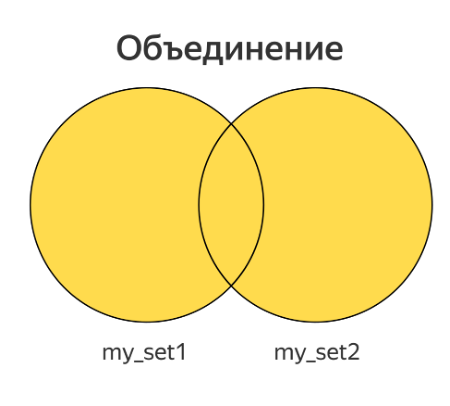
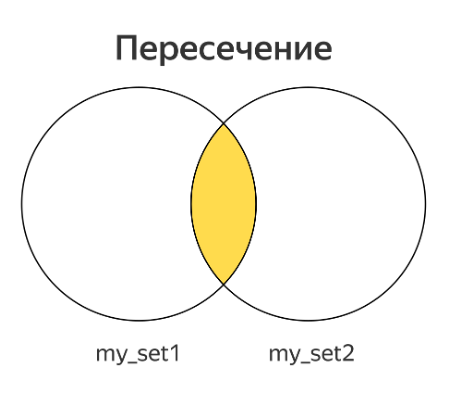
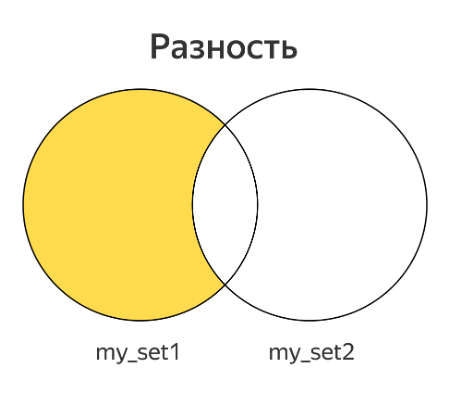
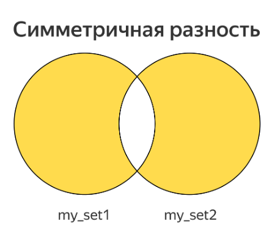

# Множества

## Объекты типа set

**Множество** — составной тип данных, представляющий собой несколько значений (элементов множества) под одним именем. Этот тип называется `set`, не создавайте, пожалуйста, переменные с таким именем! Чтобы задать множество, нужно в фигурных скобках перечислить его элементы.

```python
mammals = {'cat', 'dog', 'fox', 'elephant'}
print(mammals)  # {'cat', 'fox', 'dog', 'elephant'}
```

Введите этот код в Python и запустите программу несколько раз. Скорее всего, вы увидите разный порядок перечисления млекопитающих, так происходит потому, что элементы в множестве Python не упорядочены.

Порядок элементов в множестве выбирается случайным образом при запуске в целях безопасности, чтобы нельзя было перегрузить внутреннюю структуру множеств специальной последовательностью элементов, которая приведет к постоянной перестройке структуры.

## Создание множества

Для создания пустых множеств обязательно вызывать функцию `set`:

```python
empty = set()
```

Обратите внимание: элементами множества могут быть строки или числа. Возникает вопрос: а может ли множество содержать и строки, и числа? Давайте попробуем:

```python
mammals_and_numbers = {'cat', 5, 'dog', 3, 'fox', 12, 'elephant', 4}
print(mammals_and_numbers)
#{3, 4, 5, 'elephant', 'dog', 12, 'cat', 'fox'}
```

Как видим, множество может содержать и строки, и числа, а Python опять выводит элементы множества в случайном порядке. Заметьте, если поставить в программе оператор вывода множества на экран несколько раз, не изменяя само множество, порядок вывода элементов не изменится.

## Может ли элемент входить в множество несколько раз?

Это было бы странно, так как совершенно непонятно, как отличить один элемент от другого. Нет смысла хранить несколько одинаковых объектов, удобно иметь контейнер, сохраняющий только уникальный объекты. Поэтому множество содержит каждый элемент только один раз. Следующий фрагмент кода это демонстрирует:

```python
birds = {'raven', 'sparrow', 'sparrow', 'dove', 'hawk', 'falcon'}
print(birds) #{'sparrow', 'falcon', 'raven', 'dove', 'hawk'}
```

> Итак, у множеств есть три ключевые особенности:
> - Порядок элементов в множестве не определен
> - Элементы множеств — строки и/или числа
> - Множество не может содержать одинаковых элементов
{style="warning"}

## Операции над множеством

Простейшая операция — вычисление числа элементов множества. Для этого служит функция `len`. Мы уже встречались с этой функцией раньше, когда определяли длину строки:

```python
my_set = {'a', 'b', 'c'}
n = len(my_set)  # 3
```

Далее можно вывести элементы множества с помощью функции `print`:

```python
my_set = {'a', 'b', 'c'}
print(my_set) # {'b', 'c', 'a'}
```

Очень часто необходимо обойти все элементы множества в цикле. Для этого используется цикл `for` и оператор `in`, с помощью которых можно перебрать не только все элементы диапазона (как мы это делали раньше, используя `range`), но и элементы множества:

```python
my_set = {'a', 'b', 'c'}
for elem in my_set:
    print(elem)
```

Однако, как и в прошлый раз, в вашем случае порядок может отличаться: заранее он неизвестен. Код для работы с множествами нужно писать таким образом, чтобы он правильно работал при любом порядке обхода. Для этого надо знать два правила:
- Если мы не изменяли множество, порядок обхода элементов тоже не изменится
- После изменения множества порядок элементов может измениться произвольным образом

Чтобы проверить наличие элемента в множестве, можно воспользоваться уже знакомым оператором `in`:

```python
if elem in my_set:
    print('Элемент есть в множестве')
else:
    print('Элемента нет в множестве')
```

Выражение `elem in my_set` возвращает `True`, если элемент есть в множестве, и `False`, если его нет.

Добавление элемента в множество делается при помощи `add`:
```python
new_elem = 'e'
my_set.add(new_elem)
```

`add` — что-то вроде функции, «приклеенной» к конкретному множеству. Такие «приклеенные функции» называются методами.

Таким образом, если в коде присутствует имя множества, затем точка и еще одно название со скобками, второе название — имя метода.

Если элемент, равный `new_elem`, уже существует в множестве, оно не изменится, поскольку не может содержать одинаковых элементов. Ошибки при этом не произойдет. Небольшой пример

```python
my_set = set()
my_set.add('a')
my_set.add('b')
my_set.add('a')
print(my_set)
```

С удалением элемента сложнее. Для этого есть сразу три метода:
- `discard` (удалить заданный элемент, если он есть в множестве, и ничего не делать, если его нет)
- `remove` (удалить заданный элемент, если он есть, и породить ошибку `KeyError`, если нет)
- `pop`. Метод pop удаляет некоторый элемент из множества и возвращает его как результат. Порядок удаления при этом неизвестен.

```python
my_set = {'a', 'b', 'c'}

my_set.discard('a')         # Удалён
my_set.discard('hello')     # Не удалён, ошибки нет
my_set.remove('b')          # Удалён
print(my_set)               # В множестве остался один элемент 'c'
my_set.remove('world')      # Не удалён, ошибка KeyError
```

На первый взгляд, странно, что есть метод remove, который увеличивает количество падений вашей программы. Однако если вы на 100 % уверены, что элемент должен быть в множестве, то лучше получить ошибку во время отладки и исправить ее, чем тратить время на поиски при неправильной работе программы.

Метод `pop` удаляет из множества случайный элемент и возвращает его значение:

```python
my_set = {'a', 'b', 'c'}
print('до удаления:', my_set)
elem = my_set.pop()
print('удалённый элемент:', elem)
print('после удаления:', my_set)
```

Результат работы случаен, например, такой код может вывести следующее:
```bash
до удаления: {'b', 'a', 'c'}
удалённый элемент: b
после удаления: {'a', 'c'}
```

Если попытаться применить pop к пустому множеству, произойдет ошибка `KeyError`.

Очистить множество от всех элементов можно методом `clear`:

```python
my_set.clear()
```

## Операции над двумя множествами

Есть четыре операции, которые из двух множеств делают новое множество: **объединение**, **пересечение**, **разность** и **симметричная разность**.


### Объединение



Объединение двух множеств включает в себя все элементы, которые есть хотя бы в одном из них. Для этой операции существует метод `union`:

```python
union = my_set1.union(my_set2)
```

Или можно использовать оператор `|`:

```python
union = my_set1 | my_set2
```

### Пересечение



Пересечение двух множеств включает в себя все элементы, которые есть в обоих множествах:

```python
intersection = my_set1.intersection(my_set2)
```

Или аналог:

```python
intersection = my_set1 & my_set2
```

### Разность



Разность двух множеств включает в себя все элементы, которые есть в первом множестве, но которых нет во втором:

```python
diff = my_set1.difference(my_set2)
```

Или аналог:

```python
diff = my_set1 - my_set2
```

### Симметричная разность



Симметричная разность двух множеств включает в себя все элементы, которые есть только в одном из этих множеств:

```python
symm_diff = my_set1.symmetric_difference(my_set2)
```

Или аналогичный вариант:

```python
symm_diff = my_set1 ^ my_set2
```

## Сравнение множеств

Все операторы сравнения множеств, а именно: **==**, **<**, **>**, **<=**, **>=**, возвращают `True`, если сравнение истинно, и `False` — в противном случае.

## Равенство и неравенство множеств

Множества считаются равными, если они содержат одинаковые наборы элементов. Равенство множеств, как в случае с числами и строками, обозначается оператором **==**.
Неравенство множеств обозначается оператором **!=**. Он работает противоположно оператору ==.

```python
if set1 == set2:
	print('Множества равны')
else:
	print('Множества не равны')
```

## Подмножество и надмножество

**Подмножество** — некоторая выборка элементов множества, которая может быть как меньше множества, так и совпадать с ним, на что указывают символы «**<**» и «=» в операторе **<=**. Наоборот, надмножество включает все элементы некоторого множества и, возможно, какие-то еще.

```python
s1 = {'a', 'b', 'c'}
print(s1 <= s1)  # True
s2 = {'a', 'b'}
print(s2 <= s1)  # True
s3 = {'a'}
print(s3 <= s1)  # True
s4 = {'a', 'z'}
print(s4 <= s1)  # False
```

Операция `s1 < s2` означает «s1 является подмножеством s2, но целиком не совпадает с ним». Операция `s1 > s2` означает «s1 является надмножеством s2, но целиком не совпадает с ним».

