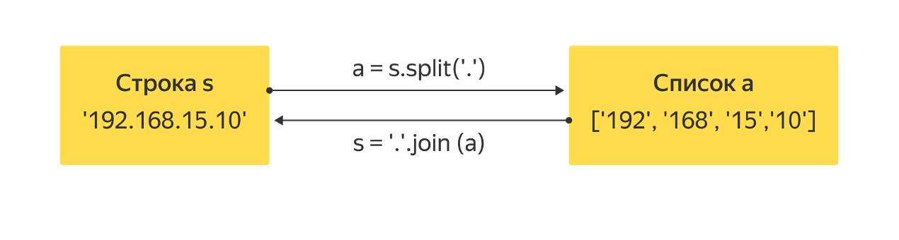
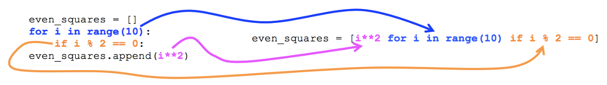

# Методы split и join. Списочные выражения

## Методы split и join

Изучая множества и списки, мы уже неоднократно встречались с методами — функциями, «приклеенными» к объекту (списку или множеству) и изменяющими его содержимое.
Методы есть не только у списков и множеств, но и у строк. Сегодня мы изучим два очень полезных метода строк — `split` и `join`. Они противоположны по смыслу: `split` разбивает строку по произвольному разделителю на список «слов», а `join` собирает из списка слов единую строку через заданный разделитель.

Чтобы вызвать эти методы, необходимо использовать уже знакомый нам синтаксис. После имени переменной, содержащей объект-строку, или просто после строки через точку пишется имя метода, затем в круглых скобках указываются аргументы. `split` и `join`, в отличие, например, от метода списков `append` или метода множеств `add`, не изменяют объект, которому принадлежат, а создают новый (список или строку) и возвращают его, как это делают обычные функции типа `len`.

### Метод split

Метод `split` можно вызвать вообще без аргументов или с одним аргументом-строкой. В первом случае строка разбивается на части, разделенные любыми символами пустого пространства (набором пробелов, символом табуляции и т. д.). Во втором случае разделителем слов считается строка-аргумент. Из получившихся слов формируется список.

В этом примере все сравнения истинны, т. е. все вызовы функции `print` выведут `True`.

```python
s = 'раз два три'
print(s.split() == ['раз', 'два', 'три'])
print('     one two  three  '.split() == ['one', 'two', 'three'])
print('192.168.1.1'.split('.') == ['192', '168', '1', '1'])
print(s.split('а') == ['р', 'з дв', ' три'])
print('A##B##C'.split('##') == ['A', 'B', 'C'])
```

### Метод join

`join` же всегда принимает один аргумент — список слов, которые нужно склеить. Разделителем (точнее, «соединителем») служит та самая строка, чей метод `join` вызывается. Это может быть и пустая строка, и пробел, и символ новой строки, и что угодно еще. В этих примерах все сравнения тоже истинны и каждый `print` выведет `True`.

```python
s = ['Тот', 'Кого', 'Нельзя', 'Называть']
print(''.join(s) == 'ТотКогоНельзяНазывать')
print(' '.join(s) == 'Тот Кого Нельзя Называть')
print('-'.join(s) == 'Тот-Кого-Нельзя-Называть')
print('! '.join(s) == 'Тот! Кого! Нельзя! Называть')
```

Итак, `split` служит для преобразования строки в список, а `join` — для преобразования списка в строку:



Обратите внимание: `split` и `join` — методы строк. Попытка вызвать такой метод у объекта, не являющегося строкой, вызовет ошибку! Например, если попытаться написать заведомо бессмысленное, с точки зрения интерпретатора Python, выражение:

```python
[1, 2, 3].join([4, 5, 6])

AttributeError             	Traceback (most recent call last)
<ipython-input-3-404b5f4d9169> in <module>()
----> 1 [1, 2, 3].join([4, 5, 6])

AttributeError: 'list' object has no attribute 'join'
```

Как видно, указан тип объекта (`[1, 2, 3]` — список, `list`) и имя отсутствующего у него метода — `join`, который мы пытаемся вызвать.

## Списочные выражения

Для генерации списков из неповторяющихся элементов в Python имеется удобная синтаксическая конструкция — списочное выражение (`list comprehension`). Она позволяет создавать элементы списка в цикле `for`, не записывая цикл целиком.

Например, если нам необходимо создать список квадратов целых чисел от 0 до 9 включительно, мы можем записать следующий код:

```python
squares = []
for i in range(10):
    squares.append(i ** 2)
print(squares)
```

```bash
[0, 1, 4, 9, 16, 25, 36, 49, 64, 81]
```

То же самое, но гораздо короче можно сделать с помощью списочного выражения:

```python
squares = [i ** 2 for i in range(10)]
print(squares)
```

```bash
[0, 1, 4, 9, 16, 25, 36, 49, 64, 81]
```

А если нам необходимы квадраты не всех чисел, а только четных? Тогда можно добавить условие:

```python
even_squares = []
for i in range(10):
    if i % 2 == 0:
        even_squares.append(i ** 2)
print(even_squares)
```

```bash
[0, 4, 16, 36, 64]
```

То же самое, но короче, с помощью списочного выражения:

```python
even_squares = [i ** 2 for i in range(10) if i % 2 == 0]
print(even_squares)
```

```bash
[0, 4, 16, 36, 64]
```

В списочном выражении `if` пишется после цикла. Такая конструкция предназначена в основном для фильтрации последовательности, на основе которой создается список. Существует и похожая задача — анализ всей последовательности, на основе которой мы хотим построить список, и, в зависимости от результата анализа, добавление одного или другого значения в список-результат. В таком случае следует использовать тернарный условный оператор:

```python
print(['четное' if x % 2 == 0 else 'нечетное' for x in range(10)])
```

```bash
['четное', 'нечетное', 'четное', 'нечетное', 'четное', 'нечетное',
 'четное', 'нечетное', 'четное', 'нечетное']
```

На рисунке показано соответствие между кодом заполнения списка с помощью цикла `for` и списочным выражением:



В списочном выражении можно пройти по двум или более циклам:

```python
print([i * j for i in range(3) for j in range(3)])
```

```bash
[0, 0, 0, 0, 1, 2, 0, 2, 4]
```

На самом деле квадратные скобки не являются неотъемлемой частью списочного выражения. Если их не поставить, выражение будет вычисляться по мере надобности — когда очередной элемент становится нужен. Заключая списочное выражение в квадратные скобки, мы тем самым даем инструкцию сразу создать все элементы и составить из них список. Пока что мы в основном будем пользоваться именно такими списочными выражениями — заключенными в квадратные скобки и превращенными таким образом в список.

## Использование списочных выражений

Списочные выражения часто используются для инициализации списков. Дело в том, что в Python не принято создавать пустые списки, чтобы потом заполнять их значениями, если можно этого избежать.

Если все-таки необходимо создать пустой список (скажем, длиной 10) и заполнить его нулями (не может же он быть совсем пустой), это легко сделать, используя умножение списка на число: `[0] * 10`.

## Считывание значений, введенных одной строкой

Списочные выражения часто используют в аргументах методов `split` и `join`. Например, комбинация метода `split` и списочного выражения позволяют нам удобно считать числа, записанные в одну строку:

```python
a = [int(x) for x in '976 929 289 809 7677'.split()]
evil, good = [int(x) for x in '666 777'.split()]
print(evil, good, sep='\n')
```

```bash
666
777
```

Здесь строка (обычно она не задается прямо в выражении, а получается из `input()`) разделяется на отдельные слова с помощью `split`. Затем списочное выражение пропускает каждый элемент получившегося списка через функцию `int`, превращая строку '976' в число 976. Можно собрать все получившиеся значения в один список или разложить их по отдельным переменным с помощью множественного присваивания, как во второй строчке примера.

Рассмотрим и пример использования метода join вместе со списочным выражением. Выведем на одной строке список квадратов натуральных чисел от 1 до 9: `1^2=1, 2^2=4, 3^2=9`... Для этого сначала с помощью списочного выражения сформируем список строк вида `['1^2=1', '2^2=4', '3^2=9', ...]`, а затем «склеим» его в одну строку методом `join`:

```python
print(', '.join(str(i) + '^2=' + str(i ** 2) for i in range(1, 10)))
```

```bash
1^2=1, 2^2=4, 3^2=9, 4^2=16, 5^2=25, 6^2=36, 7^2=49, 8^2=64, 9^2=81
```

Заметьте, что в аргументе функции `join` стоит списочное выражение, не заключенное в квадратные скобки (это можно сделать, но необязательно).

Будьте внимательны! Обычно возведение в степень обозначают «крышечкой» перед степенью, но в Python эта «крышечка» обозначает совсем другое, а возведение в степень выполняется оператором `**`. В примере «крышечка» используется только как обозначение операции возведения в степень.
