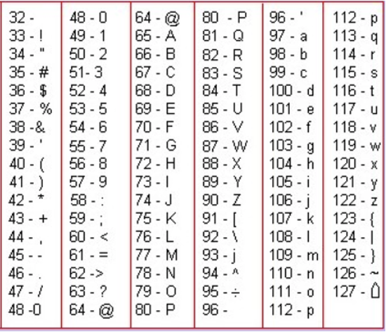

# Строки. Индексация

## Строка как коллекция

На прошлом занятии мы познакомились с коллекцией, которая называется множество. Вспомним, что основная особенность коллекций — возможность хранить несколько значений под одним именем. Можно сказать, что коллекция является контейнером для этих значений.

Но еще до изучения множеств мы уже знали тип данных, который ведет себя подобно коллекции. Этот тип данных — строка. Действительно, ведь строка фактически является последовательностью символов. В некоторых языках программирования есть специальный тип данных `char`, позволяющий хранить один символ. В Python такого типа данных нет, поэтому можно сказать, что строка — **последовательность односимвольных строк**.

## Что мы знаем о строках

Давайте вспомним, что мы уже знаем о работе со строками в языке Python. Мы умеем создавать строки четырьмя способами: задавать напрямую, считывать с клавиатуры функцией `input()`, преобразовывать число в строку функцией `str` и склеивать из двух других строк операцией +. Кроме того, мы умеем узнавать длину строки, используя функцию `len`, и проверять, является ли одна строка частью другой, используя операцию `in`:

```python
fixed_word = 'опять'
print(fixed_word)
word = input()
print(word)
number = 25
number_string = str(number)
print(number_string)
word_plus_number = fixed_word + number_string
print(word_plus_number)
print(len(word_plus_number))
print('оп' in word_plus_number)
```

## Индексация в строках

В отличие от множеств, в строках важен порядок элементов (символов). Действительно, если множества {1, 2, 3} и {3, 2, 1} — это одинаковые множества, то строки МИР и РИМ — две совершенно разные строки. Наличие порядка дает нам возможность пронумеровать символы. Нумерация символов начинается с 0:

| H | E | L | L | O |
|---|---|---|---|---|
| 0 | 1 | 2 | 3 | 4 |

### Индекс

По индексу можно получить соответствующий ему символ строки. Для этого нужно после самой строки написать в квадратных скобках индекс символа.

```python
word = 'привет'
initial_letter = word[0]
print(initial_letter)  # сделает то же, что print('п')
other_letter = word[3]
print(other_letter)  # сделает то же, что print('в')
```

Естественно, в этом примере word с тем же успехом можно было считать с клавиатуры через `input()`. Тогда мы не могли бы заранее сказать, чему равны переменные `initial_letter` и `other_letter`.

А что будет, если попытаться получить букву, номер которой слишком велик? В этом случае Python выдаст ошибку:

```python
word = 'привет'
print(word[6]) # builtins.IndexError: string index out of range
```

Конечно, номер в квадратных скобках — не всегда фиксированное число, которое прописано в самой программе. Его тоже можно считать с клавиатуры или получить в результате арифметического действия.

```python
word = 'привет'
number_of_letter = int(input())  # предположим, пользователь ввел 3
print(word[number_of_letter])  # тогда будет выведена буква 'в'
```

## Отрицательные индексы

Кроме «прямой» индексации (начинающейся с 0), в Python разрешены отрицательные индексы: `word[-1]` означает последний символ строки `word`, `word[-2]` — предпоследний и т д.

| 0      | 1     | 2     | 3      | 4      | 
|--------|-------|-------|--------|--------|
| H      | E     | L     | L      | O      |
| -5     | -4    | -3    | -2     | -1     |

А можно ли, используя индексацию, изменить какой-либо символ строки? Давайте проверим:

```python
word = 'карова'  # Написали слово с ошибкой
word[1] = 'о'    # Пробуем исправить, но:
# TypeError: 'str' object does not support item assignment
```

## Перебор элементов строки

В предыдущем уроке мы узнали, что цикл `for` можно использовать для перебора элементов множества. Таким же образом можно использовать цикл `for`, чтобы перебрать все буквы в слове:

```python
text = 'hello, my dear friends!'
vowels = 0
for letter in text:
    if letter in {'a', 'e', 'i', 'o', 'u', 'y'}:
        vowels += 1
print(vowels)
```

Но, так как символы в строке пронумерованы, у нас есть еще один способ перебрать все элементы в строке: перебрать все индексы, используя уже знакомую нам конструкцию `for i in range(...)`.

```python
text = 'hello, my dear friends!'
vowels = 0
for i in range(len(text)):
    if text[i] in 'aeiouy':
        vowels += 1
print(vowels)
```

## Хранение текстов в памяти компьютера

Давайте немного поговорим о том, как строки хранятся в памяти компьютера.
Поскольку компьютер умеет хранить только двоичные числа, для записи нечисловой информации (текстов, изображений, видео, документов) прибегают к кодированию.
Самый простой случай кодирования — сопоставление кодов текстовым символам.

Один самых распространенных форматов такого кодирования — таблица **ASCII (American standard code for information interchange)**.



Изначально в этой таблице каждому символу был поставлен в соответствие 7-битный код, что позволяло идентифицировать 128 различных символов. В таблице вы не видите символы с кодами, меньшими 32, так как они являются служебными и не предназначены для непосредственного вывода на экран (пробел, перевод строки, табуляция и т. д.).
Этого хватало на латинские буквы обоих регистров, знаки препинания и спецсимволы — например, перевод строки или разрыв страницы. Позже код расширили до 1 байта, что позволяло хранить уже 256 различных значений: в таблицу помещались буквы второго алфавита (например, кириллица) и дополнительные графические элементы (псевдографика).

В некоторых относительно низкоуровневых языках (например, в С) можно в любой момент перейти от представления строки в памяти к последовательности байтов, начинающейся по какому-либо адресу.

Сейчас однобайтные кодировки отошли на второй план, уступив место Юникоду.

Важно понимать, что Юникод — это не кодировка. Это именно таблица с описаниями элементов. То, как символы с соответствующими кодами будут храниться в памяти, зависит от конкретной кодировки, базирующейся на Юникоде: например, utf-8.

В Юникод все время добавляются новые элементы, а сам размер этой таблицы не ограничен и будет только расти, поэтому сейчас при хранении в памяти одного юникод-символа может потребоваться от 1 до 8 байт. Отсутствие ограничений привело к тому, что стали появляться символы на все случаи жизни. Например, есть несколько снеговиков.
Этого вы можете увидеть, если наберете:

```python
print('\u2603')
```

Важно понять, что все строки в Python хранятся именно как последовательность юникод-символов.


## Функция ord

Для того чтобы узнать код некоторого символа, существует функция `ord` (от order — «порядок»).

```python
ord('Б')  # 1041
```

## Функция chr

Зная код, всегда можно получить соответствующий ему символ. Для этого существует функция `chr` (от character — «символ»):

```python
chr(1041)  # Б
```

## Функция ord и chr

Функции ord и chr часто работают в паре. Попробуйте, например, предположить, что будет выведено на экран в результате работы следующей программы:

```python
for i in range(26):
    print(chr(ord('A') + i))
```
