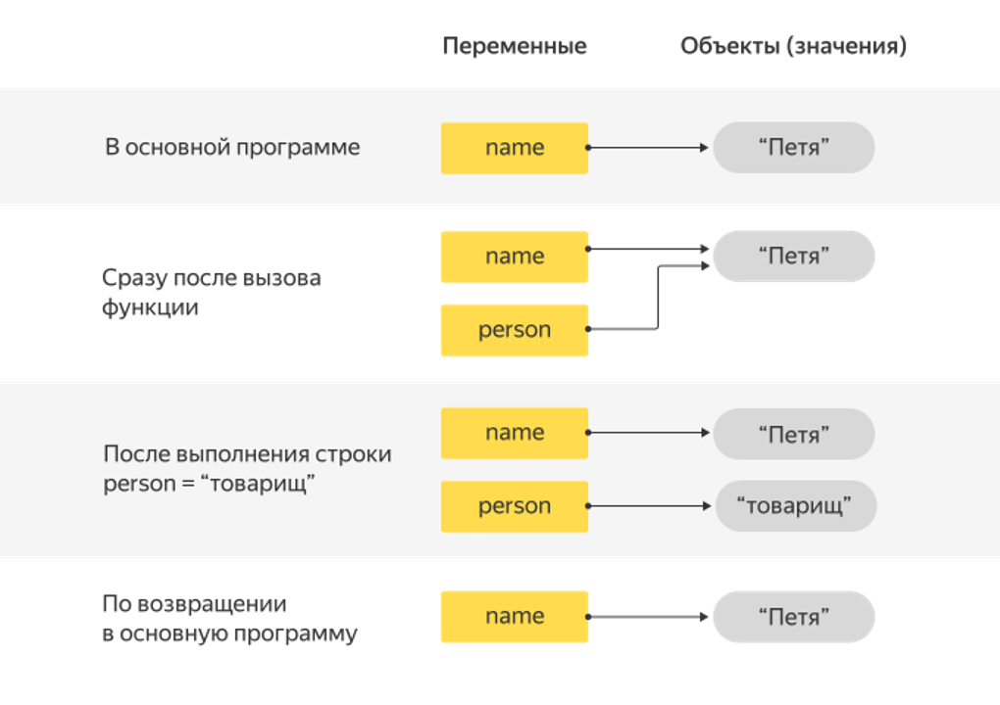
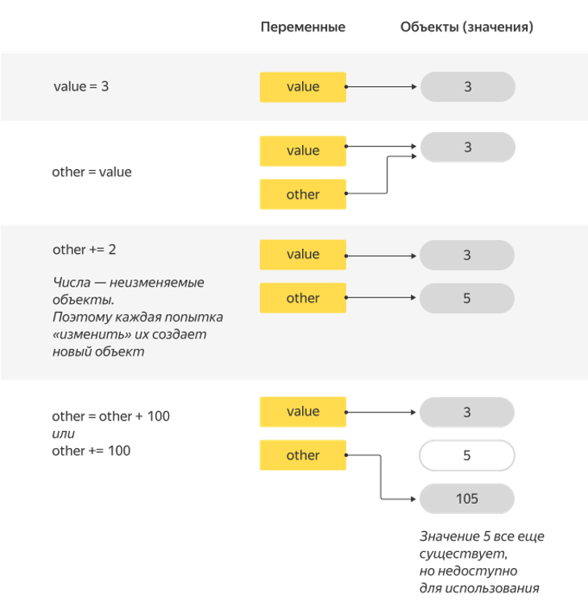
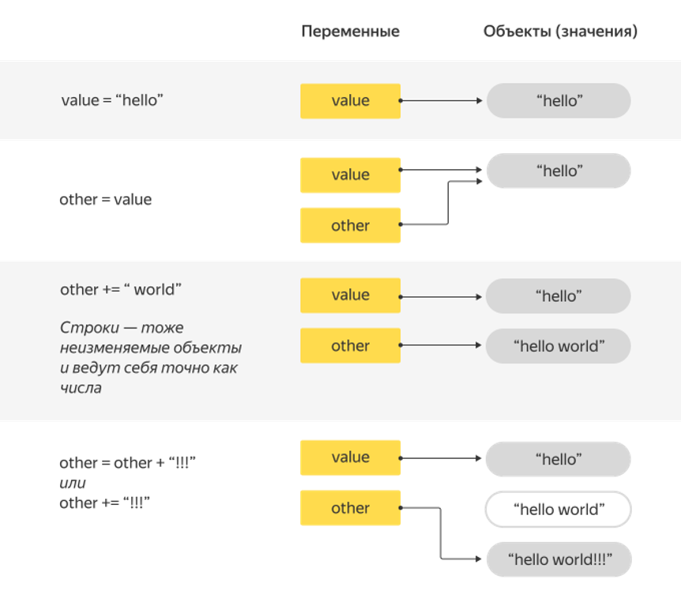
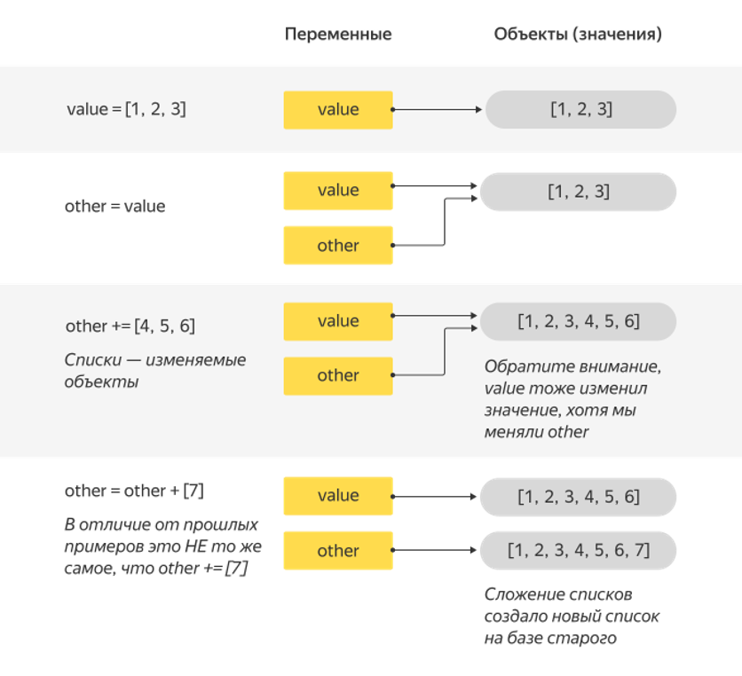

# Функции. Передача параметров

На прошлых занятиях мы начали разбирать, как работают функции и как с их помощью структурировать код. Напомним, как определяется функция:

```python
def <имя функции>([названия аргументов]):
    <тело функции>
    <...>
```

И как она вызывается:

```python
<имя функции>([значения аргументов])
```

Мы успели рассмотреть неочевидный вопрос о том, какими переменными функция может оперировать, а какие переменные ей недоступны. Как вы уже знаете, для того чтобы провести эту границу, в языке Python существует понятие об областях видимости, которые делят переменные на внешние и локальные. Они позволяют переменным с одинаковыми именами не мешать друг другу, а главное — разделяют программу на независимые друг от друга блоки. Вы узнали, что внутренние переменные функции недоступны снаружи, а внешние переменные, наоборот, можно беспрепятственно читать.

Когда вы внутри функции выполняете присваивание, появляется новая внутренняя (**локальная**) переменная и, если ее имя совпадает с именем внешней, она перекрывает переменную из внешней (**глобальной**) области видимости — и внешняя переменная остается неизменной, таким образом, внешние переменные защищены от случайной порчи. Если вы все же хотите изменить внешнюю переменную, вы должны описать переменную внутри функцию ключевым словом global. Но злоупотреблять этим не рекомендуется, поскольку отдельные части программы начинают зависеть друг от друга, что может привести ко множеству ошибок.

## Отличие между переменной и значением

Хотя мы много времени уделили изучению работы переменных с функциями, это еще не все, что нужно знать о переменных. На этом занятии вы поймете, чем переменная отличается от значения переменной.

Ранее мы рассмотрели такую программу:

```python
name = 'Петя'

def greet(name):
    print("Привет,", name)

greet('Вася')
```

которая выдает `«Привет, Вася»`.

Как мы выяснили, аргумент функции `name` является локальной переменной и перекрывает переменную name из внешней области видимости.

А теперь давайте разберем такую программу:

```python
name = 'Петя'

def greet(name):
    print("Привет,", name)
    name = 'товарищ'
    print("Здравствуй,", name)

greet(name)
    print("Name:", name)
```

Чему, по вашему мнению, будет равно имя в конце программы и почему?

Внешняя переменная `name`, конечно, **не изменится**. В функцию вообще не передается переменная! Туда передается значение, которое она хранила.

В языке Python имя переменной связывается со значением. В тот момент, когда мы присваиваем переменной новое значение, старое значение никуда не исчезает. Оно просто теряет связь с прежним именем. В нашем примере на старое значение все еще указывает имя внешней переменной. Это имя недоступно изнутри функции (поскольку внутренняя переменная называется так же, как внешняя), но, выйдя из функции, мы снова получаем возможность пользоваться этим именем.

Имена локальных переменных и имена аргументов можно менять как угодно, это не влияет на работу программы. Например, приведенную выше программу совершенно безопасно можно было бы переписать так:

```python
name = 'Петя'

def greet(person):
    print("Привет,", person)
    person = 'товарищ'
    print("Здравствуй,", person)

greet(name)
print("Name:", name)
```
Следующая схема ниже демонстрирует, как изменяется связь «имя переменной — значение» во время выполнения программы.



Стоит отметить, что, прежде чем функция будет вызвана, все ее аргументы должны быть вычислены. Таким образом, сначала выполняются инструкции, которые вычисляют значение переменной (аргументы вычисляются всегда слева-направо), и лишь затем полученные значения передаются в функцию, только после этого начинает выполняться код функции.

```python
def print_goodbye(arg):
    print('Goodbye', end=' ')


def print_cruel(arg):
    print('cruel', end=' ')


def print_world(arg):
    print('world', end=' ')
```

Скомбинируйте эти три функции в одну команду так, чтобы она выводила `"Goodbye cruel world"`.

```python
def print_goodbye(arg):
    print('Goodbye', end=' ')


def print_cruel(arg):
    print('cruel', end=' ')


def print_world(arg):
    print('world', end=' ')

print_world(print_cruel(print_goodbye(None)))
```

## Функции, изменяющие значение аргумента

Как же быть, если вам хочется изменить значение объекта? Один из способов — использовать глобальные переменные, но мы уже объяснили, чем он плох.

Оказывается, есть еще несколько способов. Вариант, который мы рассмотрим сейчас, тоже неидеален, но все же гораздо лучше, чем использование глобальных переменных.

Давайте напишем функцию, которая принимает список чисел и возводит каждое число в квадрат.

```python
def convert_to_squares(array):
    for i in range(len(array)):
        array[i] = array[i] ** 2


list = [1, 2, 3, 4, 5, 6, 7, 8, 9]
convert_to_squares(list)
print(list)
```

Эта программа выведет список квадратов чисел от 1 до 9. Заметьте, мы не присваивали ничего переменной array, это все тот же объект, что был. Но его содержимое поменялось. Ключевой момент: **объект тот же, а его наполнение другое.**

```python
def list_of_squares(array):
    new_array = []
    for i in range(len(array)):
        new_array.append(array[i] ** 2)
    array = new_array


list = [1, 2, 3, 4, 5, 6, 7, 8, 9]
list_of_squares(list)
print(list)
```

Она будет выводить на экран не квадраты чисел, а просто числа от одного до девяти.

Все потому что `array` — **локальная** для функции переменная. Присваивание ей значения ничего не делает с точки зрения внешней программы.

## Изменяемость и неизменяемость объектов

На самом деле в языке Python не так много встроенных объектов, которые можно поменять. Сейчас из изменяемых объектов вы знаете списки, множества и словари.

А числа, булевы значения, строки и даже кортежи менять нельзя. Их содержимое всегда неизменно с момента создания. Такие объекты называются иммутабельными, то есть неизменяемыми.

### Числа:

```python
a = 1
print(id(a)) # id объекта "число 1"
a += 1
print(id(a)) # id изменился, a - это объект другого числа
```



Тут есть небольшой нюанс. Если мы напишем код вроде:

```python
a = 1
b = 1
print(id(a))
print(id(b))
```

Мы увидим, что у `a` и `b` будут одинаковые `id`. Это связано с тем, что Python в целях оптимизации выделения памяти уже при старте создает ряд часто используемых величин: целых чисел (от −5 до 256), `True` и `False`, `None`, ряд коротких строк. И в момент, когда мы присваиваем переменной значение из предсозданного перечня, Python не тратит время на выделение памяти, а просто ставит указатель на уже созданное значение.

### Строки:

```python
s = 'Hello'
print(id(s)) # id строки "Hello"
s += ' world'
print(id(s)) # id другого объекта - строки "Hello world"
```



### Списки:

```python
s = [1, 2, 3]
print(id(s)) # id списка
s += [9, 8, 7]
print(id(s))
# тот же id для того же списка, но с измененным содержимым
```



Следует отметить еще один важный момент. Равенство объектов **не означает, что это один и тот же объект** (или, как еще говорят, объекты идентичны). Это особенно важно для изменяемых объектов-контейнеров, таких как списки. Но и с неизменяемыми кортежами, и со строками бывают ситуации, когда отличие между равенством и идентичностью оказывается важным.

Вернемся к аналогии с холодильниками. Если у вас в холодильнике те же продукты, что у вашего друга, это не значит, что у вас с ним один и тот же холодильник. Если вы что-нибудь добавите в свой холодильник, холодильник вашего друга автоматически никак не изменится.

```python
my_fridge = ['молоко', 'яйца', 'овощи']
my_friends_fridge = ['молоко', 'яйца', 'овощи']
print(my_fridge == my_friends_fridge)
print(id(my_fridge) == id(my_friends_fridge))
```

Содержимое холодильников одинаковое, что показывает сравнение списков при помощи оператора `==`. Но их уникальные `id` разные.

Совсем другая ситуация, когда у вас есть две переменные, ссылающиеся на один и тот же холодильник. Например, ваш холодильник является одновременно холодильником ваших родителей.

```python
my_fridge = ['молоко', 'яйца', 'овощи']
my_parents_fridge = my_fridge
print(my_fridge == my_parents_fridge)
print(id(my_fridge) == id(my_parents_fridge))
```

Строка `my_parents_fridge = my_fridge` сделала холодильник ваших родителей не просто таким же как ваш, а ровно тем же. Их `id` равны.

Теперь, если ваши родители положат что-то в свой холодильник, ваш холодильник тоже изменится, так как это тот же самый холодильник.

```python
my_parents_fridge += ['мясо']
print(my_fridge)
```

Бывают ситуации, когда такое поведение неудобно. Иногда нам хочется получить копию объекта, а не просто вторую ссылку на тот же объект. В общем случае это не так просто сделать, ведь объект (например, список) может содержать в себе другие объекты, которые тоже нужно скопировать. Если вы хотите узнать об этом подробно, вам лучше обратиться к документации.

## Копирование одномерного списка

Для того чтобы сделать копию одномерного списка `arr`, можно сделать **срез**, содержащий все элементы:

```python
arr = [1, 2, 3]
arrCopy = arr[:]
arrCopy[0] = 42
print(arr)  # => [1, 2, 3]
print(arrCopy) # => [42, 2, 3]
```

Но будьте аккуратны: ведь если список содержал вложенные списки, копия внешнего списка содержит те же самые вложенные списки, а не их копии. А значит, изменения одного списка отразятся на другом. Проще всего это увидеть на примере:

```python
arr = [[1], [2], [3]]
arrCopy = arr[:]
arrCopy[0].append(42)
print(arr)  # => [[1, 42], [2], [3]]
print(arrCopy) # => [[1, 42], [2], [3]]
```
> **Кортеж** — объект неизменяемый. В него нельзя, например, добавить элемент или заменить существующий элемент новым объектом. Но его элементы вполне могут быть изменяемыми; если среди элементов кортежа есть изменяемые элементы, поменяв их содержимое, вы фактически измените содержимое кортежа.
> По этой причине иногда бывает недостаточно следить за типом переменной. Всегда думайте заодно о типах содержимого контейнеров (контейнер — объект, содержащий другие объекты).

Напомним также, что в случае списков оператор `a1 += a2` ведет себя не совсем как `a1 = a1 + a2`. В первом случае изменяется сам список `a1` (к его концу дописываются все элементы списка `a2`), во втором — создается новый. В случае чисел, строк и кортежей, которые изменяться не могут, две эти формы записи полностью эквивалентны.


