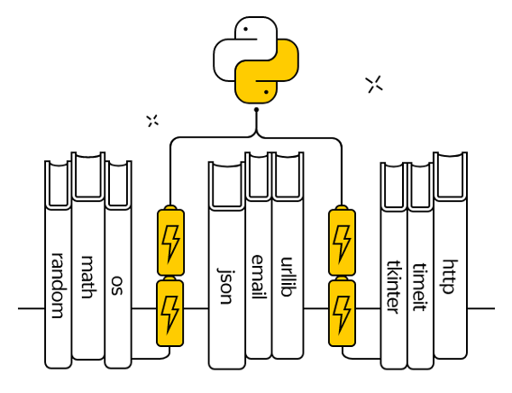
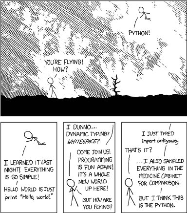

# Библиотеки Python.  Часть 1. Встроенные модули 

## Аннотация

Python — высокоуровневый язык программирования, объектно-ориентированный, модульный и подчеркнуто легкочитаемый, что делает его очень простым в изучении. Python широко применяется в образовательной сфере, для научных вычислений, больших данных и машинного обучения, в веб-разработке, графике, GUI, играх и других направлениях. В связи с огромной сферой применения существует уже бесчисленное количество библиотек, упрощающих программирование на этом языке без необходимости написания излишнего кода. На этом уроке мы начнем знакомство со стандартными библиотеками языка Python.

## Библиотеки как наследие

У каждого языка программирования есть свои особенности, в том числе и у Python. Есть сферы деятельности, где он любим, а есть области, в которых он не очень силен и не пользуется популярностью.

Сначала поговорим о сильных сторонах.

Сильные стороны Python
- На Python легко научиться программировать (именно поэтому вы его и изучаете)
- Благодаря строению языка и его динамической скриптовой природе разрабатывать на Python можно очень быстро

Принцип прост: **быстро изучить — быстро программировать.**

В результате языком Python заинтересовались люди, которым нужно автоматизировать какие-то процессы в своей деятельности или «склеивать» несколько взаимосвязанных программ в комплексы. Обычно эти люди не программисты по специальности. Это инженеры, преподаватели, математики, физики, биологи, лингвисты — все они часто применяют Python в своей практике.

Вторая причина популярности Python связана с тем, что он очень быстро стал интегрироваться с огромным количеством библиотек, написанных на других языках программирования. Что-то очень похожее было когда-то с языком программирования Perl и его платформой CPAN.

Теперь пришел черед познакомиться с термином «библиотека» в контексте программирования.

## Библиотека

Библиотека в программировании — сборник подпрограмм или объектов, используемых для разработки программного обеспечения, или ПО. Так гласит Википедия.

Давайте немного поясним. Правила структурного программирования говорят, что любая программа должна иметь структуру, а именно: делиться на взаимодействующие компоненты (блоки) — файлы, функции, классы.

Это можно сравнить с разделением книг на главы, абзацы, слова — без такого деления трудно понять смысл. Этот принцип — первый важный этап в понимании сущности библиотеки.

Следующий этап заключается в возможности использовать часть кода одной программы из другой программы. Обычно это нужно, чтобы повторно использовать код: не писать одно и то же два раза. А еще — не переписывать код, написанный на другом языке программирования. Такое свойство часто называют модульностью.

Самый простой контейнер для кода — **функция**. Часто используемые функции объединяются по своему типу в библиотеки. Например, функции по работе с видеофайлами, функции, отвечающие за соединение и получение информации из Интернета и т. д.

Библиотеки могут объединяться в более крупные сборники, в итоге иногда получаются настоящие монстры, относящиеся к какой-то широкой области. Например, OpenCV — это библиотека для компьютерного зрения, Django — для веб-программирования, Scipy — для научных вычислений.

В Python библиотеки называются **модулями**.

Итак, современный язык программирования напоминает наборы конструкторов, которые совместимы друг с другом.

Если вы программируете на Python, представьте себя ребенком, попавшим на огромный склад с конструкторами, где можно взять любой из них и делать с ним что угодно.

Именно так. Очень многие библиотеки абсолютно свободны (на их использование нет никаких ограничений), бесплатны, а их исходные коды доступны.

Обычно путают три понятия, связанные с ПО. Путаница получилась из-за того, что на английском **free** — и бесплатный, и свободный.

- Свободное ПО означает, что после покупки вы можете делать с ним все, что хотите, включая дизассемблирование, использование в коммерческих проектах, написание на его основе своих программ
- Бесплатное ПО
- ПО с открытыми исходными кодами

Возможны любые сочетания этих свойств.

<video src="https://youtu.be/n1F_MfLRlX0"/>

Некоторые библиотеки, например, связанные с математическими вычислениями, очень старые и написаны еще на Fortran. При этом они используются в современных проектах, поскольку созданы профессиональными математиками и инженерами, многократно проверены и оптимизированы.

В этом смысле библиотеки — такое же наследие человечества, как литература, музыка и архитектура.

Интересный факт: с точки зрения закона, программы являются литературными произведениями.

## Репозиторий PyPI

**PyPI** — центральный репозиторий (хранилище) модулей для языка программирования Python. Он как PlayMarket для Android, AppStore для iPhone или CPAN для Perl.
Пройдите по [ссылке](https://pypi.org/). Вы увидите страницу, которая начинается со следующих слов:

*The Python Package Index (PyPI) is a repository of software for the Python programming language.*

*PyPI helps you find and install software developed and shared by the Python community.*

Обратите внимание: количество модулей уже превысило 200 000!

Наверное, можно в шутку говорить, что у Python на все случаи жизни есть нужная библиотека.

Допустим, вы хотите написать программу-бота для «ВКонтакте», чтобы она делала за вас репосты, ставила лайки, переписывалась с друзьями, предлагала подружиться... Так вот для этого тоже есть библиотека!

Как работать с PyPI, мы изучим на следующем уроке, а пока разберемся со встроенными модулями.

## Встроенные модули

Говорят, что Python поставляется уже с батарейками — даже стандартной библиотеки, входящей в комплект, уже достаточно для многих вещей.



Стандартной библиотеке посвящен целый раздел документации. Советуем вам хотя бы раз просмотреть его, чтобы примерно знать, какие вообще библиотеки бывают.

Модули в Python устроены по иерархическому принципу, как каталоги в файловой системе. Один модуль может быть вложен в другой, причем вложенность не ограничена (хотя на практике редко бывает больше 4). Чтобы пользоваться функциями, объектами и классами из модуля, весь этот модуль или его часть нужно подключить к программе — **импортировать**.

Возникает вопрос: а почему бы не подключить все библиотеки сразу?
Можно, но это привело бы к нерациональному использованию оперативной памяти и очень долгой загрузке вашей программы.

Поэтому есть правило: **не импортируйте то, чем не пользуетесь.**

За импорт в Python отвечает директива `import`.

Давайте посмотрим на примерах, как это происходит.

```python
from math import pi # Возьмем число пи из библиотеки math
```

Теперь вам доступна переменная `pi`. (В Python это значение приближенно равно 3,141592653589793).

Модуль, переменную, класс или функцию можно при импорте назвать своим именем — для этого служит ключевое слово `as`, например:

```python
from math import pi as число_пи

print(число_пи)
```

```bash
3.141592653589793
```

Более того, поскольку в программе на языке Python в именах допустимы буквенные символы любых алфавитов, можно использовать даже греческие буквы (впрочем, это неудобно, если у вас кириллическо-латинская клавиатура).

```python
from math import pi as π

print(π)
```

```bash
3.141592653589793
```

Если нужно импортировать что-то с большей степенью вложенности, вам поможет символ ".", он выполняет ту же функцию, что и разные виды слешей в путях до файлов.

```python
# мне нужна функция urlopen из request,
# который находится внутри urllib
from urllib.request import urlopen
```

Мы можем импортировать всю библиотеку, но тогда для доступа к ее содержимому нужно снова использовать точку:

```python
import math
print(math.pi)
```

```bash
3.141592653589793
```

Или несколько точек. В любом случае аналогия с файловой структурой почти полная (объекты, функции и классы лежат в файлах, которые группируются в папки, которые тоже могут лежать в папках и т. д.).

```python
import urllib

urllib.request.urlopen(...)
```

Значения после директивы import можно писать через запятую:

```python
from math import sin, cos, tan
```

Значок `*` означает, что из библиотеки нужно импортировать все, что доступно.

```python
from math import *
```

Впрочем, так делать не рекомендуется, поскольку при таком подходе засоряется пространство имен.

Вспомните о двух полезных функций: `dir` (возвращает список со всем содержимым объекта, модуля и т. д.) и `help` (показывает справку об использовании данного объекта).

```python
import math

dir(math)
```

```bash
['__doc__', '__loader__', '__name__', '__package__', '__spec__',
 'acos', 'acosh','asin', 'asinh', 'atan', 'atan2', 'atanh', 'ceil',
 'copysign', 'cos', 'cosh','degrees', 'e', 'erf', 'erfc', 'exp',
 'expm1', 'fabs', 'factorial', 'floor','fmod', 'frexp', 'fsum',
 'gamma', 'hypot', 'isfinite', 'isinf', 'isnan', 'ldexp','lgamma',
 'log', 'log10', 'log1p', 'log2', 'modf', 'pi', 'pow', 'radians',
 'sin','sinh', 'sqrt', 'tan', 'tanh', 'trunc']
```

```bash
>>> help(math.sin)

Help on built-in function sin in module math:
 
sin(...)
    sin(x)
  
    Return the sine of x (measured in radians).
```

```python
>>> help(math.radians)

Help on built-in function radians in module math:
 
radians(...)
    radians(x)
  
    Convert angle x from degrees to radians.
```

```bash
>>> sin(radians(30))

0.49999999999999994
```

Обратите внимание: часть имен начинается с символа "`_`". Это служебные имена, мы их пока рассматривать не будем, да и программисты ими пользуются редко.

## «Пасхальные яйца» в Python

```python
>>> import this

The Zen of Python, by Tim Peters
 
Beautiful is better than ugly.
Explicit is better than implicit.
Simple is better than complex.
Complex is better than complicated.
Flat is better than nested.
Sparse is better than dense.
...
```

А импорт модуля с антигравитацией откроет в браузере комикс о том, что в Python действительно есть модули на все случаи жизни.

```python
>>> import antigravity
```


## Модуль math

Давайте вернемся к встроенному модулю math и посмотрим внимательнее на то, какие возможности он нам предоставляет.

Мы писали программу для вычисления факториала числа, оказывается, такая функция уже есть:

```python
import math

print(math.factorial(5))
```
```bash
120
```

Довольно часто применяется и функция gcd для нахождения наибольшего общего делителя:

```python
import math

print(math.gcd(500, 600))
```

```bash
100
```

Кроме того, есть функции для возведения в степень pow, которое принимает число, которое надо возвести в степень первым аргументом, а вторым аргументом — показатель степени, в которую надо возвести первый аргумент. А для извлечения квадратного корня числа есть функция `math.sqrt`.

В Python есть встроенная функция `pow` или `**`, которая также возводит в степень, но есть ряд отличий. Например, math.pow всегда возвращает результат типа `float`.

```python
import math  # Возведение в степень

print(math.pow(10, 10))  # Извлечение квадратного корня
print(math.sqrt(16))
```

```bash
10000000000.0
4.0
```

В модуль math встроены тригонометрические функции вычисления синуса, косинуса, тангенса и т. д.:

```python
import math

print(math.sin(math.radians(90)))
print(math.cos(math.radians(0)))
print(math.tan(math.radians(45)))
```

```bash
1.0
1.0
0.9999999999999999
```

Обратите внимание: они принимают на вход значение угла в **радианах**, поэтому данные в градусах надо перевести в радианы с помощью функции модуля `math`, которая называется radians. Существует и зеркальная функция degrees для перевода радиан в градусы.

```python
import math

print(math.degrees(math.pi))
```

```bash
180.0
```

Кроме того, math содержит ряд дополнительных интересных функций, например, знает теорему Пифагора. Функция `hypot(a, b)` возвращает длину гипотенузы по двум катетам прямоугольного треугольника. Полный перечень функций и их описания можно посмотреть в документации.

## Модуль random

Этот модуль предназначен для работы с псевдослучайными последовательностями. Такие последовательности важны в математическом моделировании, в криптографии и в различных играх.

Давайте посмотрим структуру модуля.

```python
import random

print(dir(random))
```

```bash
['BPF', 'LOG4', 'NV_MAGICCONST', 'RECIP_BPF', 'Random',
 'SG_MAGICCONST', 'SystemRandom', 'TWOPI', '_BuiltinMethodType',
 '_MethodType', '_Sequence', '_Set','__all__', '__builtins__',
 '__cached__', '__doc__', '__file__', '__loader__','__name__',
 '__package__', '__spec__', '_acos', '_ceil', '_cos', '_e', '_exp',
 '_inst', '_log', '_pi', '_random', '_sha512', '_sin', '_sqrt', 
 '_test','_test_generator', '_urandom', '_warn', 'betavariate',
 'choice', 'expovariate','gammavariate', 'gauss', 'getrandbits',
 'getstate', 'lognormvariate','normalvariate', 'paretovariate',
 'randint', 'random', 'randrange', 'sample','seed', 'setstate',
 'shuffle', 'triangular', 'uniform', 'vonmisesvariate',
 'weibullvariate']
```

Как видим, довольно много функций. Давайте рассмотрим некоторые из них.
Для получения одного псевдослучайного целого числа можно воспользоваться одной из двух функций: `randrange` или `randint`. Функция `randrange` возвращает случайное число из диапазона. Как и в обычном range, мы можем указать начало, конец и шаг диапазона. Функция `randint` работает похожим образом, но у нее границы диапазона — обязательные параметры, нельзя указать шаг, и верхняя граница включена в диапазон генерации.

```python
from random import randrange, randint

# возвращаем случайное целое из диапазона
print(randrange(100))
print(randrange(40, 100, 5))
print(randint(10, 20))
```

### Функция choice

Одна из самых популярных — функция `choice`. С ее помощью можно выбрать один вариант из нескольких альтернатив, заданных в списке, кортеже, строке или любом другом индексируемом типе. `choice` нельзя применять для неупорядоченных коллекций — например, множеств и словарей.

C некоторыми оговорками `choice` можно использовать для словаря, но только в том случае, если ключи в нем такие же, как в списке: начинаются с нуля, целые числа, нет пропусков. Что в целом делает такой словарь несколько бесполезным.

```bash
Например, вот так можно моделировать подкидывание монетки:
>>> from random import choice
>>> choice((1, 2))
2
>>> choice(["орел", "решка"])
'орел'
>>> choice("ab")
'a'
```

А так — сымитировать несколько бросков игральных кубиков:

```python
from random import choice

dashes = [1, 2, 3, 4, 5, 6]
for i in range(1, 10):
    print(choice(dashes), choice(dashes))
```

```bash
2 5
6 5
6 1
1 2
5 6
6 1
4 2
4 2
2 3
```

Если задать символы на сторонах кубика с использованием кодировки **Unicodе**, все будет еще реалистичнее.

```python
from random import choice

dashes = ['\u2680', '\u2681', '\u2682', '\u2683', '\u2684', '\u2685']
for i in range(1, 10):
    print(choice(dashes), choice(dashes))
```

```bash
⚄ ⚄
⚀ ⚂
⚄ ⚃
⚄ ⚂
⚃ ⚁
⚀ ⚂
⚀ ⚄
⚃ ⚁
⚄ ⚂
```

Если попробовать вызвать `choice` с пустой коллекцией, ваша программа упадет с ошибкой. Поэтому перед использованием этой функции будет нелишним проверять наличие в коллекции хотя бы одного элемента.

```python
from random import choice

my_str = "Hello, world"
if my_str:
    print(choice(my_str), choice(my_str))
```

Если нам нужно вернуть не один, а несколько элементов, на помощь придут функции `choiсes` и `sample`. `choices` возвращает заданное именованным параметром `k` количество элементов с возможными повторами (коллекция должна быть непустой), `sample` — без повторов, но выборка должна быть меньше или равна длине коллекции, иначе тоже будет ошибка.

### Функция sample

```python
from random import choices, sample

my_list = ['Yes', 'No', 'May be']
# выбираем k элементов коллекции с повторениями
print(choices(my_list, k=5))
# выбираем k элементов без повторений
print(sample(range(10), 6))
```

```bash
['No', 'Yes', 'Yes', 'Yes', 'No']
[8, 9, 1, 6, 7, 5]
```

### Функция shuffle

Функция `shuffle` перемешивает список, при этом меняется сам список, который передается как аргумент функции.

```python
from random import shuffle

a = list(range(100))
shuffle(a) # меняет сам список
print(a[:10])
```
```bash
[12, 97, 67, 13, 68, 58, 87, 92, 32, 40]
```

### Функция random {id="random-func"}

А функция `random` возвращает случайное вещественное число от 0 до 1 (не включительно):

```python
from random import random as rnd

print(rnd(), rnd(), rnd()) # вещественное число [0, 1)
```

```bash
0.7807663953103449 0.1503300563891775 0.6068329639725171
```

## Модуль datetime

Модуль `datetime` предназначен для работы с датами и временем и предоставляет, кроме функций, несколько новых типов данных. Библиотека чаще всего применяется для того, чтобы узнать текущую дату или время:

```python
import datetime as dt

print(dt.datetime.now())
print(dt.datetime.now().time())
print(dt.datetime.now().date())
```

```bash
2019-09-04 18:34:42.071614
18:34:42.071614
2019-09-04
```

Но ее можно использовать и для более интересных вещей, она предоставляет несколько интересных типов данных: `time`, `date`, `datetime` — для хранения времени, даты и совместно даты и времени.


`date` — тип для хранения даты. При создании новой даты нужно указать год, месяц и день. С помощью функции `today()` можно узнать текущую дату на компьютере, а с помощью функции `weekday()` — день недели (нумерация с 0).

```python
import datetime as dt

# тип данных 'дата' (год + месяц + день)
my_date = dt.date(2019, 11, 5)
print(my_date)
print(dt.date.today())
print(dt.date.today().weekday())
```

```bash
2019-11-05
2019-09-04
2
```

`time` — тип для хранения времени. При создании объекта данного типа надо указать час, минуту, секунду.

```python
import datetime as dt

# тип данных 'время' (час + минута + секунда + милисекунда)
my_time = dt.time(23, 15, 29)
print(my_time)
```

`datetime` — тип для объединения даты и времени. Можно объединить `date` и `time` в один `datetime` с помощью функции `combine(date, time)`. Обратиться к отдельным частям объекта `datetime` можно через точку и название части: например, year (аналогично можно поступить для `date` или `time`). С помощью функции `now()` можно узнать текущее дату и время.

```python
import datetime as dt

# тип данных дата + время
my_datetime = dt.datetime(2020, 12, 15, 13, 25, 9)
print(my_datetime)
# можно объединить дату и время
my_date = dt.date(2019, 11, 5)
my_time = dt.time(23, 15, 29)
my_datetime = dt.datetime.combine(my_date, my_time)
print(my_datetime)
print(my_datetime.year)
# и получить текущую дату и время
print(dt.datetime.now())
```

```bash
2020-12-15 13:25:09
2019-11-05 23:15:29
2019
2019-06-19 16:32:07.208456
```

Тип `timedelta` необходим для создания объектов, содержащих некоторый временной интервал. При создании таких объектов можно указать, сколько дней, часов, минут, секунд, недель содержит временной интервал. Как и с другими типами модуля `datetime`, с частями временного интервала можно обращаться аналогично. С помощью функции `total_seconds() `можно узнать длину интервала в секундах.

```python
import datetime as dt

# тип данных временной интервал
delta_time1 = dt.timedelta(seconds=10, weeks=2)
print(delta_time1)
print(delta_time1.days)
print(delta_time1.total_seconds())
```

```bash
14 days, 0:00:10
14
1209610.0
```

Интервал, в отличие от предыдущих типов, может быть отрицательным.

```python
import datetime as dt

# интервал может быть отрицательным
delta_time2 = dt.timedelta(seconds=-10, weeks=-2)
print(delta_time2)
```

```bash
-15 days, 23:59:50
```

Для интервалов, дат, времени и типа `datetime` поддерживаются математические и логические операции. Мы можем сложить два интервала времени, вычесть один из другого, увеличить интервал в n раз, уменьшить интервал в `n` раз, а с помощью деления узнать, сколько раз один интервал помещается в другой.

```python
import datetime as dt

# поддерживаются математические и логические операции
# для интервалов времени
delta_time1 = dt.timedelta(days=4, hours=4)
delta_time2 = dt.timedelta(days=1, hours=1)
print(delta_time1 - delta_time2)
print(delta_time1 + delta_time2)
print(delta_time1 * 10)
print(delta_time1 / 10)
print(delta_time1 / delta_time2)
```

```bash
3 days, 3:00:00
5 days, 5:00:00
41 days, 16:00:00
10:00:00
4.0
```

К датам мы можем прибавлять временной интервал или удалять интервал для получения новой даты, которая раньше/позже на этот интервал. При вычитании одной даты из другой мы получим интервал времени между датами. С помощью логических функций мы можем узнать, какая дата позже (т. е. больше) или раньше (т. е. меньше).

```python
import datetime as dt

# поддерживаются математические и логические операции для дат
date1 = dt.date(2019, 11, 5)
date2 = dt.date(2018, 10, 1)
delta_time1 = dt.timedelta(days=4, hours=4)
print(date1 + delta_time1)
print(date1 - delta_time1)
print(date1 - date2)
print(date2 > date1)
```

```bash
2019-11-09
2019-11-01
400 days, 0:00:00
False
```

Аналогичные действия работают и для `datetime`.


```python
import datetime as dt

# поддерживаются математические и логические операции для типа
# datetime

datetime1 = dt.datetime(2020, 12, 15, 13, 25, 9)
datetime2 = dt.datetime(2019, 12, 15, 13, 25, 9)
delta_time1 = dt.timedelta(days=4, hours=4)
print(datetime1 + delta_time1)
print(datetime1 - delta_time1)
print(datetime1 - datetime2)
print(datetime2 < datetime1)
```

```bash
2020-12-19 17:25:09
2020-12-11 09:25:09
366 days, 0:00:00
True
```

Кроме того, для времени, даты и типа `datetime` поддерживается форматированный вывод, который позволяет представлять информацию в удобном для нас виде.

```python
import datetime as dt

# поддерживается форматированный вывод
my_format = "%B"
print(dt.datetime.now().strftime('%A %d-%B-%y %H:%M:S'))
print(dt.date.today().strftime(my_format))
```

```bash
Wednesday 04-September-19 18:50:S
September
```

| Команда | Значение                                                              | Пример                                                                      |
|---------|-----------------------------------------------------------------------|-----------------------------------------------------------------------------|
| %a      | Аббревиатура дня недели                                               | Sun, Mon, …, Sat (en_US);So, Mo, …, Sa (de_DE)                              |
| %A      | Полное название дня недели                                            | Sunday, Monday, …, Saturday (en_US);Sonntag, Montag, …, Samstag (de_DE)     |
| %w      | День недели как десятичное число, где 0 — воскресенье, а 6 — суббота  | 0, 1, …, 6                                                                  |
| %d      | День месяца в формате из двух цифр                                    | 01, 02, …, 31                                                               |
| %b      | Аббревиатура месяца                                                   | Jan, Feb, …, Dec (en_US);Jan, Feb, …, Dez (de_DE)                           |
| %B      | Полное название месяца                                                | January, February, …, December (en_US);Januar, Februar, …, Dezember (de_DE) |
| %m      | Номер месяца в формате из двух цифр                                   | 01, 02, …, 12                                                               |
| %y      | Последние 2 цифры года (год без века)                                 | 00, 01, …, 99                                                               |
| %Y      | Год полностью                                                         | 0001, 0002, …, 2013, 2014, …, 9998, 9999                                    |
| %H      | Час в 24-часовом формате из двух цифр                                 | 00, 01, …, 23                                                               |
| %I      | Час в 12-часовом формате из двух цифр                                 | 01, 02, …, 12                                                               |
| %p      | AM или PM                                                             | AM, PM (en_US);am, pm (de_DE)                                               |
| %M      | Минута в формате из двух цифр                                         | 00, 01, …, 59                                                               |
| %S      | Секунда в формате их двух цифр                                        | 00, 01, …, 59                                                               |
| %f      | Микросекунды в формате из 6 цифр                                      | 000000, 000001, …, 999999                                                   |
| %j      | День в году в формате из 3 цифр                                       | 001, 002, …, 366                                                            |
| %U      | Неделя в году                                                         | 00, 01, …, 53                                                               |
| %c      | Принятое, согласно локальным настройкам, представление даты и времени | Tue Aug 16 21:30:00 1988 (en_US);Di 16 Aug 21:30:00 1988 (de_DE)            |
| %x      | Принятое, согласно локальным настройкам, представление даты           | 08/16/88 (None);08/16/1988 (en_US);16.08.1988 (de_DE)                       |
| %X      | Принятое, согласно локальным настройкам, представление времени        | 21:30:00 (en_US);21:30:00 (de_DE)                                           |
| %%      | Знак '%'                                                              | %                                                                           |

Более подробно можно посмотреть в [документации](https://docs.python.org/3.7/library/datetime.html).

## Модуль pprint

Модуль `pprint` содержит функцию `pprint`, которую удобно использовать при выводе сложных типов данных. `pprint` старается вывести в консоль объекты в наиболее читабельном для человека виде. Ее особенно удобно использовать для вывода матриц.

```python
import random
from pprint import pprint

a = [sample(range(20), 6) for _ in range(10)]
print(a)
print()
pprint(a)
```

```bash
[[0, 12, 14, 7, 15, 10], [8, 18, 15, 5, 13, 14],
 [15, 4, 14, 18, 17, 7], [11, 16, 19, 17, 14, 2],
 [6, 13, 8, 17, 9, 14], [15, 10, 4, 5, 17, 9],
 [16, 9, 14, 15, 13, 7], [12, 14, 9, 4, 7, 11],
 [13, 18, 12, 3, 17, 15], [5, 18, 16, 17, 9, 6]]

[[0, 12, 14, 7, 15, 10],
 [8, 18, 15, 5, 13, 14],
 [15, 4, 14, 18, 17, 7],
 [11, 16, 19, 17, 14, 2],
 [6, 13, 8, 17, 9, 14],
 [15, 10, 4, 5, 17, 9],
 [16, 9, 14, 15, 13, 7],
 [12, 14, 9, 4, 7, 11],
 [13, 18, 12, 3, 17, 15],
 [5, 18, 16, 17, 9, 6]]
```

`pprint` работает и для словарей.

```python
import random
from pprint import pprint

b = {x: x ** 2 for x in range(20)}
print(b)
print()
pprint(b)
```

```bash
{0: 0, 1: 1, 2: 4, 3: 9, 4: 16, 5: 25, 6: 36, 7: 49, 8: 64, 9: 81,
10: 100, 11: 121, 12: 144, 13: 169, 14: 196, 15: 225, 16: 256,
17: 289, 18: 324, 19: 361}

{0: 0,
 1: 1,
 2: 4,
 3: 9,
 4: 16,
 5: 25,
 6: 36,
 7: 49,
 ...
 19: 361}

```

Мы рассмотрели только несколько встроенных библиотек — их намного больше. И у рассмотренных мы разобрали далеко не все функции. Пользуйтесь функциями `dir` и `help` и читайте документацию, в ней приведены примеры и объяснены нюансы.
