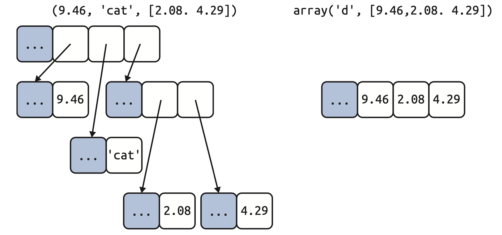
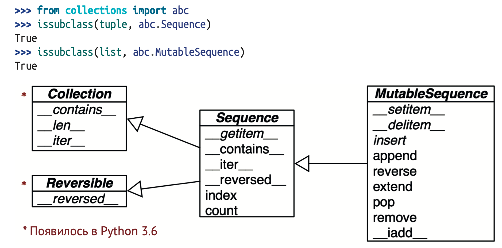
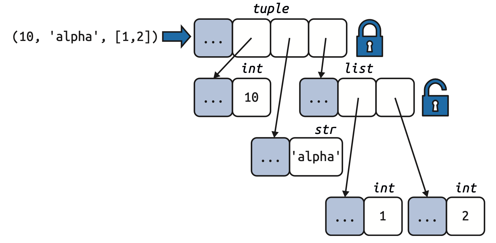
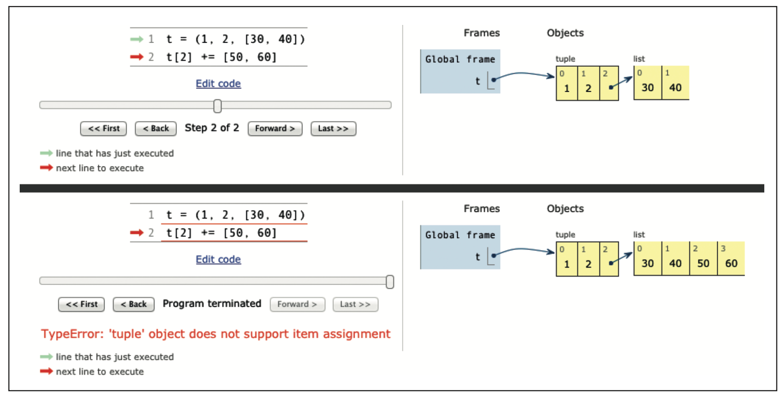

# Глава 2. Массив последовательностей

## Общие сведения о встроенных последовательностях

**Контейнерные последовательности**

Позволяют хранить элементы разных типов, в т. ч. вложенные контейнеры. Примерами могут служить `list`, `tuple` и `collections.deque`.

**Плоские последовательности**

Позволяют хранить элементы только одного типа. Примерами могут служить `str`, `bytes` и `array.array`.

В *контейнерных последовательностях* хранятся ссылки на объекты любого типа, тогда как в *плоских последовательностях* – сами значения прямо в памяти, занятой последовательностью, а не как отдельные объекты Python.



*Упрощенные диаграммы размещения кортежа и массива в памяти*

Каждый объект Python, находящийся в памяти, имеет заголовок с метаданными. У простейшего объекта, `float`, имеется поле значения и два поля метаданных:
- `ob_refcnt`: счетчик ссылок на объект;
- `ob_type`: указатель на тип объекта;
- `ob_fval`: число типа `double` (в смысле C), в котором хранится значение с плавающей точкой.

**Изменяемые последовательности**

Например, `list`, `bytearray`, `array.array` и `collections.deque`.

**Неизменяемые последовательности**

Например, `tuple`, `str` и `bytes`.



*Упрощенная UML-диаграмма нескольких классов из модуля `collections.abc` суперклассы показаны слева, стрелки ведут от подклассов к суперклассам, курсивом набраны имена абстрактных классов и абстрактных методов)*

## Списковое включение и удобочитаемость

Также имеет название **списочное выражение**

**Построить список кодовых позиций Unicode по строке**

```python
symbols = '$¢£¥€¤'
codes = []
for symbol in symbols:
    codes.append(ord(symbol))
print(codes)
```

```bash
[36, 162, 163, 165, 8364, 164]
```

**Построить список кодовых позиций Unicode по строке с применением `listcomp`**

```python
symbols = '$¢£¥€¤'
codes = [ord(symbol) for symbol in symbols]
print(codes)
```

```bash
[36, 162, 163, 165, 8364, 164]
```

Если списковое включение занимает больше двух строчек, то, быть может, лучше разбить его на части или переписать в виде старого доброго цикла `for`.

## Локальная область видимости внутри включений и генераторных выражений

В документе [PEP 572 «Assignment Expressions»](https://peps.python.org/pep-0572/) область видимости оператора `:=` определена как объемлющая функция, если только соответствующая переменная не является частью объявления `global` или `nonlocal`

```python
x = 'ABC'
codes = [ord(x) for x in x]
print(x)
print(codes)
```

```bash
'ABC'
[65, 66, 67]
```

Значение `x` не перезаписано: оно по прежнему привязано к **ABC**

```python
codes = [last := ord(c) for c in x]
print(last)
print(c)
```

```bash
67
Traceback (most recent call last):
File "<stdin>", line 1, in <module> NameError: name 'c' is not defined
```

`c` пропала, она существовала только внутри `listcomp`.

## Сравнение спискового включения с `map` и `filter`

**Один и тот же список, построенный с помощью `listcomp`**

```python
beyond_ascii = [ord(s) for s in symbols if ord(s) > 127]
print(beyond_ascii)
```

```bash
[162, 163, 165, 8364, 164]
```

**и композиции `map` и `filter`**

```python
beyond_ascii = list(filter(lambda c: c > 127, map(ord, symbols)))
print(beyond_ascii)
```

```bash
[162, 163, 165, 8364, 164]
```

Раньше я думал, что композиция `map` и `filter` быстрее эквивалентного спискового включения, но Алекс Мартелли показал, что это не так, по крайней мере в примере выше.

[02-array-seq/listcomp_speed.py](https://github.com/fluentpython/example-code-2e/blob/master/02-array-seq/listcomp_speed.py)

```python
import timeit

TIMES = 10000

SETUP = """
symbols = '$¢£¥€¤'
def non_ascii(c):
    return c > 127
"""


def clock(label, cmd):
    res = timeit.repeat(cmd, setup=SETUP, number=TIMES)
    print(label, *(f'{x:.3f}' for x in res))


clock('listcomp        :', 
      '[ord(s) for s in symbols if ord(s) > 127]')
clock('listcomp + func :', 
      '[ord(s) for s in symbols if non_ascii(ord(s))]')
clock('filter + lambda :', 
      'list(filter(lambda c: c > 127, map(ord, symbols)))')
clock('filter + func   :', 
      'list(filter(non_ascii, map(ord, symbols)))')

```

```bash
listcomp        : 0.003 0.002 0.002 0.002 0.003
listcomp + func : 0.004 0.004 0.003 0.003 0.003
filter + lambda : 0.004 0.004 0.004 0.004 0.004
filter + func   : 0.004 0.004 0.004 0.004 0.004
```

## Декартовы произведения

С помощью спискового включения можно сгенерировать список элементов декартова произведения двух и более итерируемых объектов. **Декартово произведение** – это множество кортежей, включающих по одному элементу из каждого объекта-сомножителя. Длина результирующего списка равна произведению длин входных объектов. 


*Декартово произведение последовательности трех достоинств карт и последовательности четырех мастей дает последовательность, состоящую из двенадцати пар*

Ниже показано выражение, которое использовалось для инициализации колоды карт списком, состоящим из 52 карт четырех мастей по 13 карт в каждой:

```python
import collections

Card = collections.namedtuple('Card', ['rank', 'suit'])

ranks = ['A', 'K', 'Q', 'J'] + list(map(str, range(10, 1, -1)))
suits = ['♣️', '♦️', '❤️', '♠️']

cards = [Card(rank, suit) for suit in suits for rank in ranks]
```

Списковые включения умеют делать всего одну вещь: строить списки. Для порождения последовательностей других типов придется обратиться к генераторным выражениям.

## Генераторные выражения

Инициализацию кортежей, массивов и других последовательностей тоже мож- но начать с использования спискового включения, но `genexp` экономит память, т. к. отдает элементы по одному, применяя протокол итератора, вместо того чтобы сразу строить целиком список для передачи другому конструктору.

Синтаксически генераторное выражение выглядит так же, как списковое включение, только заключается не в квадратные скобки, а в круглые.

**Инициализация кортежа и массива с помощью генераторного выражения**

```python
symbols = '$¢£¥€¤'
res = tuple(ord(symbol) for symbol in symbols)
print(res)
```

```bash
(36, 162, 163, 165, 8364, 164)
```

Если генераторное выражение – единственный аргумент функции, то дублировать круглые скобки необязательно.

```python
import array
res = array.array('I', (ord(symbol) for symbol in symbols))
print(res)
```

```bash
array('I', [36, 162, 163, 165, 8364, 164])
```

Конструктор массива принимает два аргумента, поэтому скобки вокруг генераторного выражения обязательны. Первый аргумент конструктора `array` определяет тип хранения чисел в массиве.

В примере ниже генераторное выражение используется для порождения декартова произведения и последующей распечатки ассортимента футболок двух цветов и трех размеров. Этот список футболок ни в какой момент не находится в памяти: генераторное выражение отдает циклу `for` по одному элементу. Если бы списки, являющиеся сомножителями декартова произведения, содержали по 1000 элементов, то применение генераторного выражения позволило бы сэкономить память за счет отказа от построения списка из миллиона элементов с единственной целью его обхода в цикле `for`.

```python
colors = ['black', 'white']
sizes = ['S', 'M', 'L']
for tshirt in (f'{c} {s}' for c in colors for s in sizes):
    print(tshirt)
```

```bash
black S
black M
black L
white S
white M
white L
```

## Кортеж – не просто неизменяемый список

В некоторых учебниках Python начального уровня кортежи описываются как «неизменяемые списки», но это описание неполно. У кортежей две функции:
- использование в качестве неизменяемых списков
- в качестве записей с неименованными полями

Второе применение иногда незаслуженно игнорируется.

### Кортежи как записи

В кортеже хранится запись: каждый элемент кортежа содержит данные одного поля, а его позиция определяет семантику поля.

В примере показано использование кортежей в качестве записей. Отметим, что во всех случаях переупорядочение кортежа уничтожило бы информацию, потому что семантика каждого элемента данных определяется его позицией.

```python
lax_coordinates = (33.9425, -118.408056)
city, year, pop, chg, area = ('Tokyo', 2003, 32_450, 0.66, 8014)
traveler_ids = [('USA', '31195855'), ('BRA', 'CE342567'),
    ('ESP', 'XDA205856')]
for passport in sorted(traveler_ids):
    print('%s/%s' % passport)
print('\n---\n')
for country, _ in traveler_ids:
   print(country)   
```

```bash
BRA/CE342567
ESP/XDA205856
USA/31195855

---

USA
BRA
ESP
```

Зачастую нет необходимости создавать класс только для того, чтобы поименовать поля, особенно если мы применяем распаковку и не используем индексы для доступа к полям.

### Кортежи как неизменяемые списки

Преимущества:

**Ясность**

Видя в коде кортеж, мы точно знаем, что его длина никогда не изменится.

**Производительность**

Кортеж потребляет меньше памяти, чем список той же длины, и позволяет интерпретатору Python выполнить некоторые оптимизации.

Однако не забывайте, что неизменность кортежа относится только к хранящимся в нем ссылкам – их нельзя ни удалить, ни изменить.



*Само содержимое кортежа неизменно, но это лишь означает, что хранящиеся
в кортеже ссылки всегда указывают на одни и те же объекты. Однако если какой-то из этих объектов изменяемый, например является списком, то его содержимое может измениться*

Если вы хотите явно узнать, является ли значение кортежа (или вообще любого объекта) фиксированным, можете воспользоваться встроенной функцией `hash` для создания функции `fixed` вида:

```python
def fixed(o):
    try:
        hash(o)
    except TypeError:
        return False
    return True

tf = (10, 'alpha', (1, 2))
tm = (10, 'alpha', [1, 2])
print(fixed(tf))
print(fixed(tm))
```

```bash
True
False
```

Раймонд Хэттингер: [Правда ли, что в Python кортежи эффек- тивнее списков?](https://stackoverflow.com/questions/68630/are-tuples-more-efficient-than-lists-in-python/22140115#22140115)

- Чтобы вычислить кортежный литерал, компилятор Python генерирует байт-код для константы типа кортежа, состоящий из одной операции, а для спискового литерала сгенерированный байт-код сначала помещает каждый элемент в стек данных в виде отдельной константы, а затем строит список.
- Имея кортеж `t`, вызов `tuple(t)` просто возвращает ссылку на тот же `t`. Никакого копирования не производится. Напротив, если дан список `l`, то конструктор `list(l)` должен создать новую копию `l`.
- Благодаря фиксированной длине для экземпляра `tuple` выделяется ровно столько памяти, сколько необходимо. С другой стороны, для экземпляров `list` память выделяется с запасом, чтобы амортизировать стоимость последующих добавлений в список.
- Ссылки на элементы кортежа хранятся в массиве, находящемся в самой структуре кортежа, тогда как в случае списка хранится указатель на массив ссылок, размещенный где-то в другом месте. Косвенность необходима, потому что когда список перестает помещаться в выделенной памяти, Python должен перераспределить память для массива ссылок, добавив места. Дополнительный уровень косвенности снижает эффективность процессорных кешей.

## Сравнение методов кортежа и списка

** Методы и атрибуты списка и кортежа (для краткости методы, унаследованные от `object`, опущены)**

|                             | list  | tuple |                                                                                  |
|-----------------------------|-------|-------|----------------------------------------------------------------------------------|
| `s.__add__(s2)`             | ●     | ●     | `s + s2` – конкатенация                                                          |
| `s.__iadd__(s2)`            | ●     |       | `s += s2` – конкатенация на месте                                                |
| `s.append(e)`               | ●     |       | Добавление элемента в конец списка                                               |
| `s.clear()`                 | ●     |       | Удаление всех элементов                                                          |
| `s.__contains__(e)`         | ●     | ●     | `e` входит в `s`                                                                 |
| `s.copy()`                  | ●     |       | Поверхностная копия списка                                                       |
| `s.count(e)`                | ●     | ●     | Подсчет числа вхождений элемента                                                 |
| `s.__delitem__(p)`          | ●     |       | Удаление элемента в позиции `p`                                                  |
| `s.extend(it)`              | ●     |       | Добавление в конец списка элементов из итераторного объекта `it`                 |
| `s.__getitem__(p)`          | ●     | ●     | `s[p]` – получение элемента в указанной позиции                                  |
| `s.__getnewargs__()`        | ●     | ●     | Для поддержки оптимизированной сериализации с помощью `pickle`                   |
| `s.index(e)`                | ●     | ●     | Поиск позиции первого вхождения `e`                                              |
| `s.insert(p, e)`            | ●     |       | Вставка элемента `e` перед элементом в позиции `p`                               |
| `s.__iter__()`              | ●     | ●     | Получение итератора                                                              |
| `s.__len__()`               | ●     | ●     | `len(s)` – количество элементов                                                  |
| `s.__mul__(n)`              | ●     | ●     | `s * n` – кратная конкатенация                                                   |
| `s.__imul__(n)`             | ●     |       | `s *= n` – кратная конкатенация на месте                                         |
| `s.__rmul__(n)`             | ●     | ●     | `n * s` – инверсная кратная конкатенация                                         |
| `s.pop([p])`                | ●     |       | Удалить и вернуть последний элемент или элемент в позиции `p`, если она задана   |
| `s.remove(e)`               | ●     |       | Удалить первое вхождение элемента `e`, заданного своим значением                 |
| `s.reverse()`               | ●     |       | Изменить порядок элементов на противоположный на месте                           |
| `s.__reversed__()`          | ●     |       | Получить итератор для перебора элементов от конца к началу                       |
| `s.__setitem__(p, e)`       | ●     |       | `s[p] = e` – поместить `e` в позицию `p` вместо находящегося там элемента        |
| `s.sort([key], [reverse])`  | ●     |       | Отсортировать элементы на месте с факультативными аргументами `key` и `reverse`  |

## Сопоставление с последовательностями-образцами

Самая заметная новая возможность в Python 3.10 – предложение `match/case` для сопоставления с образцом.

Ниже приведен первый пример предложения `match/case`. Допустим, что мы проектируем робота, который принимает команды в виде последовательностей слов и чисел, например `BEEPER 440 3`. Разбив команду на части и разобрав числа, мы должны получить сообщение вида `['BEEPER', 440, 3]`. Для обработки таких сообщений можно воспользоваться показанным ниже методом.

```python
def handle_command(self, message):
    match message:
        case ['BEEPER', frequency, times]:
            self.beep(times, frequency)
        case ['NECK', angle]:
            self.rotate_neck(angle)
        case ['LED', ident, intensity]:
            self.leds[ident].set_brightness(ident, intensity)
        case ['LED', ident, red, green, blue]:
            self.leds[ident].set_color(ident, red, green, blue)
        case _:
            raise InvalidCommand(message)
```

1. Выражение после ключевого слова match называется субъектом. Это данные, которые Python попытается сопоставить с образцами в ветвях case.
2. С этим образцом сопоставляется любой субъект, являющийся последовательностью из трех элементов. Первый элемент должен быть равен '`BEEPER`'. Второй и третий могут быть любыми, они связываются с переменными `frequency` и `times` именно в таком порядке.
3. С этим образцом сопоставляется любой субъект, содержащий два элемента, причем первый должен быть равен '`NECK`'.
4. С этим образцом сопоставляется субъект, содержащий три элемента, первым из которых должен быть '`LED`'. Если число элементов не совпадает, то Python переходит к следующей ветви `case`.
5. Еще одна последовательность-образец, начинающаяся с '`LED`', но теперь содержащая пять элементов, включая константу '`LED`'.
6. Это ветвь case по умолчанию. С ней сопоставляется любой субъект, для которого не нашлось подходящего образца. Переменная `_` специальная.

На первый взгляд, конструкция `match/case` похожа на предложение `switch/case` в языке `C` – но это только на первый взгляд. Основное улучшение `match` по сравнению с `switch` – **деструктуризация**, т. е. более развитая форма распаковки.

Последовательности-образцы могут быть кортежами, списками или любой комбинацией вложенных кортежей и списков, на синтаксисе это никак не сказывается: квадратные и круглые скобки в последовательности-образце означают одно и то же. 

Последовательность-образец может сопоставляться с большинством реальных или виртуальных подклассов класса `collections.abc.Sequence`, за исключением лишь классов `str`, `bytes` и `bytearray`.

С последовательностями-образцами совместимы следующие типы из стандартной библиотеки:

- `list`
- `memoryview`
- `array.array`
- `tuple`
- `range`
- `collections.deque`

В отличие от распаковки, образцы не деструктурируют итерируемые объекты, не являющиеся последовательностями (например, итераторы).

Символ `_` в образцах имеет специальный смысл: он сопоставляется с одним любым элементом в этой позиции, но никогда не связывается со значением сопоставленного элемента. Кроме того, `_` – единственная переменная, которая может встречаться в образце более одного раза.

Любую часть образца можно связать с переменной с помощью ключевого слова `as`:

```python
case [name, _, _, (lat, lon) as coord]:
```

Образцы можно сделать более специфичными, добавив информацию о типе.

```python
case [str(name), _, _, (float(lat), float(lon))]:
```

Выражения `str(name)` и `float(lat)` выглядят как вызовы конструкторов, как было бы, если бы мы хотели преобразовать `name` и `lat` соответственно в типы `str` и `float`. Но в контексте образца эта синтаксическая конструкция производит проверку типа во время выполнения: образец сопоставится с 4-элементной последовательностью, в которой элемент **0** должен иметь тип `str`, а элемент **3** должен быть парой чисел типа `float`. Кроме того, `str` в позиции **0** будет связана с переменной `name`, а два числа типа `float` в позиции **3** – с переменными `lat` и `lon` соответственно. Таким образом, хотя `str(name)` заимствует синтаксис конструктора, в контексте образца семантика совершенно другая.

Гвидо ван Россум собрал коллекцию примеров `case/match`, один из которых назвал [«Очень глубокий итерируемый объект и сравнение типа с выделением»](https://github.com/gvanrossum/patma/blob/3ece6444ef70122876fd9f0099eb9490a2d630df/EXAMPLES.md#case-6-a-very-deep-iterable-and-type-match-with-extraction).

## Головоломка: присваивание A +=

```python
t = (1, 2, [30, 40])
t[2] += [50, 60]
```

Что произойдет в результате? Какой ответ кажется вам правильным?
1. `t` принимает значение `(1, 2, [30, 40, 50, 60])`.
2. Возбуждается исключение `TypeError` с сообщением о том, что объект
   `tuple` не поддерживает присваивание.
3. Ни то, ни другое.
4. И то, и другое.

Я был почти уверен, что правильный ответ **2**, но на самом деле правилен ответ **4**: «И то, и другое»! В примере нижк показано, как этот код выполняется в оболочке для версии Python 3.9

```python
t = (1, 2, [30, 40])
t[2] += [50, 60]
print(t)
```

```bash
Traceback (most recent call last):
File "<stdin>", line 1, in <module>
TypeError: 'tuple' object does not support item assignment
(1, 2, [30, 40, 50, 60])
```

На рисунке ниже приведены два снимка экрана, демонстрирующих начальное и конечное состояния кортежа `t` после выполнения кода из примера.



*Начальное и конечное состояния кортежа в задаче о присваивании*

Изучение байт-кода, который Python генерирует для выражения `s[a] += b`, показывает, что происходит на самом деле.

```python
dis.dis('s[a] += b')
```

```bash
1     0 LOAD_NAME          0 (s)
      3 LOAD_NAME          1 (a)
      6 DUP_TOP_TWO
      7 BINARY_SUBSCR
      8 LOAD_NAME          2 (b)
      11 INPLACE_ADD
      12 ROT_THREE
      13 STORE_SUBSCR
      14 LOAD_CONST        0 (None)
      17 RETURN_VALUE
```

Это патологический случай.

Из этого примера надо вынести три урока.
1. Не стоит помещать изменяемые элементы в кортежи.
2. Составное присваивание – не атомарная операция; мы только что видели, как она возбуждает исключение, проделав часть работы.
3. Изучить байт-код не так уж трудно, и часто это помогает понять, что
   происходит под капотом.

## метОд list.sort и вСтрОенная функция sorted

Метод `list.sort` сортирует список на месте, т. е. не создавая копию. Он возвращает `None`, напоминая, что изменяет объект-приемник, а не создает новый список.

Аналогичное поведение демонстрирует, к примеру, функция `random.shuffle`, которая перетасовывает изменяемую последовательность `s` на месте и возвращает `None`.

C другой стороны, встроенная функция `sorted` создает и возвращает новый список. На самом деле она принимает любой итерируемый объект в качестве аргумента, в том числе неизменяемые последовательности и генераторы. Но независимо от типа исходного итерируемого объекта sorted всегда возвращает новый список.

===

В отсортированной последовательности поиск производится очень эффективно. Стандартный алгоритм двоичного поиска уже имеется в модуле `bisect` из стандартной библиотеки Python. Этот модуль включает также вспомогательную функцию `bisect.insort`, которая гарантирует, что отсортированная последовательность такой и останется после вставки новых элементов.

## Массивы
Если список содержит только числа,то тип `array.array` эффективнее,чем `list`: он поддерживает все операции над изменяемыми последовательностями (включая `pop`, `insert` и `extend`), а также дополнительные методы для быстрой загрузки и сохранения, например `frombytes` и `tofile`.

Массив Python занимает столько же памяти, сколько массив C. В массиве значений типа `float` хранятся не полноценные экземпляры этого типа, а только упакованные байты, представляющие их машинные значения, – как в массиве `double` в языке C. При создании экземпляра `array` задается код типа – буква, определяющая, какой тип C использовать для хранения элементов.

Например, код типа `b` соответствует типу C `signed char`, описывающему целые числа от –128 до 127. Если создать массив `array('b')`, то каждый элемент будет храниться в одном байте и интерпретироваться как целое число.

**Пример.** Создание, сохранение и загрузка большого массива чисел с плавающей
точкой

```python
>>> from array import array
from random import random
>>> floats = array('d', (random() for i in range(10**7)))
print(floats[-1])
fp = open('floats.bin', 'wb')
floats.tofile(fp)
fp.close()
floats2 = array('d')
fp = open('floats.bin', 'rb')
floats2.fromfile(fp, 10**7)
fp.close()
print(floats2[-1])
print(floats2 == floats)
```

```bash
0.07802343889111107
0.07802343889111107
True
```

Как видим, пользоваться методами `array.tofile` и `array.fromfile` легко. Выполнив этот пример, вы убедитесь, что и работают они очень быстро. Несложный эксперимент показывает, что для загрузки методом `array.fromfile` 10 миллионов чисел с плавающей точкой двойной точности из двоичного файла, созданного методом `array.tofile`, требуется примерно 0,1 с. Это почти в 60 раз быстрее чтения из текстового файла, когда требуется разбирать каждую строку встроенной функцией `float`. Метод `array.tofile` работает примерно в 7 раз быстрее, чем запись чисел с плавающей точкой в текстовый файл по одному на строку. Кроме того, размер двоичного файла с 10 миллионами чисел двойной точности составляет 80 000 000 байт (по 8 байт на число, с нулевыми накладными расходами), а текстового файла с теми же данными – 181 515 739 байт.

**Таблица 2.3.** Методы и атрибуты типов `list` и array (нерекомендуемые методы массива,
а также унаследованные от object, для краткости опущены)

|                            | list  | array  |                                                                                                                       |
|----------------------------|-------|--------|-----------------------------------------------------------------------------------------------------------------------|
| `s.__add__(s2)`            | ●     | ●      | `s + s2` – конкатенация                                                                                               |
| `s.__iadd__(s2)`           | ●     | ●      | `s += s2` – конкатенация на месте                                                                                     |
| `s.append(e)`              | ●     | ●      | Добавление элемента в конец списка                                                                                    |
| `s.byteswap()`             |       | ●      | Перестановка всех байтов в массиве с целью изменения машинной архитектуры                                             |
| `s.clear()`                | ●     | ●      | Удаление всех элементов                                                                                               |
| `s.__contains__(e)`        | ●     | ●      | `e` входит в `s`                                                                                                      |
| `s.copy()`                 | ●     | ●      | Поверхностная копия списка                                                                                            |
| `s.__copy__()`             |       | ●      | Поддержка метода `copy.copy`                                                                                          |
| `s.count(e)`               | ●     | ●      | Подсчет числа вхождений элемента                                                                                      |
| `s.__deepcopy__()`         |       | ●      | Оптимизированная поддержка метода `copy.deepcopy`                                                                     |
| `s.__delitem__(p)`         | ●     | ●      | Удаление элемента в позиции `p`                                                                                       |
| `s.extend(it)`             | ●     | ●      | Добавление в конец списка элементов из итерируемого объекта `it`                                                      |
| `s.frombytes(b)`           |       | ●      | Добавление в конец элементов из последовательности байтов, интерпретируемых как упакованные машинные слова            |
| `s.fromfile(f, n)`         |       | ●      | Добавление в конец `n` элементов из двоичного файла `f`, интерпретируемых как упакованные машинные слова              |
| `s.fromlist(l)`            |       | ●      | Добавление в конец элементов из списка; если хотя бы один возбуждает исключение `TypeError`, то не добавляется ничего |
| `s.__getitem__(p)`         | ●     | ●      | `s[p]` – получение элемента в указанной позиции                                                                       |
| `s.index(e)`               | ●     | ●      | Поиск позиции первого вхождения `e`                                                                                   |
| `s.insert(p, e)`           | ●     |        | Вставка элемента `e` перед элементом в позиции `p`                                                                    |
| `s.itemsize`               |       | ●      | Размер каждого элемента массива в байтах                                                                              |
| `s.__iter__()`             | ●     | ●      | Получение итератора                                                                                                   |
| `s.__len__()`              | ●     | ●      | `len(s)` – количество элементов                                                                                       |
| `s.__mul__(n)`             | ●     | ●      | `s * n` – кратная конкатенация                                                                                        |
| `s.__imul__(n)`            | ●     |        | `s *= n` – кратная конкатенация на месте                                                                              |
| `s.__rmul__(n)`            | ●     | ●      | `n * s` – инверсная кратная конкатенация                                                                              |
| `s.pop([p])`               | ●     |        | Удалить и вернуть последний элемент или элемент в позиции `p`, если она задана                                        |
| `s.remove(e)`              | ●     |        | Удалить первое вхождение элемента `e`, заданного своим значением                                                      |
| `s.reverse()`              | ●     | ●      | Изменить порядок элементов на противоположный на месте                                                                |
| `s.__reversed__()`         | ●     | ●      | Получить итератор для перебора элементов от конца к началу                                                            |
| `s.__setitem__(p, e)`      | ●     | ●      | `s[p] = e` – поместить `e` в позицию `p` вместо находящегося там элемента                                             |
| `s.sort([key], [reverse])` | ●     |        | Отсортировать элементы на месте с факультативными аргументами `key` и `reverse`                                       |
| `s.tobytes()`              |       | ●      | Сохранение элементов как упакованных машинных слов в объекте типа `bytes`                                             |
| `s.tofile(f)`              |       | ●      | Сохранение элементов как упакованных машинных слов в двоичном файле `f`                                               |
| `s.tolist()`               |       | ●      | Сохранение элементов в виде числовых объектов в объекте `list`                                                        |
| `s.typecode`               |       | ●      | Односимвольная строка, описывающая C-тип элементов                                                                    |

## Двусторонние и другие очереди

Методы `append` и `pop` позволяют использовать список `list` как стек или очередь (если вызывать только `.append` и `.pop(0)`, то получится дисциплина обслуживания LIFO). Однако вставка и удаление элемента из левого конца списка (с индексом 0) обходятся дорого, потому что приходится сдвигать весь список.

Класс `collections.deque` – это потокобезопасная двусторонняя очередь, предназначенная для быстрой вставки и удаления из любого конца. Эта структура удобна и для хранения списка «последних виденных элементов» и прочего в том же духе, т. к. `deque` можно сделать ограниченной (при создании задать максимальную длину). Тогда по заполнении `deque` добавление новых элементов приводит к удалению элементов с другого конца.

```python
from collections import deque

dq = deque(range(10), maxlen=10)
print(dq)
dq.rotate(3)
print(dq)
dq.rotate(-4)
print(dq)
dq.appendleft(-1)
print(dq)
dq.extend([11, 22, 33])
print(dq)
dq.extendleft([10, 20, 30, 40])
print(dq)
```

```bash
deque([0, 1, 2, 3, 4, 5, 6, 7, 8, 9], maxlen=10)
deque([7, 8, 9, 0, 1, 2, 3, 4, 5, 6], maxlen=10)
deque([1, 2, 3, 4, 5, 6, 7, 8, 9, 0], maxlen=10)
deque([-1, 1, 2, 3, 4, 5, 6, 7, 8, 9], maxlen=10)
deque([3, 4, 5, 6, 7, 8, 9, 11, 22, 33], maxlen=10)
deque([40, 30, 20, 10, 3, 4, 5, 6, 7, 8], maxlen=10)
```

Отметим, что `deque` реализует большинство методов `list` и добавляет несколько новых, связанных с ее назначением, например `popleft` и `rotate`. Но существует и скрытая неэффективность: удаление элементов из `середины` deque производится медленно. Эта структура данных оптимизирована для добавления и удаления элементов только с любого конца.

Операции `append` и `popleft` атомарны, поэтому deque можно безопасно использовать как FIFO-очередь в многопоточных приложениях без явных блокировок.

**Таблица 2.4**. Методы, реализованные в классах `list` и `deque` (унаследованные от `object` для краткости опущены)

|                             | list  | deque |                                                                                  |
|-----------------------------|-------|-------|----------------------------------------------------------------------------------|
| `s.__add__(s2)`             | ●     |       | `s + s2` – конкатенация                                                          |
| `s.__iadd__(s2)`            | ●     | ●     | `s += s2` – конкатенация на месте                                                |
| `s.append(e)`               | ●     | ●     | Добавление элемента справа (после последнего)                                    |
| `s.appendleft(e)`           |       | ●     | Добавление элемента слева (перед первым)                                         |
| `s.clear()`                 | ●     | ●     | Удаление всех элементов                                                          |
| `s.__contains__(e)`         | ●     | ●     | `e` входит в `s`                                                                 |
| `s.copy()`                  | ●     | ●     | Поверхностная копия списка                                                       |
| `s.__copy__()`              |       | ●     | Поддержка `copy.copy` (поверхностная копия)                                      |
| `s.count(e)`                | ●     | ●     | Подсчет числа вхождений элемента                                                 |
| `s.__delitem__(p)`          | ●     | ●     | Удаление элемента в позиции `p`                                                  |
| `s.extend(it)`              | ●     | ●     | Добавление элементов из итерируемого объекта `it` справа                         |
| `s.extendleft(it)`          |       | ●     | Добавление элементов из итерируемого объекта `it` слева                          |
| `s.__getitem__(p)`          | ●     | ●     | `s[p]` – получение элемента в указанной позиции                                  |
| `s.index(e)`                | ●     | ●     | Поиск позиции первого вхождения `e`                                              |
| `s.insert(p, e)`            | ●     |       | Вставка элемента `e` перед элементом в позиции `p`                               |
| `s.__iter__()`              | ●     | ●     | Получение итератора                                                              |
| `s.__len__()`               | ●     | ●     | `len(s)` – количество элементов                                                  |
| `s.__mul__(n)`              | ●     |       | `s * n` – кратная конкатенация                                                   |
| `s.__imul__(n)`             | ●     |       | `s *= n` – кратная конкатенация на месте                                         |
| `s.__rmul__(n)`             | ●     |       | `n * s` – инверсная кратная конкатенация                                         |
| `s.pop([p])`                | ●     | ●     | Удалить и вернуть последний элемент                                              |
| `s.popleft()`               |       | ●     | Удалить и вернуть первый элемент                                                 |
| `s.remove(e)`               | ●     | ●     | Удалить первое вхождение элемента `e`, заданного своим значением                 |
| `s.reverse()`               | ●     | ●     | Изменить порядок элементов на противоположный на месте                           |
| `s.__reversed__()`          | ●     | ●     | Получить итератор для перебора элементов от конца к началу                       |
| `s.rotate(n)`               |       | ●     | Переместить `n` элементов из одного конца в другой                               |
| `s.__setitem__(p, e)`       | ●     | ●     | `s[p] = e` – поместить `e` в позицию `p` вместо находящегося там элемента        |
| `s.sort([key], [reverse])`  | ●     |       | Отсортировать элементы на месте с факультативными аргументами `key` и `reverse`  |

Помимо `deque`, в стандартной библиотеке Python есть пакеты, реализующие другие виды очередей.

### queue

Содержит синхронизированные (т. е. потокобезопасные) классы `Queue`, `LifoQueue` и `PriorityQueue`. Они используются для безопасной коммуникации между потоками. Все три очереди можно сделать ограниченными, передав конструктору аргумент `maxsize`, больший 0. Однако, в отличие от `deque`, в случае переполнения элементы не удаляются из очереди, чтобы освободить место, а блокируется вставка новых элементов, т. е. программа ждет, пока какой-нибудь другой поток удалит элемент из очереди. Это полезно для ограничения общего числа работающих потоков.

### multiprocessing

Реализует собственную неограниченную очередь `SimpleQueue` и ограниченную очередь `Queue`, очень похожие на аналоги в пакете `queue`, но предназначенные для межпроцессного взаимодействия. Чтобы упростить управление задачами, имеется также специализированный класс `multiprocessing.JoinableQueue`.

### asyncio

Предоставляет классы Queue, `LifoQueue`, `PriorityQueue` и `JoinableQueue`, API которых построен по образцу классов из модулей `queue` и `multiprocessing`,но адаптирован для управления задачами в асинхронных программах.

### heapq

В отличие от трех предыдущих модулей, `heapq` не содержит класса очереди, а предоставляет функции, в частности `heappush` и `heappop`, которые дают возможность работать с изменяемой последовательностью как с очередью с приоритетами, реализованной в виде пирамиды.