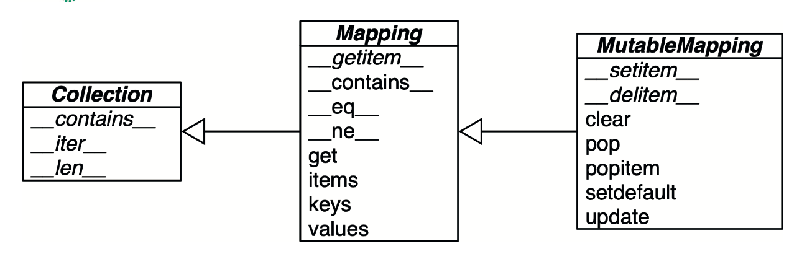
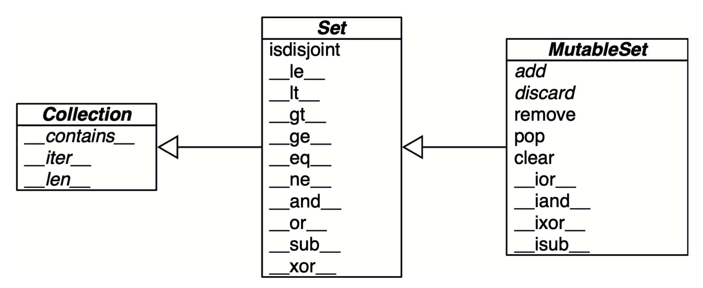

# Глава 3. Словари и множества

Встроенные типы, объекты и функции хранятся в словаре `__builtins__.__dict__`.

В силу своей важности словари в Python высокооптимизированы. В основе высокопроизводительных словарей лежат `хеш-таблицы`.

## Объединение отображений оператором |

В Python 3.9 поддерживаются операторы `|` и `|=` для объединения отображений.

```python
d1 = {'a': 1, 'b': 3}
d2 = {'a': 2, 'b': 4, 'c': 6}
print(d1 | d2)
```

```bash
{'a': 2, 'b': 4, 'c': 6}
```

Для модификации уже имеющегося отображения на месте служит оператор `|=`. Продолжим предыдущий пример – содержимое `d1` изменилось, хотя переменная осталась той же:

```python
d1 = {'a': 1, 'b': 3}
print(d1)

d1 |= d2
print(d1)
```

```bash
{'a': 1, 'b': 3}
{'a': 2, 'b': 4, 'c': 6}
```

## Сопоставление с отображение-образцом

Предложение `match/case` поддерживает субъекты, являющиеся отображениями. Отображения-образцы выглядят как литералы типа `dict`, но могут сопоставляться с экземплярами любого реального или виртуального подкласса `collections.abc.Mapping`.

```python
def get_creators(record: dict) -> list:
    match record:
        case {'type': 'book', 'api': 2, 'authors': [*names]}:
            return names
        case {'type': 'book', 'api': 1, 'author': name}:
            return [name]
        case {'type': 'book'}:
            raise ValueError(f"Invalid 'book' record: {record!r}")
        case {'type': 'movie', 'director': name}:
            return [name]
        case _:
            raise ValueError(f'Invalid record: {record! r}')
```

Теперь посмотрим, как функция `get_creators` обрабатывает некоторые тесты.

```python
b1 = dict(api=1, author='Douglas Hofstadter',
          type='book', title='Gödel, Escher, Bach')
print(get_creators(b1))
from collections import OrderedDict
b2 = OrderedDict(api=2, type='book',
                 title='Python in a Nutshell',
                 authors='Martelli Ravenscroft Holden'.split())
print(get_creators(b2))
get_creators({'type': 'book', 'pages': 770})
get_creators('Spam, spam, spam')
```

```bash
['Douglas Hofstadter']
['Martelli', 'Ravenscroft', 'Holden']
Traceback (most recent call last):
    ValueError: Invalid 'book' record: {'type': 'book', 'pages': 770}
Traceback (most recent call last):
    ValueError: Invalid record: 'Spam, spam, spam'
```

В отличие от последовательностей-образцов, сопоставление с отображениями-образцами считается успешным даже в случае частичного совпадения. В тестах субъекты `b1` и `b2` включают ключ `title`, отсутствующий в образце `book`, и тем не менее сопоставление успешно.

Использовать аргумент `**extra` для сопоставления с лишними парами ключ-значение необязательно, но если вы хотите собрать их в словарь, то можете указать одну переменную с префиксом `**`. Она должна быть последней в образце, а конструкция `**_` запрещена ввиду своей избыточности. Вот простой пример:

```python
food = dict(category='ice cream', flavor='vanilla', cost=199)
match food:
    case {'category': 'ice cream', **details}:
        print(f'Ice cream details: {details}')
```

```bash
Icde cream details: {'flavor': 'vanilla', 'cost': 199}
```

## Стандартный Api типов отображений

Модуль `collections.abc` содержит абстрактные базовые классы `Mapping` и `MutableMapping`, формализующие интерфейсы типа `dict` и родственных ему. 



*Упрощенная UML-диаграмма класса `MutableMapping` и его суперклассов из модуля `collections.abc` (стрелки ведут от подклассов к суперклассам, курсивом набраны имена абстрактных классов и абстрактных методов)*

Основная ценность ABC – документирование и формализация минимального интерфейса отображений, а также использование в тестах с помощью функции `isinstance` в тех программах, которые должны поддерживать произвольные отображения:

```python
my_dict = {}
print(isinstance(my_dict, abc.Mapping))
print(isinstance(my_dict, abc.MutableMapping))
```

```bash
True
True
```

Чтобы реализовать свое отображение, проще расширить класс `collections.UserDict` или обернуть `dict` с помощью композиции, чем создавать подклассы этих ABC. Класс `collections.UserDict` и все конкретные классы отображений в стандартной библиотеке инкапсулируют базовый словарь `dict`, который, в свою очередь, основан на хеш-таблице.

## Что значит «хешируемый»?

Вот часть определения хешируемости, взятая из [глоссария Python](https:// docs.python.org/3/glossary.html#term-hashable):

> Объект называется хешируемым, если имеет хеш-код, который не изменяется на протяжении всего времени его жизни (у него должен быть метод `__hash__()`), и допускает сравнение с другими объектами (у него должен быть метод `__eq__()`). Если в результате сравнения хешируемых объектов оказывается, что они равны, то и их хеш-коды должны быть равны.

Все числовые типы и плоские неизменяемые типы `str` и `bytes` являются хешируемыми. Объект типа `frozenset` всегда хешируемый, потому что его элементы должны быть хешируемыми по определению. Объект типа `tuple` является хешируемым только тогда, которые хешируемы все его элементы.

```python
tt = (1, 2, (30, 40))
print(hash(tt)) 
tl = (1, 2, [30, 40])
print(hash(tl))
tf = (1, 2, frozenset([30, 40]))
print(hash(tf))
```

```bash
8027212646858338501
Traceback (most recent call last):
    File "<stdin>", line 1, in <module> TypeError: unhashable type:
    'list'
-4118419923444501110
```

Любой пользовательский тип является хешируемым по определению, потому что его хеш-значение равно `id()`, а метод `__eq__()`, унаследованный от класса `object`, просто сравнивает идентификаторы объектов. Если объект реализует пользовательский метод `__eq__()`, учитывающий внутреннее состояние, то он будет хешируемым, только если его метод `__hash__()` всегда возвращает один и тот же хеш-код. На практике это требование означает, что методы `__eq__()` и `__hash__()` должны принимать во внимание только те атрибуты экземпляра, которые не изменяются на протяжении всей жизни объекта.

## Обзор наиболее употребительных методов отображений

Базовый API отображений очень хорошо развит. В табл. 3.1 показаны методы, реализованные в классе `dict` и двух его самых полезных разновидностях: `defaultdict` и `OrderedDict` (тот и другой определены в модуле `collections`).

**Таблица 3.1.** Методы типов отображений `types` `dict`, `collections`.`defaultdict` и `collections`. OrderedDict (для краткости методы, унаследованные от `object`, опущены); необязательные аргументы заключены в квадратные скобки

|                                  | dict  | defaultdict  | OrderedDict  |                                                                                                                               |
|----------------------------------|-------|--------------|--------------|-------------------------------------------------------------------------------------------------------------------------------|
| `d.clear()`                      | ●     | ●            | ●            | Удаление всех элементов                                                                                                       |
| `d.__contains__(k)`              | ●     | ●            | ●            | `k` входит в `d`                                                                                                              |
| `d.copy()`                       | ●     | ●            | ●            | Поверхностная копия                                                                                                           |
| `d.__copy__()`                   |       | ●            | ●            | Поддержка `copy.copy`                                                                                                         |
| `d.default_factory`              |       | ●            |              | Вызываемый объект, к которому обращается метод `__missing__` в случае отсутствия значения                                     |
| `d.__delitem__(k)`               | ●     | ●            | ●            | `del d[k]` – удаление элемента с ключом `k`                                                                                   |
| `d.fromkeys(itm, [initial])`     | ●     | ●            | ●            | Новое отображение, ключи которого поставляет итерируемый объект, и с необязательным начальным значением (по умолчанию `None`) |
| `d.get(k, [default])`            | ●     | ●            | ●            | Получить элемент с ключом `k`, а если такой ключ отсутствует, вернуть `default` или `None`                                    |
| `d.__getitem__(k)`               | ●     | ●            | ●            | `d[k]` – получить элемент с ключом `k`                                                                                        |
| `d.items()`                      | ●     | ●            | ●            | Получить представление элементов – множество пары `(key, value)`                                                              |
| `d.__iter__()`                   | ●     | ●            | ●            | Получение итератора по ключам                                                                                                 |
| `d.keys()`                       | ●     | ●            | ●            | Получить представление ключей                                                                                                 |
| `d.__len__()`                    | ●     | ●            | ●            | `len(d)` – количество элементов                                                                                               |
| `d.__missing__(k)`               |       | ●            |              | Вызывается, когда `__getitem__` не может найти элемент                                                                        |
| `d.move_to_end(k, [last])`       |       |              | ●            | Переместить ключ `k` в первую или последнюю позицию (last по умолчанию равно `True`)                                          |
| `d.__or__(other)`                | ●     | ●            | ●            | Поддерживает операцию `d1                                                                                                     | d2`, создающую объединение `d1` и `d2` (Python ≥ 3.9) |
| `d.__ior__(other)`               | ●     | ●            | ●            | Поддерживает операцию `d1                                                                                                     |= d2`, добавляющую в `d1` содержимое `d2` (Python ≥ 3.9) |
| `d.pop(k, [default])`            | ●     | ●            | ●            | Удалить и вернуть значение с ключом `k`, а если такой ключ отсутствует, вернуть `default` или `None`                          |
| `d.popitem()`                    | ●     | ●            | ●            | Удалить и вернуть произвольный элемент `(key, value)`                                                                         |
| `d.__reversed__()`               |       |              | ●            | Получить итератор для перебора ключей от последнего к первому вставленному                                                    |
| `d.__ror__(other)`               | ●     | ●            | ●            | Поддерживает операцию `other                                                                                                  | d` – оператор инверсного объединения (Python ≥ 3.9) |
| `d.setdefault(k, [default])`     | ●     | ●            | ●            | Если `k` принадлежит `d`, вернуть `d[k]`, иначе положить `d[k] = default` и вернуть это значение                              |
| `d.__setitem__(k, v)`            | ●     | ●            | ●            | `d[k] = v` – поместить `v` в элемент с ключом `k`                                                                             |
| `d.update(m, [**kargs])`         | ●     | ●            | ●            | Обновить `d` элементами из отображения или итерируемого объекта, возвращающего пары `(key, value)`                            |
| `d.values()`                     | ●     | ●            | ●            | Получить представление значений                                                                                               |


То, как метод `d.update(m)` трактует свой первый аргумент `m`, – яркий пример **утиной типизации** (duck typing): сначала проверяется, есть ли у `m` метод `keys`, и если да, то предполагается, что это отображение. В противном случае `update()` производит обход `m` в предположении, что элементами являются пары `(key, value)`.

## Вставка и обновление изменяемых значений

В полном соответствии с философией быстрого отказа доступ к словарю `dict` с помощью конструкции `d[k]`возбуждает исключение,если ключ `k` отсутствует. Любой питонист знает об альтернативной конструкции `d.get(k, default)`, которая применяется вместо `d[k]`, если иметь значение по умолчанию удобнее, чем обрабатывать исключение `KeyError`. Однако если нужно обновить изменяемое значение, то есть способ лучше.

В примере ниже показан неоптимальный скрипт, демонстрирующий одну ситуацию, когда `dict.get` – не лучший способ обработки отсутствия ключа. Он основан на примере [Алекса Мартелли](http://www.aleax.it/Python/accu04_Relearn_Python_alex.pdf)

```python
"""Строит индекс, отображающий слово на список его вхождений"""

import re import sys
WORD_RE = re.compile(r'\w+')
index = {}
with open(sys.argv[1], encoding='utf-8') as fp:
    for line_no, line in enumerate(fp, 1):
        for match in WORD_RE.finditer(line):
            word = match.group()
            column_no = match.start() + 1
            location = (line_no, column_no)
            # некрасиво; написано только для демонстрации идеи
            occurrences = index.get(word, [])
            occurrences.append(location)
            index[word] = occurrences
# напечатать в алфавитном порядке
for word in sorted(index, key=str.upper):
    print(word, index[word])
```

1. Получить список вхождений слова `word` или `[]`, если оно не найдено.
2. Добавить новое вхождение в occurrences.
3. Поместить модифицированный список `occurrences` в словарь `dict`; при этом
   производится второй поиск в индексе.
4. При задании аргумента `key` функции `sorted` мы не вызываем `str.upper`, а только передаем ссылку на этот метод, чтобы `sorted` могла нормализовать слова перед сортировкой

Три строчки, относящиеся к обработке `occurrences` в примере можно заменить одной, воспользовавшись методом `dict.setdefault`.

```python
'''Строит индекс, отображающий слово на список его вхождений'''
import re import sys

WORD_RE = re.compile(r'\w+')
index = {}
with open(sys.argv[1], encoding='utf-8') as fp:
    for line_no, line in enumerate(fp, 1):
        for match in WORD_RE.finditer(line):
            word = match.group()
            column_no = match.start() + 1
            location = (line_no, column_no)
            index.setdefault(word, []).append(location)

# напечатать в алфавитном порядке
for word in sorted(index, key=str.upper):
    print(word, index[word])
```

Получить список вхождений слова `word` или установить его равным `[]`, если слово не найдено; `setdefault` возвращает значение, поэтому список можно обновить без повторного поиска.

Иными словами, строка...
```python
my_dict.setdefault(key, []).append(new_value)
```
... дает такой же результат, как ...
```python
if key not in my_dict:
    my_dict[key] = []
my_dict[key].append(new_value)
```

## Автоматическая обработка отсутствующих ключей

### defaultdict: еще один подход к обработке отсутствия ключа

Экземпляр класса `collections.defaultdict` создает элементы, имеющие значение по умолчанию, динамически, если при использовании конструкции `d[k]` ключ не был найден.

Работает это следующим образом: при конструировании объекта `defaultdict` задается вызываемый объект, который порождает значение по умолчанию всякий раз, как методу `__getitem__` передается ключ, отсутствующий в словаре.

Вызываемый объект, порождающий значения по умолчанию, хранится в атрибуте экземпляра `default_factory`.

```python
"""Строит индекс, отображающий слово на список его вхождений"""

import collections import re
import sys

WORD_RE = re.compile(r'\w+')
index = collections.defaultdict(list)
with open(sys.argv[1], encoding='utf-8') as fp:
    for line_no, line in enumerate(fp, 1):
        for match in WORD_RE.finditer(line):
            word = match.group()
            column_no = match.start() + 1
            location = (line_no, column_no)
            index[word].append(location)
# напечатать в алфавитном порядке
for word in sorted(index, key=str.upper):
    print(word, index[word])
```

> Атрибут `default_factory` объекта `defaultdict` вызывается только для того, чтобы предоставить значение по умолчанию при обращении к методу `__getitem__` и только к нему. Например, если `dd` – объект класса `defaultdict` и `k` – отсутствующий ключ, то при вычислении выражения `dd[k]` происходит обращение к `default_factory` для создания значения по умолчанию, а вызов `dd.get(k)` все равно возвращает `None` и `k in dd` равно `False`.

### Метод __missing__ {id="missing_method"}

В основе механизма обработки отсутствия ключей в отображениях лежит метод, которому как нельзя лучше подходит имя `__missing__`. Он не определен в базовом классе `dict`, но `dict` знает о нем: если создать подкласс `dict` и реализовать в нем метод `__missing__`, то стандартный метод `dict.__getitem__` будет обращаться к нему всякий раз, как не найдет ключ, – вместо того чтобы возбуждать исключение `KeyError`.

Конкретный пример дает библиотека работы с устройствами для IoT, в которой программируемая плата с контактами ввода-вывода общего назначения (например, Raspberry Pi или Arduino) представлена объектом класса `Board` с атрибутом `my_board.pins`, который является отображением идентификаторов физических контактов на программные объекты контактов. Идентификатор физического контакта может задаваться числом или строкой вида "`A0`" либо "`P9_12`". Для единообразия желательно, чтобы все ключи `board.pins` были строками, но хорошо бы, чтобы и обращение вида `my_arduino.pin[13]` тоже работало, тогда начинающие не будут впадать в ступор, желая зажечь светодиод, подключенный к контакту `13` на плате Arduino.

**Пример. Класс `StrKeyDict0` преобразует нестроковые ключи в тип `str` во время поиска**

```python
class StrKeyDict0(dict):
    def __missing__(self, key):
        if isinstance(key, str):
            raise KeyError(key)
       return self[str(key)]

    def get(self, key, default=None):
        try:
            return self[key]
        except KeyError:
            return default
        
    def __contains__(self, key):
        return key in self.keys() or str(key) in self.keys()
```

Без проверки `isinstance(key, str)` метод `__missing__` работал бы для любого ключа `k` – не важно, принадлежит он типу `str` или нет, – если только `str(k)` порождает существующий ключ. Но если ключ `str(k)` не существует, то возникла бы бесконечная рекурсия. В последней строке вычисление `self[str(key)]` привело бы к вызову `__getitem__` с параметром, равным строковому представлению ключа, а это, в свою очередь, – снова к вызову `__missing__`.
Метод `__contains__` в этом примере также необходим для обеспечения согласованного поведения, потому что его вызывает операция `k in d`, однако реализация данного метода, унаследованная от `dict`, не обращается к `__missing__` в случае отсутствия ключа. В нашей реализации `__contains__` есть тонкий нюанс: мы не проверяем наличие ключа принятым в Python способом – `k in my_dict` – потому что конструкция `str(key) in self` привела бы к рекурсивному вызову `__contains__`. Чтобы избежать этого, мы явно ищем ключ в `self.keys()`.
Поиск вида `k in my_dict.keys()` эффективен в Python 3 даже для очень больших отображений, потому что `dict.keys()` возвращает представление, похожее на множество. Однако не забывайте, что `k in my_dict` делает то же самое, причем быстрее, потому что не нужно искать среди атрибутов метод `.keys()`.

### Несогласованное использование __missing__ в стандартной библиотеке {id="except_missing"}

**Подкласс `dict`**

Подкласс `dict`, в котором реализован только метод `__missing__` и никаких других. В этом случае `__missing__` может вызываться лишь при использовании конструкции `d[k]`, которая обращается к методу `__getitem__`, унаследованному от `dict`.

**Подкласс `collections.UserDict`**

Подкласс `UserDict`, в котором реализован только метод `__missing__` и никаких других. В этом случае метод `get`, унаследованный от `UserDict`, вызывает `__getitem__`. Это значит, что `__missing__` может вызываться для обработки поиска с помощью конструкций `d[k]` или `d.get(k)`.

**Подкласс `abc.Mapping` с простейшим `__getitem__`**

Минимальный подкласс `abc.Mapping`, в котором реализован метод `__missing__` и необходимые абстрактные методы, в т. ч. имеется реализация `__getitem__`, не обращающаяся к `__missing__`. В таком классе метод `__missing__` никогда не вызывается.

**Подкласс `abc.Mapping` с `__getitem__`, вызывающим `__missing__`**

Минимальный подкласс `abc.Mapping`, в котором реализован метод `__missing__` и необходимые абстрактные методы, в т. ч. имеется реализация `__getitem__`, обращающаяся к `__missing__`. В таком классе метод `__missing__` вызывается, когда поиск производится с помощью конструкций `d[k]`, `d.get(k)` и `k in d`.

## Вариации на тему dict

### collections.OrderedDict

Поскольку начиная с версии Python 3.6 встроенный словарь `dict` также хранит ключи упорядоченными, использовать `OrderedDict` имеет смысл главным образом для поддержания обратной совместимости с предыдущими версиями. Тем не менее в документации приводится несколько оставшихся различий между `dict` и `OrderedDict`, которые я повторю здесь, перечислив в порядке, отвечающем частоте использования в повседневной практике.

- Оператор равенства в классе `OrderedDict` проверяет, что порядок следования ключей одинаков.
- Метод `popitem()` в классе `OrderedDict` имеет другую сигнатуру. Он принимает необязательный аргумент, указывающий, какой элемент извлечь.
- В классе `OrderedDict` имеется метод `move_to_end()`, который эффективно переходит к последнему элементу в словаре.
- При проектировании обычного `dict` на первое место ставилась высокая эффективность операций отображения, а отслеживание порядка вставки было вторичным.
- При проектировании `OrderedDict` на первое место ставилась высокая эффективность операций переупорядочения, а эффективность использования памяти, скорость итерирования и производительность операций обновления были вторичны.
- Алгоритмически `OrderedDict` справляется с частыми операциями переупорядочения лучше, чем `dict`. Поэтому он подходит для отслеживания не- давних операций доступа (например, в LRU-кеше).

### collections.ChainMap
Хранит список отображений, так что их можно просматривать как единое целое. Поиск производится в каждом отображении в порядке их перечисления в конструкторе и завершается успешно, если ключ найден хотя бы в одном. Например:

```python
d1 = dict(a=1, b=3)
d2 = dict(a=2, b=4, c=6)

from collections import ChainMap

chain = ChainMap(d1, d2)
print(chain['a'])
print(chain['c'])
```

```bash
1
6
```

Экземпляр `ChainMap` не копирует входные отображения, а хранит ссылки на них. Все модификации и вставки `ChainMap` применяются только к первому из входных отображений. Продолжим предыдущий пример:

```python
chain['c'] = -1
print(d1)
print(d2)
```

```bash
{'a': 1, 'b': 3, 'c': -1}
{'a': 2, 'b': 4, 'c': 6}
```

`ChainMap` полезен при реализации интерпретаторов языков с вложенными областями видимости, когда каждая область видимости представлена отдельным отображением, в направлении от самого внутреннего к самому внешнему.

### collections.Counter

Отображение, в котором с каждым ключом ассоциирован счетчик. Обновление существующего ключа увеличивает его счетчик. Этот класс можно использовать для подсчета количества хешируемых объектов или в качестве мультимножества. В классе `Counter` реализованы операторы `+` и `-` для объединения серий и другие полезные методы, например `most_common([n])`, который возвращает упорядоченный список кортежей, содержащий `n` самых часто встречающихся элементов вместе с их счетчиками.

```python
ct = collections.Counter('abracadabra')
print(ct)
ct.update('aaaaazzz')
print(ct)
print(ct.most_common(3))
```

```bash
Counter({'a': 5, 'b': 2, 'r': 2, 'c': 1, 'd': 1})
Counter({'a': 10, 'z': 3, 'b': 2, 'r': 2, 'c': 1, 'd': 1})
[('a', 10), ('z', 3), ('b', 2)]
```
Обратите внимание, что оба ключа `b` и `r` делят третье место, но `ct.most_ common(3)` показывает только три счетчика.

### shelve.Shelf

Модуль `shelve` из стандартной библиотеки предоставляет постоянное хранилище для отображения строковых ключей на объекты Python, сериализованные в двоичном формате `pickle`. Название `shelve` (полка) – намек на то, что банки с соленьями (`pickle`) хранятся на полках.

Функция уровня модуля `shelve.open` возвращает экземпляр `shelve.Shelf` – простую базу ключей и значений, поддерживаемую модулем `dbm` и обладающую следующими свойствами:
- `shelve.Shelf` является подклассом `abc.MutableMapping`, т. е. предоставляет основные методы, ожидаемые от типа отображения;
- кроме того, `shelve.Shelf` предоставляет еще несколько методов для управления вводом-выводом, например `sync` и `close`;
- экземпляр `Shelf` является контекстным менеджером, поэтому его можно включать в блок `with`, гарантирующий закрытие после использования;
- ключи и значения сохраняются при каждом присваивании нового значения ключу. Ключи должны быть строками;
- значения должны быть объектами, которые модуль `pickle` умеет сериализовывать.

> Модуль `pickle` легко использовать в простых случаях, но у него есть несколько недостатков. Прочитайте статью Нэда Бэтчелдера [«Pickle’s nine flaws»](https://nedbatchelder.com/blog/202006/pickles_nine_flaws.html), прежде чем принимать любое решение, подразумевающее использование `pickle`.

## Создание подкласса UserDict вместо dict

Рекомендуется создавать новый тип отображения путем расширения класса `collections.UserDict`, а не `dict`.
Основная причина, по которой предпочтительнее наследовать классу `UserDict`, а не `dict`, заключается в том, что в реализации `dict` некоторые углы срезаны, что вынуждает нас переопределять методы, которые можно без всяких проблем унаследовать от `UserDict`.
Отметим, что `UserDict` не наследует `dict`, а пользуется композицией: хранит в атрибуте `data` экземпляр `dict`, где и находятся сами элементы. Это позволяет избежать нежелательной рекурсии при кодировании таких специальных методов, как `__setitem__`, и упрощает код `__contains__`.


**Пример. `StrKeyDict` всегда преобразует нестроковые ключи в тип `str` – при вставке, обновлении и поиске**

```python
import collections

class StrKeyDict(collections.UserDict):
    def __missing__(self, key):
        if isinstance(key, str):
            raise KeyError(key)
        return self[str(key)]

    def __contains__(self, key):
        return str(key) in self.data

    def __setitem__(self, key, item):
        self.data[str(key)] = item
```

Поскольку `UserDict` – подкласс `MutableMapping`, остальные методы, благодаря которым `StrKeyDict` является полноценным отображением, наследуются от `UserDict`, `MutableMapping` или `Mapping`. В двух последних есть несколько полезных конкретных методов, хотя они и являются абстрактными базовыми классами (ABC). Стоит отметить следующие методы.

- `MutableMapping.update`

    Этот метод можно вызывать напрямую, но им также пользуется метод `__init__` для инициализации экземпляра другими отображениями, итерируемыми объектами, порождающими пары `(key, value)`, и именованными аргументами. Поскольку для добавления элементов он использует конструкцию `self[key] = value`, то в конечном итоге будет вызвана наша реализация `__setitem__`.

- `Mapping.get`

    В предыдущих примерах в классе `StrKeyDict0` мы вынуждены были самостоятельно написать метод `get`, чтобы получаемые результаты были согласованы с `__getitem__`, но в последнем примере мы унаследовали `Mapping.get`, который реализован в точности так, как `StrKeyDict0.get`

## Представления словаря

Такие методы `dict`, как `.keys()`, `.values()` и `.items()`, возвращают экземпляры классов `dict_keys`, `dict_values` и `dict_items` соответственно. Эти представления словаря – проекции внутренних структур данных, используемых в реализации `dict`, допускающие только чтение.

Объект представления – это динамический прокси-объект. Если исходный словарь изменился, то изменения сразу же становятся видны через имеющееся представление.

Классы `dict_keys`, `dict_values` и `dict_items` внутренние: они недоступны через `__builtins__` или какой-либо модуль из стандартной библиотеки. Даже получив ссылку на любой из них, вы не сможете воспользоваться ей в коде на Python, чтобы создать новое представление.

Класс `dict_values` – простейшее из представлений словарей: он реализует только специальные методы `__len__`, `__iter__` и `__reversed__`. Классы `dict_keys` и `dict_items` дополнительно реализуют несколько методов множества – почти столько же, сколько класс `frozenset`.

## Практические последствия внутреннего устройства класса dict {id="inner_construct_dict"}

Реализация класса Python dict на основе хеш-таблиц очень эффективна, но важно понимать, какие последствия вытекают из такого проектного решения.

- Ключи должны быть хешируемыми объектами. Они должны правильно реализовывать методы `__hash__` и `__eq__`.
- Доступ к элементу по ключу производится очень быстро. Словарь может содержать миллионы ключей, но Python для нахождения ключа нужно только вычислить хеш-код ключа и получить по нему смещение относительно начала хеш-таблицы; возможно, еще придется выполнить несколько попыток, чтобы добраться до нужной записи.
- Порядок ключей сохраняется, это побочный эффект более компактного размещения словаря в памяти, реализованного в CPython 3.6 и ставшего официальной особенностью языка в версии 3.7.
- Несмотря на новое компактное размещение, словарям внутренне присущи большие накладные расходы на хранение в памяти. Самой компактной внутренней структурой данных для контейнера был бы массив указателей на элементы. По сравнению с этим хеш-таблица должна хранить больше данных на каждую запись, причем хотя бы треть записей должна оставаться незаполненной, чтобы интерпретатор мог работать эффективно.
- Для экономии памяти избегайте создания атрибутов экземпляров вне метода `__init__`.

## Теория множеств

Множества – сравнительно недавнее добавление к Python, которое используется недостаточно широко. Тип `set` и его неизменяемый вариант `frozenset` впервые появились в виде модуля в Python 2.3, а в Python 2.6 были «повышены» до встроенных типов.

Множество – это набор уникальных объектов. Поэтому один из основных способов его использования – устранение дубликатов.

```python
l = ['spam', 'spam', 'eggs', 'spam', 'bacon', 'eggs']
print(set(l))
print(list(set(l)))
```

```bash
{'eggs', 'spam', 'bacon'}
['eggs', 'spam', 'bacon']
```

Элементы множества должны быть хешируемыми. Сам тип `set` хешируемым не является, поэтому объекты set не могут вложенными. Но тип `frozenset` хешируемый, поэтому элементами `set` могут быть объекты типа `frozenset`.

Помимо гарантии уникальности, типы множества предоставляют набор теоретико-множественных операций, в частности инфиксные операции: если `a` и `b` – множества,то `a | b` – их объединение, `a & b` – пересечение, а `a - b` – разность.

## Литеральные множества

Синтаксис литералов типа `set` – `{1}`,` {1, 2}` и т. д. – выглядит в точности как математическая нотация, за одним важным исключением: не существует литерального обозначения пустого множества, в таком случае приходится писать `set()`.


Литеральный синтаксис множеств вида `{1, 2, 3}` быстрее и понятнее, чем вызов конструктора (например, `set([1, 2, 3])`). При этом вторая форма медленнее, потому что для вычисления такого выражения Python должен найти класс `set` по имени, чтобы получить его конструктор, затем построить список и, наконец, передать этот список конструктору. А при обработке литерала `{1, 2, 3}` Python исполняет специализированный байт-код `BUILD_SET`.

Не существует специального синтаксиса для литералов, представляющих `frozenset`, – их приходится создавать с помощью конструктора. И стандартное строковое представление в Python 3 выглядит как вызов конструктора `frozenset`. Ниже показан пример в сеансе оболочки:
```python
print(frozenset(range(10)))
```

```bash
frozenset({0, 1, 2, 3, 4, 5, 6, 7, 8, 9})
```

## Множественное включение

Множественное включение (`setcomp`) было добавлено еще в версии Python 2.7 наряду со словарным включением.

```python
from unicodedata import name

result = {chr(i) for i in range(32, 256) if 'SIGN' in name(chr(i),'')}
print(result)
```

```bash
{'§', '=', '¢', '#', '¤', '<', '¥', 'μ', '×', '$', '¶', '£', '©', '°',
 '+', '÷', '±', '>', '£', '®', '%'}
```

## Практические последствия внутреннего устройства класса set

Типы `set` и `frozenset` реализованы с помощью хеш-таблиц. Отсюда вытекает ряд следствий.

Элементы множества должны быть хешируемыми объектами. Ключи должны быть хешируемыми объектами. Они должны правильно реализовывать методы `__hash__` и `__eq__`.
- Проверка на членство производится очень эффективно. Множество может содержать миллионы элементов, но для нахождения элемента нуж- но только вычислить его хеш-код и получить по нему смещение относительно начала хеш-таблицы; возможно, еще придется выполнить не- сколько попыток, чтобы добраться до нужного элемента или убедиться, что его не существует.
- Множествам присущи большие накладные расходы на хранение в памяти по сравнению с низкоуровневым массивом указателей на элементы, что было бы компактнее, но резко замедлило бы поиск, если число элементов в множестве сколько-нибудь велико.
- Порядок элементов зависит от порядка вставки, но опираться на эту зависимость не рекомендуется, т. к. это ненадежно. Если два элемента различны, но имеют одинаковый хеш-код, то их взаимное расположение зависит от того, какой элемент был добавлен первым.
- Добавление элементов в множество может изменить порядок уже присутствующих в нем элементов. Это связано с тем, что эффективность алгоритма падает, когда хеш-таблица заполнена на две трети или более, поэтому Python приходится увеличивать размер таблицы по мере ее роста, что влечет за собой перемещение в памяти. Когда такое происходит, элементы вставляются заново, и их относительный порядок может измениться.

## Операции над множествами

На рисунке ниже приведена сводка методов, которые имеются у изменяемых и неизменяемых множеств. Многие из них – специальные методы, поддерживающие перегрузку операторов.

Многие из них – специальные методы, поддерживающие перегрузку операторов. В табл. 3.2 показаны математические операции над множествами, которым соответствуют какие-то операторы или методы в Python. Отметим, что некоторые операторы и методы изменяют конечное множество на месте (например, `&=`, `difference_update` и т. д.). Таким операциям нет места в идеальном мире математических множеств, и в классе `frozenset` они не реализованы.



*UML-диаграмма класса `MutableSet` и его суперклассов из модуля `collections.abc`*

**Таблица 3.2**. Математические операции над множествами: эти методы либо порождают
новое множество, либо модифицируют конечное множество на месте (если оно изменяемое)

| Мат. символ   | Оператор Python | Метод                                     | Описание                                                                                                               |
|---------------|-----------------|-------------------------------------------|------------------------------------------------------------------------------------------------------------------------|
| `S ∩ Z`       | `s & z`         | `s.__and__(z)`                            | Пересечение `s` и `z`                                                                                                  |
|               |                 | `s.intersection(it,...)`                  | Пересечение `s` и всех множеств, построенных из итерируемых объектов `it` и т. д.                                      |
|               | `s &= z`        | `s.__iand__(z)`                           | Замена `s` пересечением `s` и `z`                                                                                      |
|               |                 | `s.intersection_update(it,...)`           | Замена `s` пересечением `s` и всех множеств, построенных из итерируемых объектов `it` и т. д.                          |
| `S ∪ Z`       | `s              | z`                                        | `s.__or__(z)`                                                                                                          | Объединение `s` и `z`                                                                                                |
|               | `z              | s`                                        | `z.__ror__(s)`                                                                                                         | Инверсный оператор `|`                                                                                              |
|               |                 | `s.union(it,...)`                         | Объединение `s` и всех множеств, построенных из итерируемых объектов `it` и т. д.                                      |
|               | `s              | = z`                                      | `s.__ior__(z)`                                                                                                         | Замена `s` объединением `s` и `z`                                                                                    |
|               |                 | `s.update(it,...)`                        | Замена `s` объединением `s` и всех множеств, построенных из итерируемых объектов `it` и т. д.                          |
| `S \ Z`       | `s - z`         | `s.__sub__(z)`                            | Относительное дополнение или разность `s` и `z`                                                                        |
|               | `z - s`         | `z.__rsub__(s)`                           | Инверсный оператор `-`                                                                                                 |
|               |                 | `s.difference(it,...)`                    | Разность между `s` и всеми множествами, построенными из итерируемых объектов `it` и т. д.                              |
|               | `s -= z`        | `s.__isub__(z)`                           | Замена `s` разностью между `s` и `z`                                                                                   |
|               |                 | `s.difference_update(it,...)`             | Замена `s` разностью между s и всеми множествами, построенными из итерируемых объектов `it` и т. д.                    |
|               |                 | `s.symmetric_difference(it)`              | Дополнение `s & set(it)`                                                                                               |
| `S Δ Z`       | `s ^ z`         | `s.__xor__(z)`                            | Симметрическая разность (дополнение пересечения `s & z`)                                                               |
|               | `z ^ s`         | `z.__rxor__(s)`                           | Инверсный оператор `^`                                                                                                 |
|               |                 | `s.symmetric_difference_ update(it,...)`  | Замена `s` симметрической разностью между `s` и всеми множествами, построенными из итерируемых объектов `it` и т. д.   |
|               | `s ^= z`        | `s.__ixor__(z)`                           | Замена s симметрической разностью между `s` и `z`                                                                      |
| `S ∩ Z = ∅`   |                 | `s.isdisjoint(z)`                         | `s` и `z` дизъюнктны (т. е. не пересекаются)                                                                           |
| `e ∈ Z`       | `e in s`        | `s.__contains__(e)`                       | `e` является элементом `s`                                                                                             |
| `S ⊆ Z`       | `s <= z`        | `s.__le__(z)`                             | `s` является подмножеством `z`                                                                                         |
|               |                 | `s.issubset(it)`                          | `s` является подмножеством множества `z`, построенного из итерируемого объекта `it`                                    |
| `S ⊂ Z`       | `s < z`         | `s.__lt__(z)`                             | `s` является собственным подмножеством `z`                                                                             |
| `S ⊇ Z`       | `s >= z`        | `s.__ge__(z)`                             | `s` является надмножеством `z`                                                                                         |
|               |                 | `s.issuperset(it)`                        | `s` является надмножеством множества `z`, построенного из итерируемого объекта `it`                                    |
| `S ⊃ Z`       | `s > z`         | `s.__gt__(z)`                             | `s` является собственным надмножеством `z`                                                                             |

Помимо теоретико-множественных операторов и методов, типы множеств реализуют и другие методы, полезные на практике. Они сведены в табл. 3.4.

**Таблица 3.4.** Дополнительные методы множеств

|                | set  | frozenset | Описание                                                                                |
|----------------|------|-----------|-----------------------------------------------------------------------------------------|
| `s.add(e)`     | ●    |           | Добавить элемент `e` в `s`                                                              |
| `s.clear()`    | ●    |           | Удалить все элементы из `s`                                                             |
| `s.copy()`     | ●    | ●         | Поверхностная копия `s`                                                                 |
| `s.discard(e)` | ●    |           | Удалить элемент `e` из `s`, если он там присутствует                                    |
| `s.__iter__()` | ●    | ●         | Получить итератор для обхода `s`                                                        |
| `s.__len__()`  | ●    | ●         | `len(s)`                                                                                |
| `s.pop()`      | ●    |           | Удалить и вернуть элемент `s`, возбудив исключение `KeyError`, если `s` пусто           |
| `s.remove(e)`  | ●    |           | Удалить элемент `e` из `s`, возбудив исключение `KeyError`, если `e` отсутствует в `s`  |


## Теоретико-множественные операции над представлениями словарей 

В табл. 3.5 показано, что объекты представлений, возвращаемые методами `.keys()` и `.items()` объекта dict, удивительно похожи на `frozenset`.

|                              | frozenset  | dict_keys | dict_items | Описание                                                |
|------------------------------|------------|-----------|------------|---------------------------------------------------------|
| `s.__and__(z)`               | ●          | ●         | ●          | `s & z` (пересечение `s` и `z`)                         |
| `s.__rand__(z)`              | ●          |           |            | Инверсный оператор `&`                                  |
| `s.__contains__(e)`          | ●          | ●         | ●          | `e` является элементом `s`                              |
| `s.copy()`                   | ●          |           |            | Поверхностная копия `s`                                 |
| `s.difference(it, …)`        | ●          |           |            | Разность между `s` и итерируемыми объектами `it` и т.д. |
| `s.intersection(it, …)`      | ●          |           |            | Пересечение `s` и итерируемых объектов `it` и т.д.      |
| `s.isdisjoint(z)`            | ●          | ●         | ●          | `s` и `z` дизъюнкты (т.е. не имеют общих элементов)     |
| `s.issubset(it)`             | ●          |           |            | `s` является подмножеством итерируемого объекта `it`    |
| `s.issuperset(it)`           | ●          |           |            | `s` является надмножеством итерируемого объекта `it`    |
| `s.__iter__()`               | ●          | ●         | ●          | Получить итератор для обхода `s`                        |
| `s.__len__()`                | ●          | ●         | ●          | `len(s)`                                                |
| `s.__or__(z)`                | ●          | ●         | ●          | `s                                                      | z` (объединение `s` и `z`)                         |
| `s.__ror__(z)`               | ●          |           |            | Инверсный оператор `                                    |`                                 |
| `s.__reversed__()`           | ●          |           |            | Получить итератор для обхода `s` в обратном порядке     |
| `s.__rsub__(z)`              | ●          |           |            | Инверсный оператор `-`                                  |
| `s.__sub__(z)`               | ●          | ●         | ●          | `s - z` (разность `s` и `z`)                            |
| `s.symmetric_difference(it)` | ●          |           |            | Дополнение `s` и `set(it)`                              |
| `s.union(it, …)`             | ●          |           |            | Объединение `s` и итерируемых объектов `it` и т.д.      |
| `s.__xor__(z)`               | ●          | ●         | ●          | `s ^ z` (симметрическая разность `s` и `z`)             |
| `s.__rxor__(z)`              | ●          |           |            | Инверсный оператор `^`                                  |


В частности, `dict_keys` и `dict_items` реализуют специальные методы для поддержки операторов над множествами `&` (пересечение), `|` (объединение), `-` (разность) и `^` (симметрическая разность).

Например, с помощью `&` легко получить ключи, встречающиеся в двух словарях:

```python
d1 = dict(a=1, b=2, c=3, d=4)
d2 = dict(b=20, d=40, e=50)
print(d1.keys() & d2.keys())
```

```bash
{'b', 'd'}
```