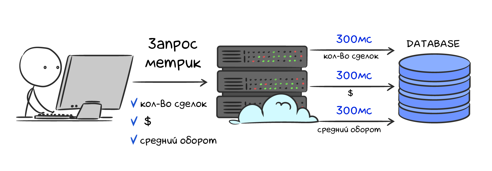

# Кэш

На сегодняшний день время отклика на запрос является критичной метрикой для любого проекта. Пользователи не очень любят, когда web-страница формируется долго (несколько секунд или дольше). Поэтому разработчики стремятся уменьшить время ответа на запрос клиента, для чего прибегают к кэшированию.

Представим, что разрабатывается торговая платформа и есть личный кабинет с аналитикой сделок пользователя. Нужно выводить количество сделок, прибыль, средний оборот и тд. Большинство метрик являются агрегационными, то есть их нужно вычислять. Если использовать только РСУБД, то среднее время ответа будет сотни миллисекунд, а при большой нагрузке — секунды. Можно подключить подходящие аналитические базы данных, но чаще всего это слишком дорого в средних проектах.



Самая распространенная практика решения сегодня — это кэш. Сложные вычисления кэшируются, то есть записываются в оперативную память. Обращение к оперативной памяти займет сотни наносекунд, примерно в миллион раз быстрее, чем вычислить данные из РСУБД. Новая схема взаимодействия будет включать кэширующий сервер. Алгоритм следующий:

1. клиент делает запрос
2. бекенд проверяет кэш. Если значение есть в кэше, то оно просто возвращается клиенту
3. если значения в кэше нет, то сервер вычисляет все из базы, записывает числа в кэш и отдает клиенту. Теперь все последующие запросы будут возвращать результаты вычислений из кэша


## Подводные камни

Как и любое решение в разработке, кэширование — не серебряная пуля и имеет свои недостатки. Несколько моментов, которые стоит держать в уме при использовании кэша:

- приложение должно уметь работать без кэша. Кэширующий сервер упал или недоступен? Пользователь все равно должен получать все данные просто с небольшой задержкой. Завязывать какую-то логику продукта на кэш (например, хранить данные аналитики только в кэше) — нельзя, потому что это ненадежное хранилище.
- с введением нового звена в архитектуру всегда следует усложнение разработки и поддержки продукта. Проверка и запись значений в кэше — это дополнительная логика в коде, которая требует дополнительного времени на тестирование и исправление потенциальных ошибок.
- сколько времени должно храниться значение в кэше? Что делать, если значение невалидно, так как пользователь открыл новую сделку или получил прибыль? Эти вопросы будут возникать постоянно, и в каждом проекте ответы будут уникальными.

## Redis как кэш

Redis чаще всего используют именно как кэширующий сервер. Он имеет богатый встроенный функционал для этих целей. Рассмотрим основные команды, с помощью которых кэшируют значения в Redis.

### Кэширование

Представим, что нужно записать количество сделок пользователя в кэш. Запишем, что у пользователя с ID **33** имеется **5** сделок. Используем обычную команду `set`:

```bash
127.0.0.1:6379> set user:33:deals_count 5
OK
```

Данные записаны. Однако они будут храниться вечно до следующей перезагрузки сервера или пока не будут удалены вручную. Одно из основных свойств кэша — это то, что он хранится короткий промежуток времени. Данных может быть много, а ресурсы серверов не бесконечны. К счастью в Redis можно указать время жизни ключа (время экспирации), по истечении которого ключ будет удален. Для этого достаточно добавить постфикс ex количество_секунд к команде `set`:

```bash
127.0.0.1:6379> set user:33:deals_count 5 ex 120
OK
```

Проверить, через сколько ключ удалится можно командой `ttl`:

```bash
127.0.0.1:6379> ttl user:33:deals_count
(integer) 115
```

В данном случае ключ `user:33:deals_count` исчезнет через **115** секунд.

Если попытаться получить значение спустя это время, то вернется пустой ответ:

```bash
127.0.0.1:6379> get user:33:deals_count
(nil)
```

Время жизни можно задавать не только в секундах, но и в миллисекундах с помощью префикса `px количество_миллисекунд`:

```bash
set user:33:deals_count 5 px 10000
```

Проверка времени жизни осуществляется командой `pttl`:

```bash
127.0.0.1:6379> pttl user:33:deals_count
(integer) 7484
```

Вывод выше показывает, что ключ `user:33:deals_count` исчезнет через **7484** миллисекунд (~7.4 секунд).

Для установки времени жизни для уже существующего ключа используется команда `expire`

```bash
set user:33:deals_count 5 ex 100
ttl user:33:deals_count
(integer) 99
expire user:33:deals_count 300
ttl user:33:deals_count
(integer) 298
```

## Инвалидация кэша

Любой кэш может стать неактуальным раньше времени жизни. В нашем примере со сделками это может произойти при возникновении новой сделки у пользователя. В этом случае нужно удалить ключ в кэше, чтобы при следующем запросе произошел пересчет значения. Может возникнуть вопрос: а почему бы просто не добавить значение в имеющийся ключ? В данном примере это было бы наилучшим решением, но действовать необходимо не «в лоб». При увеличении значения двумя командами `get` + `set` может получиться неконсистентное состояние (подробнее эта проблема будет рассмотрена в следующем уроке). Также обновление значения не всегда возможно, например, в случае если значение — это среднее арифметическое.

Удаление ключа происходит командой `del`:

```bash
127.0.0.1:6379> del user:33:deals_count
(integer) 1
```

Вернувшееся значение `1` означает, что ключ существовал и был успешно удален. Если ключа не было, то вернулся бы `0`.

Иногда требуется удалить тысячи ключей за раз. Например, у поставщика цен на акции произошел сбой и все сделки за период сбоя оказались недействительными. В этом случае нельзя использовать N вызовов команды `del`, потому что это будет выполняться очень долго и заберет все ресурсы Redis. Для множественного удаления существует команда `unlink`, которую можно безопасно использовать в продакшен-среде:

```bash
127.0.0.1:6379> unlink user:1:deals_count user:2:deals_count user:3:deals_count
(integer) 1
```

Все ключи для удаления указываются через пробел. Стоит учитывать, что ключи удаляются асинхронно, то есть могут существовать после `unlink` короткий промежуток времени.

## Резюме

- кэш ускоряет время ответа клиенту, но не заменяет надежных хранилищ
- в Redis ключ с временем жизни в секундах записывается командой `set ключ значение ex количество_секунд`, а в миллисекундах командой `set ключ значение px количество_миллисекунд`
- инвалидация — неотъемлемая часть работы с кэшем. Чтобы удалить атомарный ключ, используется `del ключ`. Для удаления множества ключей существует команда `unlink ключ1 ключ2 ...`

### Дополнительные материалы

1. [Redis Unlink command](https://redis.io/commands/unlink/)
2. [Redis Delete command](https://redis.io/commands/del/)
3. [Redis LRU Cache](https://redis.io/docs/reference/eviction/)

### Вопросы для самопроверки

**Отметьте преимущество использования кэш-сервиса на проекте**

- ускорение ответа для рассчитанных значений
- упрощение архитектуры проекта
- дополнительная надежность хранения данных. Если РСУБД выйдет из строя, кэш-сервер заменит базу данных на время восстановления работы

**Допишите команду проверки времени жизни Redis-ключа `user:1` в секундах**

- ___ user:1

**Допишите команду проверки времени жизни Redis-ключа `user:1` в миллисекундах**

- ___ user:1

**Допишите команду асинхронного удаления трех ключей в Redis: `user:1`, `user:2`, `user:3`**

- ___ user:1 user:2 user:3