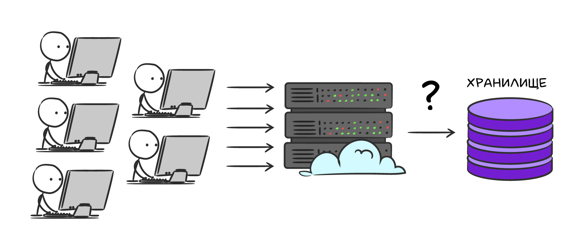
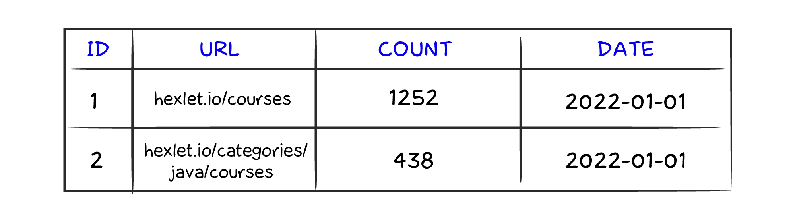
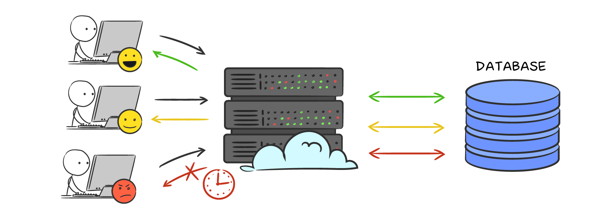

# Счетчики онлайн-событий

Развитие любого веб-сайта происходит на основе аналитических данных. Одна из часто используемых метрик — количество посетителей страницы. Иногда эту метрику показывают пользователям в интерфейсе. Как лучше реализовать такой счетчик на бэкенде?



Сперва можно попробовать хранить записи о посещаемости в таблице реляционной базы данных. Структура таблицы `visits` будет следующей: идентификатор с автоинкрементом, абсолютная ссылка на страницу, количество посещений и дата. На связку (url, date) нужно добавить уникальный индекс, чтобы не было дублей в счетчиках.



Когда пользователь открывает страницу, выполняется запрос

```sql
INSERT INTO visits (url, count, date)
VALUES
(
    'hexlet.io/courses',
    1,
    '2022-01-01'
) ON DUPLICATE KEY UPDATE count = count + 1
```

Такой запрос является атомарным и будет правильно выполняться в конкурентной среде. Если на веб-странице низкая посещаемость, то данное решение сработает. Однако, что если 1000 пользователей зайдут на страницу в один момент времени? Счетчик в базе увеличится на 1000. С консистентностью все хорошо, но что будет с производительностью? Классические базы данных тратят примерно 15% времени на полезную работу непосредственно с запросом. Все остальное время тратится на блокировки и управление транзакциями в конкурентной среде. Из-за блокировок транзакции обновление счетчика будут выполняться последовательно. Если у первого пользователя запрос выполнится за 20 мс, то у второго уже за 40 мс, и так далее. Причем рост задержки ответа не будет линейным. То есть 500-ый пользователь будет ждать не 500 * 20мс = 10 000 мс (10с), а намного больше. Естественно, ни один бэкенд не будет ждать более пары секунд выполнения запроса в БД и просто отвалится по таймауту. Итого, при нагрузке в 1000 одновременных запросов теряется ~90% данных, что естественно недопустимо.



## Атомарные инкременты в Redis

Счетчики — отличный кейс использования Redis, и сейчас разберемся почему.

### Инкремент

Представим, что на платформе необходимо отображать количество онлайн пользователей в режиме реального времени. Для этого можно хранить счетчик по ключу `page:{url}:online_count`. При подключении нового пользователя выполняется увеличение счетчика на 1 (инкремент) с помощью команды `incr`:

```bash
127.0.0.1:6379> incr page:hexlet.io/courses:online_count
(integer) 1
127.0.0.1:6379> incr page:hexlet.io/courses:online_count
(integer) 2
127.0.0.1:6379> incr page:hexlet.io/courses:online_count
(integer) 3
```

На каждый запрос возвращается новое значение после увеличения.

Также существует возможность увеличить счетчик на `N` за раз с командой `incrby`:

```bash
127.0.0.1:6379> incrby page:hexlet.io/courses:online_count 27
(integer) 30
```

### Декремент

В определенный момент пользователь закрывает страницу, и необходимо уменьшить счетчик онлайна. Используется команда `decr`:

```bash
127.0.0.1:6379> decr page:hexlet.io/courses:online_count
(integer) 29
```

Как и с увеличением есть команда для уменьшения счетчика на `N`:

```bash
127.0.0.1:6379> decrby page:hexlet.io/courses:online_count 19
(integer) 10
```

### Взаимодействие со счетчиком

Со счетчиком можно работать так же, как и с обычным ключом: получать значение, устанавливать время жизни, удалять:

```bash
127.0.0.1:6379> get page:hexlet.io/courses:online_count
"10"
127.0.0.1:6379> expire page:hexlet.io/courses:online_count 60
(integer) 1
127.0.0.1:6379> ttl page:hexlet.io/courses:online_count
(integer) 53
127.0.0.1:6379> del page:hexlet.io/courses:online_count
(integer) 1
```

## Резюме

- в простых проектах онлайн-счетчик можно реализовать с помощью классических РСУБД
- онлайн-счетчики имеют простую структуру данных и небольшое количество идентификаторов (ключей), что отлично ложится на архитектуру хранения в оперативной памяти, в частности в Redis
- Redis отлично справляется с консистентностью данных в высоконагруженной конкурентной среде, потому что все запросы выполняются атомарно, последовательно и за пару миллисекунд

### Дополнительные материалы

- [Redis INCR command](https://redis.io/commands/incr/)
- [Redis INCRBY command](https://redis.io/commands/incrby/)
- [Redis DECR command](https://redis.io/commands/decr/)
- [Redis DECRBY command](https://redis.io/commands/decrby/)

### Вопросы для самопроверки

**Как можно реализовать API троттлинг (вызов метода не более N раз в определенный промежуток времени) с помощью Redis, если допустимо, чтобы на определенный API метод приходило не более 1000 запросов?**

- записывать количество запросов в оперативную память сервиса. Раз в секунду синхронизировать данные с Redis и проверять их на превышение 1000 запросов
- на каждый запрос выполнять команду `incr`. Результат команды сравнить с 1000, и если он выше, то возвращать ошибку
- хранить количество осуществленных запросов в Redis-ключе. На каждый запрос выполнять команду `get` и проверять число. Если оно меньше 1000, то прибавлять 1 и записывать новое значение в Redis

**Допишите команду увеличения счетчика `counter` в Redis на 1**

- ___ counter

**Допишите команду уменьшения счетчика `counter` в Redis на 1**

- ___ counter

**Допишите команду увеличения счетчика `counter` в Redis на `36`**

- ___ counter ___

**Допишите команду уменьшения счетчика `counter` в Redis на `24`**

- ___ counter ___

**Допишите команду установки 60 секунд времени жизни для ключа** user:1 **в Redis**

- ___ user:1 ___