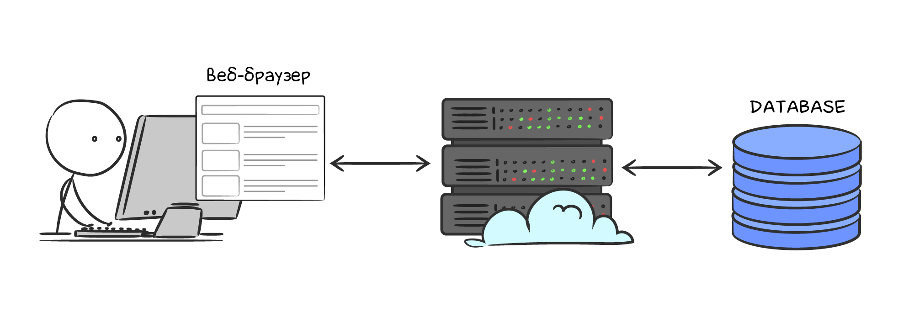

# Введение и установка

Представьте, что вы пишете backend небольшого интернет-магазина, состоящего из серверного приложения с бизнес-логикой и реляционной базы данных:



Первое время архитектура покрывает все ваши нужды: товары отображаются, заказы создаются быстро. Но со временем проект усложняется. Чаще всего это вызвано двумя факторами:

- продукт требует новой бизнес-логики
- рост пользовательской базы несет дополнительную нагрузку на сервера 

В определенный момент реляционной системы управления базами данных (далее "**РСУБД**") становится недостаточно и в архитектуре появляются дополнительные технологии для решения конкретных проблем.

Несколько примеров практических задач, когда РСУБД — неподходящее или неоптимальное решение:

- отображение количества пользователей, находящихся на странице в режиме реального времени
- ускорение времени ответа на тяжелый HTTP запрос
- отложенная отправка писем/смс при оформлении заказа
- отображение недавних покупок/просмотренных товаров на всех платформах 

Для эффективного решения вышеописанных задач подходит open-source база данных **Redis**. Сегодня тысячи компаний, включая Instagram, Twitter, Uber, Airbnb, выбирают **Redis** за его скорость и масштабируемость.

Все основные варианты использования Redis будут рассмотрены по ходу этого курса. Сейчас достаточно знать главные особенности этого хранилища:

- **_in-memory_** означает, что данные хранятся в оперативной памяти. Это накладывает ограничение на объем данных, который хранится в Redis, но дает более быстрое чтение и запись по сравнению с длительными хранилищами (NVME, SSD, HDD)
- **_KV хранилище (key-value)_**. В Redis нет таблиц, схем или каких-либо других абстракций для доступа к данным. Все данные записываются и получаются по ключам. Вследствие этого основные операции выполняются за **O(1)**

## Установка

Несмотря на то, что вся практика для данного курса выполняется в нашей среде, это не отменяет необходимости умения работать с базой локально. Более того, эффективное обучение невозможно без повторения примеров из уроков в своей среде. Поэтому, перед тем, как начать, необходимо установить Redis локально.

[Ссылка для скачивания](https://redis.io/download/)

## Через пакетный менеджер вашей операционной системы

MacOS:

```bash
brew install redis
```

Linux:

```bash
sudo add-apt-repository ppa:redislabs/redis
sudo apt-get update
sudo apt-get install redis
```

## Через Docker

```bash
docker run --name local-redis -d redis
```

## Подключение

### Локальное подключение

После установки Redis сервер нужно запускать вручную:

```bash
redis-server
11760:C 07 Dec 2021 18:25:26.103 # oO0OoO0OoO0Oo Redis is starting oO0OoO0OoO0Oo
11760:C 07 Dec 2021 18:25:26.103 # Redis version=6.2.6, bits=64, commit=00000000, modified=0, pid=11760, just started
11760:C 07 Dec 2021 18:25:26.103 # Warning: no config file specified, using the default config. In order to specify a config file use redis-server /path/to/redis.conf
11760:M 07 Dec 2021 18:25:26.104 * Increased maximum number of open files to 10032 (it was originally set to 256).
11760:M 07 Dec 2021 18:25:26.104 * monotonic clock: POSIX clock_gettime
                _._
           _.-``__ ''-._
      _.-``    `.  `_.  ''-._           Redis 6.2.6 (00000000/0) 64 bit
  .-`` .-```.  ```\/    _.,_ ''-._
 (    '      ,       .-`  | `,    )     Running in standalone mode
 |`-._`-...-` __...-.``-._|'` _.-'|     Port: 6379
 |    `-._   `._    /     _.-'    |     PID: 11760
  `-._    `-._  `-./  _.-'    _.-'
 |`-._`-._    `-.__.-'    _.-'_.-'|
 |    `-._`-._        _.-'_.-'    |           https://redis.io
  `-._    `-._`-.__.-'_.-'    _.-'
 |`-._`-._    `-.__.-'    _.-'_.-'|
 |    `-._`-._        _.-'_.-'    |
  `-._    `-._`-.__.-'_.-'    _.-'
      `-._    `-.__.-'    _.-'
          `-._        _.-'
              `-.__.-'

11760:M 07 Dec 2021 18:25:26.105 # Server initialized
11760:M 07 Dec 2021 18:25:26.105 * Ready to accept connections
```

Такой способ подходит для академических целей, но не используется в производственных окружениях. Обычно Redis сервер запускается как демон (daemon):

```bash
redis-server --daemonize yes
```
Когда сервер запущен, можно попробовать подключиться к нему с помощью утилиты `redis-cli`:

```bash
redis-cli

127.0.0.1:6379>
```

Чтобы удостовериться, что сервер работает корректно, достаточно запустить команду `info`:

```bash
127.0.0.1:6379> info
# Server
redis_version:6.2.6
redis_git_sha1:00000000
redis_git_dirty:0
redis_build_id:c6f3693d1aced7d9
redis_mode:standalone
os:Darwin 19.5.0 x86_64
arch_bits:64
...
```

### Подключение с Docker {id="docker_1"}

В разделе установки через Docker Redis сервер запускается в контейнере с именем `local-redis`. Используем это же имя для подключения:

```bash
docker exec -it local-redis redis-cli
```

## Резюме

1. **Redis** — это очень быстрая **key-value БД**, хранящая все данные в оперативной памяти
2. В зависимости от задачи Redis может быть и базой данных, и кэшом, и даже брокером сообщений
3. Важно установить Redis локально и поработать с ним из терминала, так как взаимодействие из любого языка программирования происходит через такие же CLI-команды

### Дополнительные материалы

1. [Установка Redis](https://redis.io/download/)