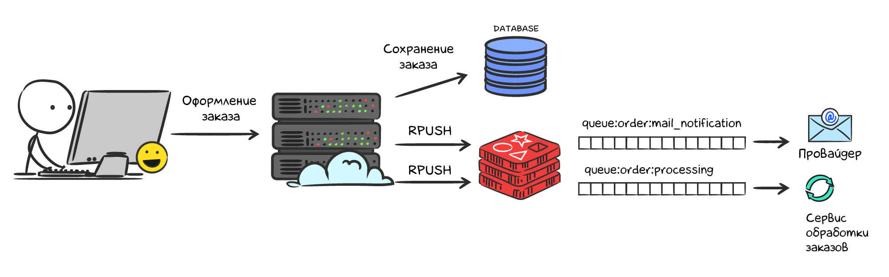

# Брокер сообщений Redis

Представьте, что вы пишете back-end интернет-магазина. Когда клиент оставляет заказ, сервер сохраняет данные в БД, отправляет чек клиенту на электронную почту и передает информацию в отдел обработки заказов. Самый простой способ реализовать этот алгоритм — выполнять все последовательно синхронно. Однако при разработке веб-приложений всегда стоит учитывать, что что-то может пойти не так. Провайдер электронных писем может иметь технические проблемы, из-за чего отправка письма задержится на несколько секунд или письмо не отправится с первого раза.


Допустим, провайдер электронных писем работает штатно, и выполнение алгоритма происходит дальше. Но теперь сервис обработки заказов недоступен по какой-то причине. И снова запрос зависает на несколько секунд или не отрабатывает вовсе.


Должен ли пользователь долго ждать или видеть ошибки в случае временных технических неполадок со стороны третьих сервисов? Вряд ли. В правильной архитектуре запросы выполняются за десятки миллисекунд, а временные технические неполадки скрываются. Реализовать такую архитектуру можно с помощью асинхронной обработки отложенных задач.

## Message Brokers

Асинхронную обработку обычно делают с помощью специальных сервисов — брокеров сообщений. Сегодня существует множество различных брокеров сообщений и каждый из них хорошо подходит под свои задачи. Концептуально работу брокера сообщений можно описать так:

1. Back-end сервис кладет сообщения в брокера
2. С другой стороны сервис-обработчик (worker) читает сообщения из брокера и как-то их обрабатывает
3. Сообщения внутри брокера буферизируются и формируется очередь. Если в один момент времени нужно записать 10 тыс. сообщений, они запишутся без задержки, а потом обработаются за какой-то промежуток времени


## Redis Message Broker

Многие проекты используют Redis как брокер сообщений из-за простоты интеграции. Популярные фреймворки абстрагируют от разработчика внутреннюю реализацию очередей в Redis. Однако в некоторых языках (например, Golang) можно интегрироваться самому.

### Простая реализация

Рассмотрим простую реализацию очереди в Redis на примере оформления заказа в интернет магазине. При оформлении заказ сохраняется в БД синхронно, после этого кладется сообщение в 2 очереди для отправки электронного письма и передачи заказа в сервис обработки. Каждая очередь является списком (Lists). Чтобы положить сообщение в конец очереди, используется команда `rpush`. С другой стороны сервисы-обработчики слушают очередь командой `blpop`.



Допустим, пользователь с ID `33` оставил заказ. В этом случае будут выполнены следующие команды:

```bash
127.0.0.1:6379> rpush queue:order:mail_notification '{"user_id":33,"order_id":12345}'
(integer) 1

127.0.0.1:6379> rpush queue:order:processing '{"user_id":33,"order_id":12345}'
(integer) 1
```

Проверим, что сообщения успешно сохранились в списках:

```bash
127.0.0.1:6379> lrange queue:order:mail_notification 0 -1
1) "{\"user_id\":33,\"order_id\":12345}"

127.0.0.1:6379> lrange queue:order:processing 0 -1
1) "{\"user_id\":33,\"order_id\":12345}"
```

Сервисы обработчики слушают очередь с помощью команды `blpop key [key ...] timeout`:

```bash
127.0.0.1:6379> blpop queue:order:mail_notification 10
1) "queue:order:mail_notification"
2) "{\"user_id\":33,\"order_id\":12345}"

127.0.0.1:6379> blpop queue:order:processing 10
1) "queue:order:processing"
2) "{\"user_id\":33,\"order_id\":12345}"
```

Команда `blpop` — это блокирующее чтение списка. Если список пуст, то выполнение программы блокируется до наступления таймаута, указанного в последнем аргументе в секундах. Если в списке есть элементы, то команда удалит самый левый элемент списка и вернет его. Удаление и чтение происходит атомарно, то есть при нескольких одновременных запросах не может быть ситуации, когда один элемент прочитался более 1 раза.

В такой схеме есть значимый изъян. Если сервис обработчик достанет сообщение из очереди и упадет, не до конца его обработав, то сообщение потеряется навсегда. Надеяться, что система всегда будет работать как задумано (happy path), не стоит.

## Надежные очереди в Redis

Успешно обработать ситуации, когда сервис не до конца обрабатывает сообщение, можно с помощью команды `blmove source destination LEFT|RIGHT LEFT|RIGHT timeout`. Эта команда также блокирует выполнение при пустом списке. Если в списке есть элементы, то самый левый элемент списка возвращается, удаляется из списка `source` и сохраняется в запасном списке `destination`.

```bash
127.0.0.1:6379> rpush queue:order:mail_notification '{"user_id":33,"order_id":12345}'
(integer) 1

127.0.0.1:6379> blmove queue:order:mail_notification queue:order:mail_notification:fallback LEFT RIGHT 10
"{\"user_id\":33,\"order_id\":12345}"
```

Что делать со списком `destination` — решается в каждом проекте по своему. Где-то нужно вручную просматривать ошибки и заново отправлять на обработку, а где-то можно сделать автоматического обработчика, который будет складывать данные из запасной очереди обратно в основную через какой-то промежуток времени.

## Ошибки инфраструктуры

Отметим один важный момент. Если по какой-то причине упадет сам Redis сервер, то данные за последние несколько секунд могут быть потеряны. Этого можно избежать специальной настройкой персистентности данных, которая понизит производительность. Всегда присутствует компромисс между пропускной способностью и надежностью хранения. Детальное изучение настроек Redis-сервера выходит за рамки данного курса, но при необходимости нужную информацию можно найти в интернете.

## Резюме

- все, что может быть выполнено асинхронно, нужно выносить в обработку через очереди
- Redis — простой брокер очередей, который покрывает нужды большинства небольших проектов
- очереди в Redis реализуются с помощью встроенной структуры данных Lists
- запись сообщения в очередь происходит командой `rpush` (или `lpush`, если очередь развернута)
- сервисы-обработчики читают очереди командой `blmove`
- не всегда обработка происходит успешно, поэтому важно использовать запасные очереди, чтобы не терять сообщения

### Дополнительные материалы

- [Redis RPUSH command](https://redis.io/commands/rpush)
- [Redis LPUSH command](https://redis.io/commands/lpush)
- [Redis BLMOVE command](https://redis.io/commands/blmove)
- [Redis Message broker](https://redis.com/solutions/use-cases/messaging/)

### Вопросы для самопроверки

**Какие преимущества брокера сообщений, реализованном на Redis**
_(нужно выбрать все корректные ответы)_

- надежность хранения данных
- простота в повторной обработке сообщений с ошибками
- простота реализации
- скорость записи/чтения сообщений

**Допишите команду блокирующего чтения слева списка `queue` с таймаутом 30 секунд в Redis**

- ___ queue ___

**Допишите команду блокирующего получения сообщения из ключа queue справа с копированием данных в ключ `queue:fallback` справа**

- ___ queue queue:fallback ___ ___

**Что из перечисленного стоит вынести в асинхронную обработку из кода обработки API метода?**
_(нужно выбрать все корректные ответы)_

- сохранение состояния объекта в базу данных
- подсчет аналитических данных
- парсинг тела запроса пользователя
- отправка push-уведомлений
- формирование ответа пользователю