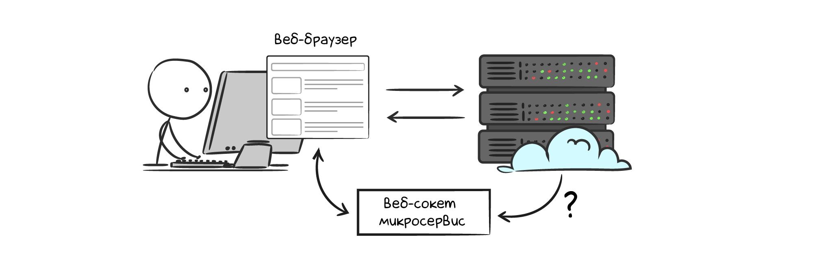
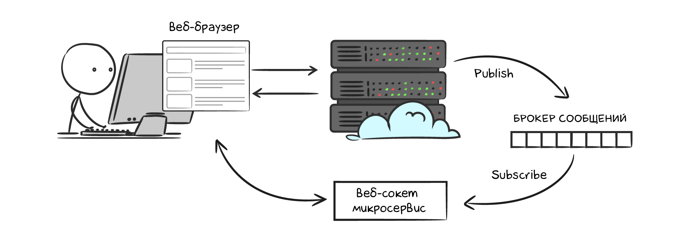

# Реалтайм чат с Redis PubSub

Многие современные веб-сайты имеют события, которые отображаются у пользователя в режиме реального времени без перезагрузки страницы. Например, в любой социальной сети нет необходимости перезагружать страницу, чтобы получить новое сообщение от другого пользователя. Как технически устроены такие системы?

Современная архитектура выглядит следующим образом:

- веб-браузер подключается к серверу по веб-сокету (особый тип соединения, который один раз устанавливается и держится. В рамках этого соединения клиент с сервером общаются независимо)
- когда происходит событие, back-end отправляет данные браузеру по веб-сокету
браузер получает данные и отображает событие в режиме реального времени


Нас интересует back-end часть данной архитектуры. Обычно веб-сокет соединения обслуживаются отдельным микросервисом. Когда со стороны веб-сервера происходит событие, сервер отправляет данные в веб-сокет микросервиса, чтобы передать веб-браузеру.



Как передавать данные от веб-сервера в веб-сокет микросервис? Самое тривиальное решение: делать HTTP запрос. Для небольших приложений с редкими событиями этого будет достаточно. Однако для большинства проектов такое решение не подойдет, потому что HTTP устанавливает TCP соединение на каждом запросе и отправляет много лишней информации в виде заголовков. Например, в мессенджерах, где новые сообщения приходят миллионами, с HTTP все будет работать недопустимо медленно.

В данном случае хорошим решением будет использование брокера сообщений. Он может быть настроен под разные модели доставки сообщений. В примере с мессенджерами идеально подходит модель **Pub/Sub** (издатель-подписчик). Веб-сокет микросервис подписывается на канал личных сообщений пользователя. В какой-то момент веб-сервер публикует сообщение в канал, и веб-сокет микросервис отправляет его в браузер. Преимущества этого решения:

- подписчик держит постоянное соединение с брокером сообщений
- издатель отправляет только полезную информацию без лишних заголовков
- пропускная способность такого взаимодействия подходит для высоконагруженных проектов



## Redis Pub/Sub

Разберем как Redis реализует модель Pub/Sub на примере личных сообщений в мессенджере.

Веб-сокет микросервис подписывается на события с помощью команды `subscribe channel [channel ...]`:

```bash
127.0.0.1:6379> subscribe messages
Reading messages... (press Ctrl-C to quit)
1) "subscribe"
2) "messages"
3) (integer) 1
```

После выполнения команды возвращается `1` в случае успешной подписки на канал, и соединение блокируется в ожидании сообщений.

При отправке нового сообщения веб-сервер публикует событие в Redis командой `publish channel message`:

```bash
127.0.0.1:6379> publish messages '{"user_id":55,"message_id":"d1356e62-f33f-412c-b47c-ff107f3e88b1","message_text":"Oh, hi Mark!","sent_at":1642741377}'
(integer) 1
```

В ответе на команду `publish` возвращается количество клиентов, получивших опубликованное сообщение.

Со стороны веб-сокет микросервиса моментально приходит сообщение:
```bash
1) "message"
2) "messages"
3) "{\"user_id\":55,\"message_id\":\"d1356e62-f33f-412c-b47c-ff107f3e88b1\",\"message_text\":\"Oh, hi Mark!\",\"sent_at\":1642741377}"
```

1 означает действие; 2 — канал, из которого получено сообщение; 3 тело сообщения.

### Когда использовать Pub/Sub

Стоит отметить, что Redis Pub/Sub используется в тех случаях, когда события могут быть потеряны. Если в момент публикации не будет ни одного подписчика или у пользователя не будет открытого веб-сокет соединения, событие уйдет в никуда. Например, это подходит для нотификаций пользователя о новых сообщениях в мессенджере, потому что при перезагрузке страницы данные будут получены с сервера по API. Однако данная архитектура явно не подходит для отправки уведомлений на электронную почту или SMS.

## Резюме

- модель Pub/Sub используется в реалтайм приложениях
- Redis эффективно реализует модель Pub/Sub, позволяя иметь пропускную способность в 1 млн. сообщений в секунду
- подписчик подписывается на события командой `subscribe`
- издатель публикует события командой `publish`

### Дополнительные материалы

- [Redis Pub/Sub](https://redis.io/topics/pubsub)
- [Redis PUBLISH command](https://redis.io/commands/publish)
- [Redis SUBSCRIBE command](https://redis.io/commands/subscribe)

### Вопросы для самопроверки

**Отметьте преимущества Redis Pub/Sub**
_(нужно выбрать все корректные ответы)_

- высокая пропускная способность
- надежность хранения сообщений. В случае ошибок сообщения могут быть прочитаны позже
- реализация `exactly once` чтения. При публикации сообщение может быть прочитано только один раз одним подписчиком
- возможность подписаться на несколько каналов одновременно

**Допишите команду подписки на каналы `channel:1` и `channel:2` в Redis Pub/Sub**

- ___ channel:1 channel:2

**Допишите команду записи сообщения `hello` в канал `channel` в Redis Pub/Sub**

- ___ channel ___

**Вы собираетесь сделать сообщение в канал Redis Pub/Sub. В данном канале нет подписчиков. Что произойдет с сообщением?**

- команда публикации заблокируется, пока не появится хотя бы один подписчик
- сообщение будет потеряно
- сообщение будет записано в канал и вернется при подписке на канал

**При публикации в канал Redis Pub/Sub вернулось число 0. Что это означает?**

- такое сообщение уже публиковалось в канал, поэтому оно было проигноировано
- у канала нет подписчиков. Никто не прочитал сообщение
- сообщение успешно опубликовано