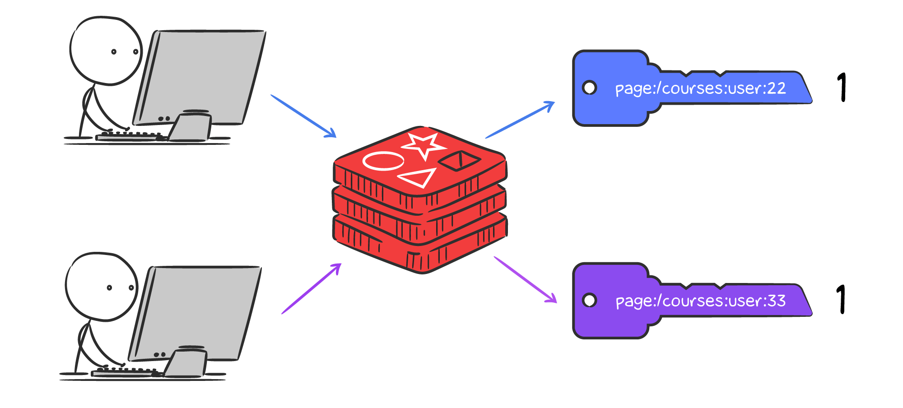

# Проверка на уникальность с Sets

На сегодняшний день любой бизнес активно использует аналитику, чтобы развивать свои продукты. На основе данных можно лучше понимать пользователей и их потребности. Одна из базовых метрик, использующаяся повсеместно, — это количество уникальных посетителей страницы. Представим, что есть необходимость хранить такие данные в Redis.


Прежде всего, стоит определить, как данные будут использоваться. Важно эффективно выполнять 2 условия:

1. получать количество уникальных посетителей страницы
2. проверять, что пользователь уже есть в списке посетителей, чтобы не записать дважды

Прикинем несколько вариантов решения.

## Обычные ключи

Для начала можно попробовать хранить каждое посещение отдельным ключом с форматом `page:{page_path}:user:{user_id}`:



```bash
127.0.0.1:6379> set page:/courses:user:22 1
OK
127.0.0.1:6379> set page:/courses:user:33 1
OK
127.0.0.1:6379> exists page:/courses:user:22
(integer) 1
127.0.0.1:6379> keys page:/courses:user:*
1) "page:/courses:user:33"
2) "page:/courses:user:22"
```

Хотя проверка на существование пользователя в списке будет происходить быстро, этот вариант не подходит, потому что получение количества уникальных пользователей займет O(N) (N — количество ключей в Redis).

## Redis Lists

Второй вариант — использовать тип данных **Lists** для хранения уникального списка ID пользователей:


```bash
127.0.0.1:6379> lpush page:/courses 22 33 44
(integer) 3
127.0.0.1:6379> llen page:/courses
(integer) 3
```

В данном случае размер списка можно получить очень быстро за O(1), но вставка будет происходить неэффективно, так как перед вставкой необходимо делать поиск по всему списку для проверки существования.

## Redis Hashes

Можно использовать структуру **Hashes**. Ключом будет страница, а значения будут в формате `{user_id}: 1`:


```bash
127.0.0.1:6379> hset page:/courses 11 1 22 1 33 1
(integer) 3
127.0.0.1:6379> hlen page:/courses
(integer) 3
```

Это решение удовлетворяет обоим требованиям:

1. Получение списка уникальных пользователей происходит за O(1) с командой `hlen`
2. Вставка происходит за O(1) с проверкой уникальности пользователя

Но имеются и недостатки:

- Хранится много лишних данных из-за единиц для каждого идентификатора юзера
- Hashes не позволяют посчитать пересечения списков: например, количество пользователей, которые посетили 3 определенные страницы

## Redis Sets

Для решения задачи с уникальными посетителями в Redis есть структура данных **Sets**. Sets — это список уникальных элементов, поддерживающий быстрые функции вставки, проверки на уникальность и пересечений.

### Запись

Для записи значений используется команда `sadd key member [member ...]`:

```bash
127.0.0.1:6379> sadd page:/courses 11 22 33 44
(integer) 4
```

Если набора не существовало, то он будет создан. После записи возвращается количество добавленных элементов. Если попытаться добавить существующий элемент, то вернется 0:

```bash
127.0.0.1:6379> sadd page:/courses 22
(integer) 0
```

### Чтение и проверка на уникальность

Получить количество уникальных пользователей страницы можно с помощью команды `scard key`:

```bash
127.0.0.1:6379> scard page:/courses
(integer) 4
```

Команда `sismember key member` проверяет, что пользователь посещал данную страницу:

```bash
127.0.0.1:6379> sismember page:/courses 33
(integer) 1
127.0.0.1:6379> sismember page:/courses 12222
(integer) 0
```

### Удаление

Удалить пользователя из набора можно командой `srem key member [member ...]`:

```bash
127.0.0.1:6379> srem page:/courses 44
(integer) 1
127.0.0.1:6379> smembers page:/courses
1) "11"
2) "22"
3) "33"
```

### Пересечения

Допустим, что есть 3 страницы: `/courses`, `/courses/java` и `/courses/php`. Нужно получить уникальных пользователей, которые посетили все 3 страницы. Задача решается одной командой `sinter key [key ...]`:

```bash
127.0.0.1:6379> sadd page:/courses 1 2 3 4 5 6 7 8 9 10
(integer) 10
127.0.0.1:6379> sadd page:/courses/java 1 2 3 4 5 6 7
(integer) 7
127.0.0.1:6379> sadd page:/courses/php 5 6 7 8 9
(integer) 5
127.0.0.1:6379> sinter page:/courses page:/courses/java page:/courses/php
1) "5"
2) "6"
3) "7"
```

## Резюме

- уникальные значения в Redis можно хранить с помощью Hashes, но тогда хранятся лишние данные и отсутствуют некоторые функции
- структура данных Sets идеально подходит для списков уникальных значений. Вставка и проверка на уникальность происходят за O(1). Также присутствуют функции для расчета пересечений/разницы
- добавить элемент в набор можно командой `sadd`
- с помощью `sismember` можно проверить существование элемента в наборе
- для получения количества уникальных элементов используется команда `scard`
- для вычисления пересечений наборов используется команда `sinter`

### Дополнительные материалы

- [Redis SADD command](https://redis.io/commands/sadd)
- [Redis SCARD command](https://redis.io/commands/scard)
- [Redis SISMEMBER command](https://redis.io/commands/sismember)
- [Redis SREM command](https://redis.io/commands/srem)
- [Redis SINTER command](https://redis.io/commands/sinter)

### Вопросы для самопроверки

**Как хранить список значений в Redis, если необходимо держать его уникальным?**

- использовать Redis Unique Lists для хранения данных
- использовать Redis Sets для хранения набора данных 
- использовать JSON для хранения данных
- использовать Redis Hashes для хранения данных

**Отметьте верный вариант выполнения команды `sadd page:1 127.0.0.1 127.0.0.2` в Redis, при условии, что ключ `page:1` не существует?**

- вернется ошибка, так как набор не существовал до этого
- создастся новый набор данных и вернется число 1
- создастся новый набор данных и вернется число 0
- создастся новый набор данных и вернется число 2

**Допишите команду получения количества элементов в наборе данных `user:1:page_views` в Redis**

- ___  user:1:page_views

**Допишите команду проверки существования элемента `/courses/javascript` в наборе данных `user:1:page_views` в Redis**

- ___ user:1:page_views ___

**Допишите команду удаления элемента `/courses/php` из набора данных `user:1:page_views` в Redis**

_ ___ user:1:page_views ___