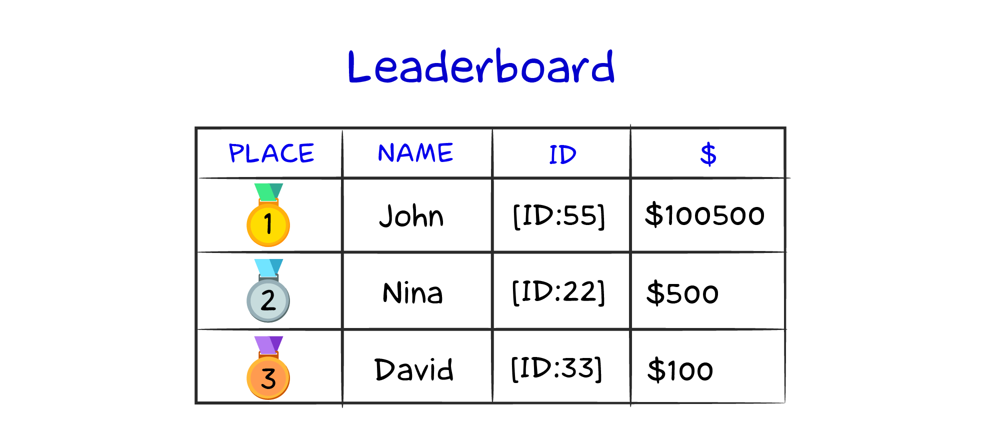
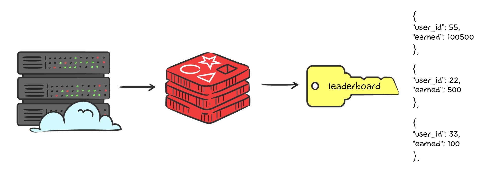
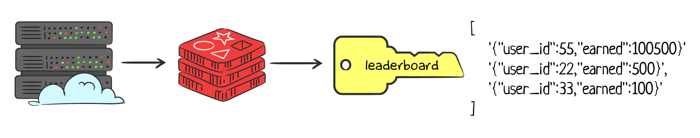

# Организация рейтингов с Sorted Sets

Сегодня многие компании используют геймификацию для маркетинга и вовлечения аудитории. Например, трейдинговые платформы часто запускают турниры с большими призовыми фондами. Чтобы победить в турнире, нужно заработать как можно больше денег за определенный промежуток времени. Ключевая часть любого турнира — это лидерборд (таблица с рейтингом лидеров). Рейтинги мотивируют пользователей торговать больше, чтобы обогнать соперников.

Технически организация рейтингов — интересная задача. Все данные должны храниться в надежном хранилище: например, РСУБД. Однако при средней нагрузке сервера запрос на получение данных будет выполняться долго, потому что содержит агрегации и сортировку. Чтобы клиент не ждал несколько секунд при формировании рейтинга, используется кэширование в Redis. Но как лучше хранить лидерборд в кэше?

Рассмотрим пример с турниром на трейдинговой платформе. Данные содержат идентификаторы пользователей и количество заработанных денег. По этим данным формируется рейтинг:



## Хранение в JSON

Самый очевидный способ — это хранить рейтинг в сериализованном виде, например, в JSON.



Этот способ имеет несколько существенных недостатков:

- очень много логики уходит на сторону приложения. Нужно реализовывать парсинг и обновление данных с сортировкой
- нельзя получить лидеров рейтинга простым способом. В любом случае придется доставать список всех пользователей. А если в турнире участвует более 1 млн. 

## Хранение в Lists

Следующий возможный способ хранения — это **Lists** в Redis:



Из преимуществ такого подхода: появляется возможность получать ТОП-10 пользователей без чтения всего списка. Однако недостатки все еще присутствуют:

- все значения придется парсить при каждом чтении/записи со стороны сервера
- вставка/обновление рейтинга требует получения всего списка, что недопустимо при нагрузках на сервер

## Redis Sorted Sets

В Redis существует структура данных **Sorted Sets** (отсортированные наборы), которая позволяет эффективно хранить и работать с лидербордами. Если Set представляет собой набор уникальных строк, то Sorted Set добавляет сортировку с помощью дополнительного параметра — рейтинга.

### Запись

Чтобы добавить запись в лидерборд, используется команда `zadd key score member [score member ...]`:

```bash
127.0.0.1:6379> zadd leaderboard 100500 55
(integer) 1
127.0.0.1:6379> zadd leaderboard 500 22
(integer) 1
127.0.0.1:6379> zadd leaderboard 100 33
(integer) 1
```

При успешном добавлении нового участника возвращается единица. Если участник существовал, то он перезапишется с новым значением, и команда вернет `0`.

Если участник заработал какую-то сумму, то можно прибавить ее к рейтингу командой `zincrby key increment member`:

```bash
127.0.0.1:6379> zincrby leaderboard 500 22
"1000"
```

В ответе возвращается новый рейтинг участника.

### Получение лидерборда

Для получения списка ТОП-3 используется команда `zrange key min max`. По умолчанию команда вернет список от наименьшего рейтинга к наибольшему. Так как в данном примере в рейтинге хранится количество заработанных денег и необходимо, чтобы пользователь с наибольшей суммой был на первом месте, нужно передать дополнительный параметр `REV`:

```bash
127.0.0.1:6379> zrange leaderboard 0 2 REV
1) "55"
2) "22"
3) "33"
```

Отсчет индексов начинается с нуля, поэтому для получения ТОП-3 используются границы `0` и `2`.

Если требуется получить количество денег кроме идентификаторов пользователей, то добавляется параметр `WITHSCORES`:

```bash
127.0.0.1:6379> zrange leaderboard 0 2 REV WITHSCORES
1) "55"
2) "100500"
3) "22"
4) "1000"
5) "33"
6) "100"
```

## Резюме

- для кэширования рейтингов в Redis следует использовать встроенную структуру данных Sorted Sets
- при использовании Sorted Sets со стороны сервера не нужно писать никакую логику
Sorted Sets эффективно работает при большом количестве данных.
- Добавление/обновление и чтение набора имеет алгоритмическую сложность O(log(N))

### Дополнительные материалы

- [Redis Leaderboards](https://redis.com/solutions/use-cases/leaderboards/)
- [Redis ZADD command](https://redis.io/commands/zadd)
- [Redis ZINCRBY command](https://redis.io/commands/zincrby)
- [Redis ZRANGE command](https://redis.io/commands/zrange)

### Вопросы для самопроверки

**Какое преимущество имеет Sorted Sets в сравнении с Sets в Redis?**

- встроенная сортировка значений по рейтингу
- возможность хранить уникальный набор данных
- быстрый подсчет пересечений

**Допишите команду добавления участника `participant:25` в Redis-ключ `tournament` c рейтингом `300`**

- ___ tournament ___ ___

**Допишите команду добавления `250` очков для существующего участника `participant:25` в Redis-ключ `tournament`**

- ___ tournament ___ ___

**Допишите команду получения ТОП-3 участников из Redis-ключа `tournament` от большего к меньшему**

- ___ tournament ___ ___ ___