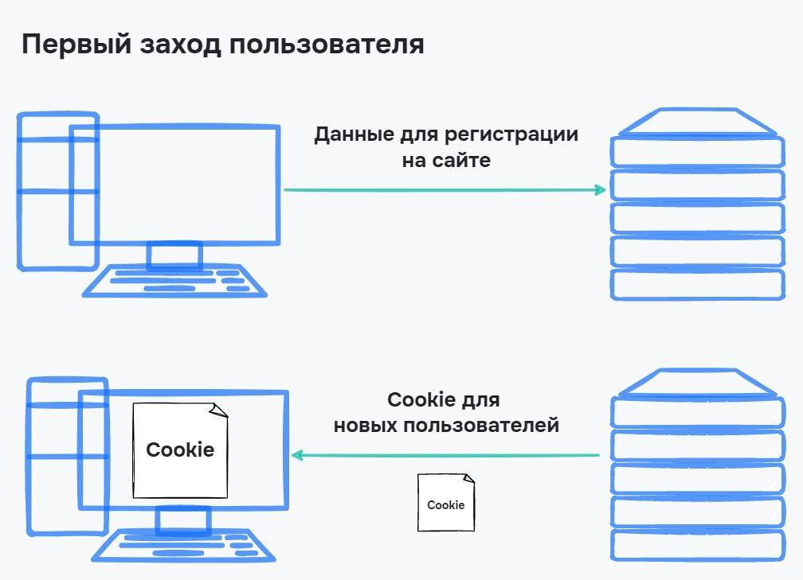
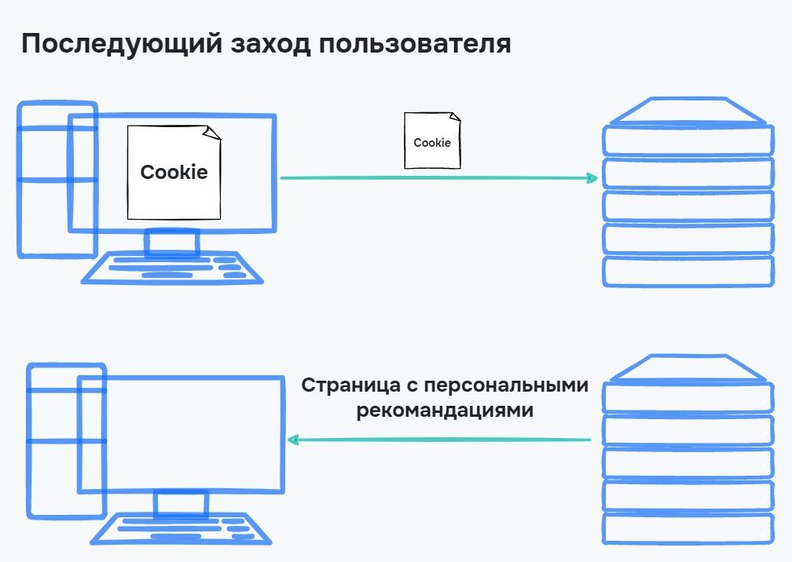

# Безопасность в интернете и цифровой след

Интернет стал весомой частью жизни людей: работа, общение, знакомства, развлечения — все это перешло в цифровую область. Мы используем десятки сайтов каждый день и при этом оставляем свои данные на них — цифровой след. Как отпечатки пальцев могут помочь поймать преступника, так и цифровой след может помочь вычислить вас как пользователя.

В этом уроке поговорим о том, какие данные мы оставляем в интернете, и кому они могут понадобиться.

## Цифровой след

**Цифровой след** — данные, которые мы оставляем о себе в интернете. Это не обязательно данные, которые были взяты без уведомления. Еще это те данные, которые мы оставили о себе сами, например, при регистрации в социальной сети.

Следы делятся на два типа:

- **Активный цифровой след** — информация, которую мы оставляем сами. Например, когда отправляем пост в социальную сеть под своей учетной записью. В этом случае запись связана с нашим профилем, по которой можно узнать, кто написал сообщение
- **Пассивный цифровой след** — информация, которая собирается без нашего ведома, но с нашего согласия. Это может быть IP-адрес, геолокация, количество заходов на ту или иную страницу 

Цифровой след — это не «паспорт», по которому можно установить личность человека. Но с помощью множества следов можно узнать о человеке больше. Этим активно пользуются рекламодатели и правоохранительные органы. От них не отстают мошенники, которые с помощью цифрового следа могут понять наши запросы и подстроить свои схемы персонально под нас.

Разберем, какая информация собирается о нас в разных типах цифровых следов.

## Активный цифровой след

Активные следы мы оставляем сами. Например, когда делимся информацией о себе или разрешаем сайтам собирать о нас информацию, принимая соглашение при первом заходе.

Представим нового пользователя на Хекслете. Вот его шаги:

1. Зарегистрироваться с использованием своего имени и фамилии
2. Привязать аккаунт Github
3. Завершить три курса по изучению языка PHP
4. Оставить 10 комментариев с вопросами по урокам и упражнениям

Эти действия оставили цифровой след о пользователе. Кто угодно может увидеть, какие курсы пользователь проходил, какие вопросы задавал, над какими проектами работал на GitHub.

Чем больше человек оставил информации о себе, тем больше информации мы можем узнать о нем, если поищем его страницы в социальных сетях, форумах, досках объявлений.

Активный цифровой след часто используют HR-специалисты. Например, они изучают кандидата, проверяют его страницы в социальных сетях на предмет высказываний, которые не подходят для должности. Этическая сторона таких действий вызывает споры, но все эти данные открыты, поэтому о вторжении в частную жизнь речи идти не может.

Активный след не только тот, который может быть прочитан всеми пользователями, но и тот, который мы оставляем о себе другим компаниям. Например:

- Заполнение формы заказа товара
- Электронная почта для рекламной рассылки
- Общение в чатах
- Подача заявки на банковскую карту

Эти данные не лежат в публичном доступе, но пересылаются другим людям или организациям, поэтому такие действия тоже оставляют активный цифровой след. Например, подписка на новости о шахматах может происходить через портал, который будет предлагать подписаться на рассылки по другим играм.

Этими данными пользуются мошенники. Если собирать информацию о нас в социальных сетях, можно найти новости о том, что мы получили премию, повышение, наследство или выиграли в лотерею. После этого изучается наш профиль, собирается личная информация и совершается звонок. Остальное — дело техники мошенников.

## Пассивный цифровой след
Пассивный цифровой след собирается не таким явным способом, как активный. В уроке про HTTP был пример запроса, который посылается на сервер:

```text
GET /search?q=как+приготовить+торт HTTP/1.1
Host: google.com
User-Agent: Mozilla/5.0 (Windows NT 10.0; Win64; x64) AppleWebKit/537.36 (KHTML, like Gecko) Chrome/104.0.5112.124 Safari/537.36
Accept: text/html,application/xhtml+xml,application/xml;q=0.9,image/avif,image/webp,image/apng,*/*;q=0.8,application/signed-exchange;v=b3;q=0.9
Accept-Language: ru,en;q=0.9
Accept-Encoding: gzip, deflate, br
```

Информация, которая находится здесь — пассивный цифровой след. Когда мы делаем запрос на сайт, мы посылаем информацию о браузере, IP-адрес, название операционной системы и другую служебную информацию.

По некоторой из этой информации можно узнать другие данные. Например, по IP-адресу можно вычислить название провайдера и примерную область проживания. По таким крупицам возможно определить месторасположение пользователя.

Пассивные следы остаются не только от запросов, они активно собираются сайтами. В языке JavaScript, который используется на сайтах, можно получить информацию о пользователе:

- Версия браузера
- Высота и ширина экрана в пикселях
- Количество оперативной памяти в устройстве
- Расширения браузера, которые установлены. Именно отсюда сайты знают, что установлен блокировщик рекламы и предлагают его отключить
- Страница, с которой перешел пользователь
- Язык системы

Помимо этого на сайтах устанавливают специальные метрики от поисковых систем. Они собирают информацию о пользователях сайта, количествах посещений той или иной страницы, времени на странице. Эти данные помогают разработчикам делать сайт удобнее, но их используют и поисковые компании.

Стоит несколько раз поискать товар, как вся реклама в интернете подстраивается под этот запрос — это результат сбора информации о вас. Анализ идет на стыке пассивных и активных следов.

Этот сбор данных так же законен, так как при посещении почти любого сайта в интернете вы соглашаетесь хранить и собирать Cookie или Куки, тем самым оставляя активный цифровой след и согласие на сбор и анализ пассивных следов. Разберем, что такое куки и что они хранят.

## Cookie
**Cookie** или **куки** — небольшие данные, которые сайт посылает нам, и они сохраняются в браузере. Так сайт хранит данные о последних посещениях, любимых страницах, просмотренных товарах, товарах в корзине. Также так сохраняется информация о том, что мы уже входили на сайт под своей учетной записью. Именно куки делают так, что нет необходимости выполнять вход при каждом заходе на сайт:





Куки делятся на два типа:

- **Постоянные**. Данные хранятся в браузере после закрытия сайта. Такие куки могут находиться в браузере день, неделю или даже несколько месяцев
- **Временные**. Данные хранятся до закрытия сайта. Это полезно в больших каталогах, чтобы показать, какие страницы мы уже смотрели и дать на эти страницы ссылки

Куки — важный механизм для мошенников. Они используют различные схемы и пытаются получить куки пользователя. Если наши куки окажутся в руках мошенника, то они смогут получить доступ к тем сайтам, в которые мы входили. Разработчики тоже не сидят на месте и вводят дополнительные меры безопасности, но лет десять назад воровство кук было распространено в интернете.

## Выводы
В этом уроке мы разобрали что такое цифровой след и почему важно следить за тем, какие данные о себе мы оставляем в интернете. Повторим важные моменты:

- Цифровой след — информация, которая остается от пользователя в интернете
- Цифровые следы бывают двух видов:
  - Активные — следы, которые мы оставляем сами: страницы в социальных сетях, заполнение форм на сайтах, активность на сайтах
  - Пассивные — следы, которые собирают о нас сайты: IP-адрес, данные о браузере и операционной системе, часовой пояс, расширения браузера
- Цифровые следы содержатся в куках — небольших данных, которые сайты посылают на компьютер пользователя и получает их при заходе на сайт
- Слежение за своими цифровыми следами — важный инструмент для безопасности. С помощью цифровых следов мошенники могут найти информацию о нас, наших интересах и использовать это в корыстных целях

### Дополнительные материалы

1. [Что такое цифровой след?](https://www.kaspersky.ru/resource-center/definitions/what-is-a-digital-footprint)

### Вопросы для самопроверки

**Что такое цифровой след**

- Отпечатки пальцев в цифровой базе государства
- Наши паспортные данные
- Данные, которые мы оставляем о себе в сети
- След от пушистых лапок

**На какие типы делятся цифровые следы**

- Пассивные
- Частные
- Активные
- Общие

**В чём особенность активных цифровых следов**

- Они меняются каждый день
- Их собирают без нашего ведома
- Мы их оставляем сами

**Что такое Cookie**

- Данные, которыми обмениваются клиент и сервер для персонализации сайта или приложения
- Вкусные печеньки, которые можно скушать с горячим молоком
- Просто плашка на каждом сайте, с которой мы соглашаемся
- Цифровые следы, которые собираются без нашего ведома и согласия