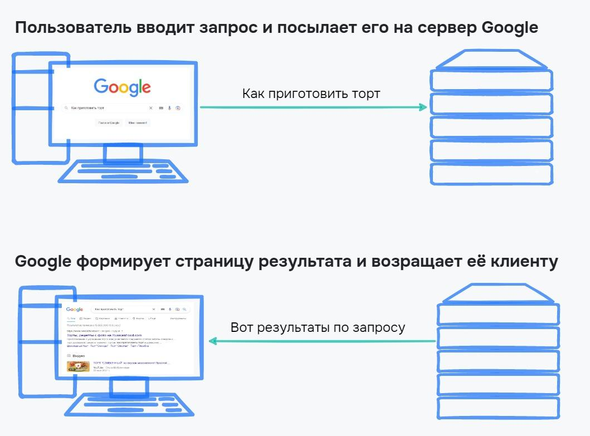
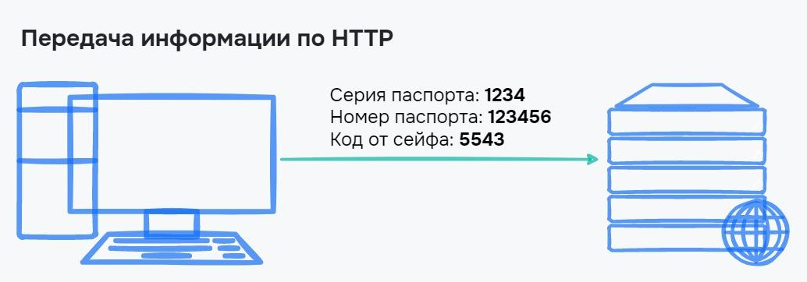
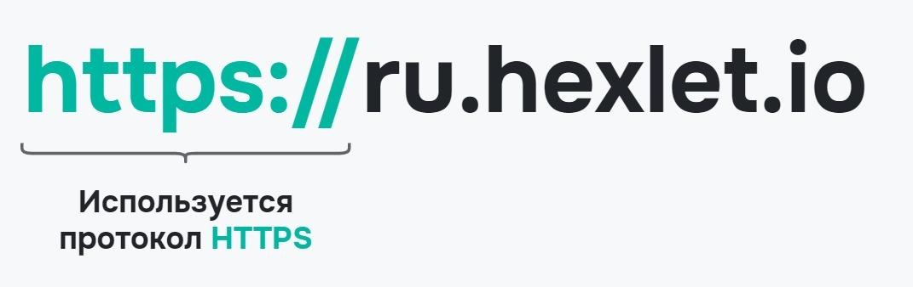
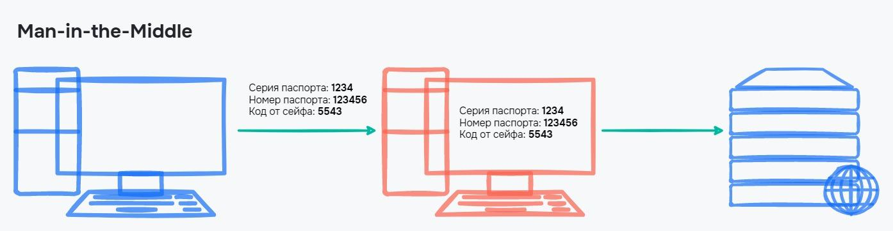
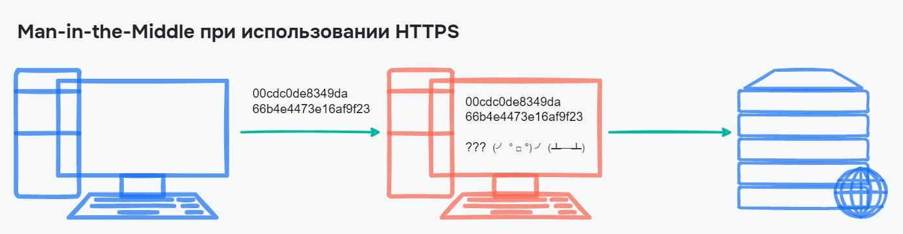

# Безопасность в интернете. Протокол HTTPS

Для обмена информацией с сайтом в интернете используются протоколы HTTP и HTTPS. Эти протоколы находятся на прикладном уровне по модели TCP/IP.

В этом уроке мы рассмотрим работу этих протоколов, что отсылается на сервер и какую информацию получает клиент. Также узнаем, почему нельзя передавать банковские данные по протоколу HTTP, а лучше для этих целей использовать HTTPS. Еще мы разберемся, при чем здесь атака Man-in-the-Middle.

## Протоколы HTTP и HTTPS

Все сайты в интернете построены по принципу «Запрос — ответ». Например, когда вы спрашиваете в Google «Как приготовить торт», то запрос с таким текстом посылается на сервер. Он находит все подходящие ссылки и возвращает страницу, на которой расположены результаты по запросу:



Клиент и сервер общаются по правилам, то есть по протоколам. Для работы с сайтами используются два основных протокола:

- **HTTP** (HyperText Transfer Protocol) — протокол передачи гипертекста
- **HTTPS** (HyperText Transfer Protocol Secure) — защищенный протокол передачи гипертекста

Эти протоколы находятся на прикладном уровне модели TCP/IP и описывают, в каком формате посылаются запросы, и что ожидается в ответ. Это скрыто от пользователя. При этом даже простой запрос в поисковую систему состоит из множества дополнительной информации, которая пересылается от пользователя.

Рассмотрим протокол подробнее и определим, что такое гипертекст.

## Протокол HTTP {id="http_1"}

Представьте страницу сайта в интернете. Она состоит из текстов, картинок, видео и аудио. Все это обычная текстовая страница. В интернете страницы связаны между собой ссылками. Например, чтобы зайти в этот урок, вам нужно перейти по ссылке в курсе или нажать кнопку «Далее» в предыдущем уроке.

Ссылки, которые направляют на другие страницы, называются **гиперссылками**, а страница в интернете состоит из **гипертекста** — текста со ссылками. Именно это и подразумевается под **протоколом передачи гипертекста** — передается целая страница с текстом, медиафайлами, разметкой на языке HTML, CSS и JavaScript.

HTTP — набор правил, по которым передается запрос на получение гипертекста и правила. По этим правилам определяется формат ответа на запрос. Важно, что порядок именно такой — пользователь посылает запрос и получает ответ в виде страницы.

Рассмотрим, как выглядит запрос и ответ на примере поискового запроса в гугле.

### Запрос в HTTP {id="http_2"}

Когда пользователь хочет узнать у Google, как приготовить торт, по HTTP отправляется запрос:

```text
GET /search?q=как+приготовить+торт HTTP/1.1
Host: google.com
User-Agent: Mozilla/5.0 (Windows NT 10.0; Win64; x64) AppleWebKit/537.36 (KHTML, like Gecko) Chrome/104.0.5112.124 Safari/537.36
Accept: text/html,application/xhtml+xml,application/xml;q=0.9,image/avif,image/webp,image/apng,*/*;q=0.8,application/signed-exchange;v=b3;q=0.9
Accept-Language: ru,en;q=0.9
Accept-Encoding: gzip, deflate, br
```

Это не полный список данных. Но по нему уже можно понять, как много данных посылается на сервер, чтобы получить список сайтов по запросу. В этом запросе браузер послал на сервер:

- Поисковую фразу «Как приготовить торт»
- Куда именно посылается информация
- Какой используется браузер или **User-Agent** — строка, где собираются данные о пользователе, который отправил запрос
- Разрешенные типы данных, которые мы готовы получить

То, что указано в примере выше, является протоколом HTTP.

## Ответ в HTTP
Когда запрос посылается в HTTP, клиент ожидает ответ. Он включает в себя:

- Статус ответа. Возможно, запрашиваемой страницы не существует. Тогда сервер вернет статус 404. Если страница есть и все в порядке, то вернется код 200
- Служебные заголовки. Здесь может быть указана дата, размер ответа, тип ответа. Это полезно для браузера, чтобы он мог корректно отобразить страницу
- Тело ответа. Здесь и хранится вся страница, которую нужно отобразить. Она присылается в виде HTML разметки, на которой и проектируются сайты в интернете 

Тело ответа может быть очень большим и содержать десятки тысяч строк кода. А браузеру нужно это обработать перед тем, как вывести на экран. Вот как может выглядеть ответ от сервера:

```text
HTTP/1.1 200 OK
Last-Modified: Sun, 07 Jul 2022 13:10:10 GMT
Connection: Keep-Alive
Content-Type: text/html; charset=UTF-8

<!doctype html>
<html>
Здесь и далее разметка в формате HTML
```

В запросе и ответе данные посылаются в открытом виде. В итоге можно увидеть, какие данные были посланы и получены. Все это никак не зашифровано. Поэтому такая передача данных ненадежна для конфиденциальной информации, например ваших паспортных данных:



Чтобы решить проблему защищенности при передаче информации, разработали протокол HTTPS.

## Протокол HTTPS
Протокол HTTPS дополнил протокол HTTP — добавил в него функцию шифрования информации. Часто пользователи даже не замечают, что сайт открывается именно по протоколу HTTPS.

Взгляните на адресную строку своего браузера. Сайт Хекслета работает именно по этому протоколу, поэтому можно увидеть значок замочка и адрес [https://ru.hexlet.io](https://ru.hexlet.io). Если попробовать открыть сайт по протоколу HTTP, то сработает автоматическая переадресация на защищенный протокол. Так мы гарантируем, что ваш логин и пароль от сайта будут в безопасности при обращении к серверу:



Протокол HTTPS — стандарт почти для любого сайта в интернете. Сайты перестали быть только средством получения информации — мы передаем свои данные, поэтому нам необходима защищенность. Если передавать важные данные по протоколу HTTP, то их могут перехватить злоумышленники, которые перехватят запрос, получат информацию и отправят его дальше. Такая атака называется Man-in-the-Middle.

## Man-in-the-Middle
Пока данные переходят от клиента на сервер их возможно перехватить и прочитать. Из-за того, что данные только читаются, то ни сервер, ни клиент не заметят этого, значит, ничего странного для двух сторон не произойдет.

Название **Man-in-the-Middle** или «**Человек посередине**» атака получила из-за того, что злоумышленник встраивается в процесс передачи информации. Вначале вся информация проходит через него, а уже потом уходит дальше:



Один из самых простых способов осуществить такую атаку — создать свою публичную Wi-Fi сеть, например, в кафе. В итоге пользователь подключается к ней, и теперь злоумышленник может видеть все пакеты, которые пересылаются по этой сети.

Если используется протокол HTTPS, то между клиентом и сервером устанавливается защищенное соединение. Все данные в нем шифруются, а расшифровать их можно только на одной из сторон, но не во время передачи. Даже если злоумышленник сможет перехватить пакеты, то вместо данных он получит бессмысленную информацию:



Внимательно следите за протоколом при передаче:

- Логина и пароля
- Банковских данных
- Сообщений своим друзьям и близким
- Персональных данных

Если вы не доверяете сайту, который запрашивает какие-то данные, то лучше уйдите с него.

## Выводы
В этом уроке мы рассмотрели работу протоколов HTTP и HTTPS, а также узнали, что отсылается на сервер, какую информацию получает клиент, и почему нельзя передавать банковские данные по протоколу HTTP. Повторим важные моменты:

- Для передачи информации в интернете используются протоколы HTTP и HTTPS
- Основное отличие HTTP и HTTPS — шифрование данных. При использовании HTTP данные передаются в открытом виде, что небезопасно
- При передаче данных по протоколу HTTP их может перехватить злоумышленник с помощью атаки Man-in-the-Middle
- Чтобы злоумышленники не перехватили конфиденциальную информацию, сайты используют протокол HTTPS, который шифрует данные

### Дополнительные материалы

1. [Что такое протокол HTTPS, и как он защищает вас в интернете](https://yandex.ru/blog/company/77455)

### Вопросы для самопроверки

**Какие протоколы используются для общения сервера и клиента**

- Wi-Fi
- TCP
- HTTPS
- Ethernet
- HTTP

**На каком уровне стека TCP/IP находятся протоколы HTTP и HTTPS**

- Сетевой
- Канальный
- Прикладной
- Транспортный

**В чём особенность протокола HTTPS**

- Быстрая передача
- Передача информации о клиенте
- Использование гипертекста
- Шифрование данных

**Какой протокол обеспечивает защиту от атаки Man-in-the-Middle**

- HTTP
- HTTPS