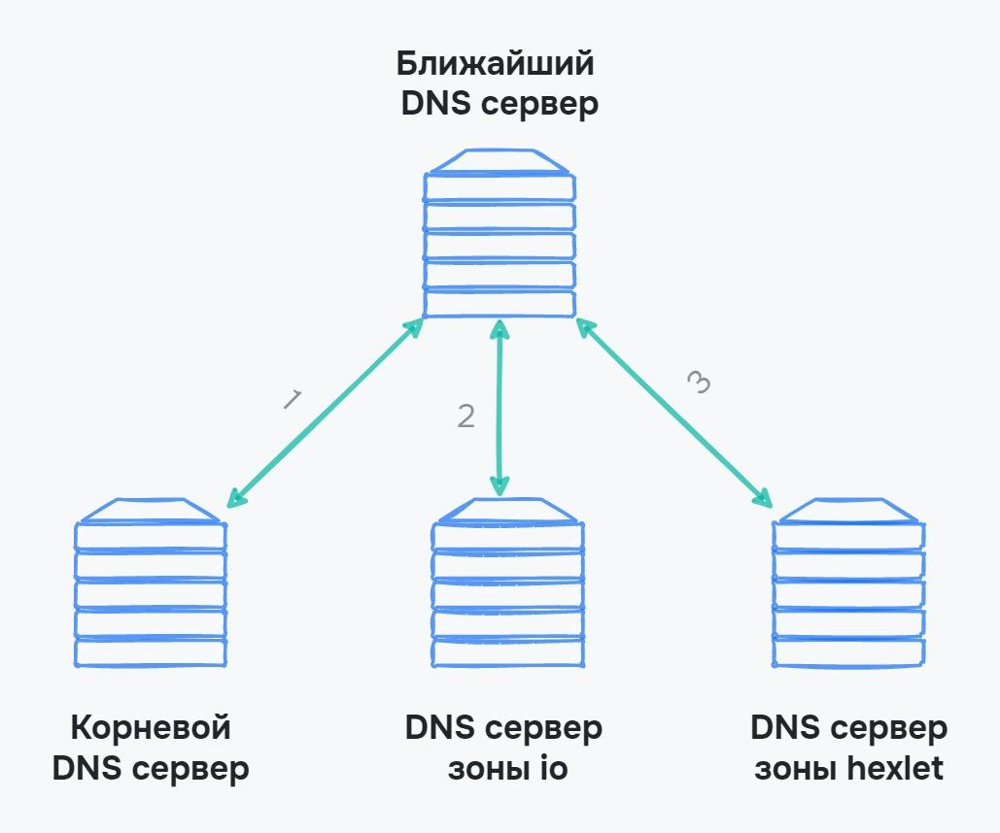

# Сайт в интернете

Сейчас вы читаете этот урок на сайте Хекслета — для вас это просто текст, изображения, ссылки, кнопки. В этом уроке мы рассмотрим, что такое сайт с технической точки зрения: из чего он состоит, как формируется адрес сайта и как в этом помогают DNS и серверы.

## Из чего состоит сайт
Современный сайт похож на клиент-серверную архитектуру. Как и в ней, сайты и приложения в интернете разбиваются на две основные составляющие:

- Frontend (фронтенд) — клиентская часть
- Backend (бекенд) — серверная часть

Разберем каждую составляющую сайта подробнее.

## Frontend
Клиентская часть сайта обрабатывается на стороне клиента, то есть нас с вами. Браузеры самостоятельно обрабатывают:

- Разметку сайта на языке HTML
- Стили сайта на языке CSS
- Различные анимации и обработку данных на языке JavaScript

Все это называется **frontend** приложения — часть, которая видна пользователю и обрабатывается у него на компьютере. На странице этого урока вы видите боковую панель с кнопками, текст, заголовки, изображения, ссылки — все это обрабатывает ваш браузер. Поэтому один и тот же сайт может по-разному отображаться на разных устройствах.

## Backend

Сайт это не только красивый внешний вид, но и сами данные, их сохранение и получение, возможность регистрации. Логическая часть сайта, которая скрыта от взгляда пользователя, называется **backend** или **серверная часть**.

Backend часто представлен двумя компонентами:

- Логические обработчики
- База данных

Например, на странице этого урока backend часть обработала:

- Статус курса — платный или бесплатный
- Зарегистрированы вы на сайте или нет
- В каком уроке вы сейчас находитесь. После этого посылается запрос на получение текста урока
- Есть ли в этом уроке тесты и упражнения
- Проходили ли вы этот урок ранее

Backend обработает информацию и, если нужно, пришлет данные, которые нужны, чтобы показать ту или иную дополнительную информацию. Например, чтобы выполнить упражнения, нужно вступить в курс.

Когда backend обработает данные, они передаются во frontend часть, где они выводятся для пользователя. Backend только передает данные, а за их вывод отвечает frontend часть.

Когда мы знаем, как сайт устроен с технической стороны, разберем, где он хранится.

## Где хранятся сайты и как на них попасть

Интернет по большей части работает по модели клиент-сервер. Это значит, что сайты хранятся на сервере, к которому клиенты обращаются через браузер.

Сервер это тоже компьютер и ему нужно где-то находиться. Он может стоять как дома у создателя сайта, так и у компаний, которые за определенную плату предоставляют доступ к этому компьютеру. Такие компании называются **хостерами**, а предлагают они услугу **хостинга**.

Использовать хостинг — самый простой способ создать свою страницу в интернете. Когда вы оплачиваете услуги хостинга, вы получаете доступ к компьютеру, техподдержку, обслуживание сервера, его настройку и функционирование. Все это ложится на плечи компании, которая предоставляет услуги. Вам нужно только создать сайт и положить его на хостинг.

Чтобы попасть на сайт, который находится на хостинге, используют уникальный адрес. Для Хекслета это адрес hexlet.io. Разберем, откуда берется это имя, из чего оно состоит и как браузер понимает, что этот адрес обозначает сайт Хекслета.

## Домен
Сейчас вы на сайте с адресом ru.hexlet.io. Такой адрес называется домен, и он состоит из нескольких уровней.

Проще определять уровень домена по количеству точек в нем. Уровни идут справа налево:

- `io` — домен первого уровня
- `hexlet` — домен второго уровня
- `ru` — домен третьего уровня. Обычно их называют поддоменами, так как связку домена первого и второго уровня воспринимают как единое целое. Например, домен *hexlet.io* и его поддомен *ru*

Домен первого и второго уровня всегда есть в адресе сайта. Домены первого уровня знакомы многим, например, `.ru`, `.com`.

Домен второго уровня относится к определенному лицу: физическому или юридическому. Например, hexlet, yandex, google, mail, vk, youtube.

Остальные уровни домена называются поддоменами, они относятся к домену третьего уровня. Например, поддомен `ru` у сайта Хекслета. Это русскоязычная версия сайта. Некоторые компании располагают мобильную версию на поддомене и тогда адрес сайта может быть таким m.site.ru

Чтобы получить домен, его нужно зарегистрировать. Это платная услуга, которую предоставляют компании-регистраторы. Домен оплачивается раз в год и закрепляется за определенным человеком или компанией. Иногда хостер и регистратор — одна и та же компания. Тогда домен и сервер связываются одновременно. Иначе нужно производить определенные настройки на стороне сервера и подтверждать свое право владения доменом.

Теперь у нас есть хостинг и есть домен, которые знают друг о друге. Разберем, как компьютер понимает, куда именно нужно обращаться, когда в адресную строку вводится ru.hexlet.io. Тут в дело вступает DNS.

## DNS

Мы уже знаем, что DNS позволяет связать IP-адрес компьютера с его именем. В современном интернете DNS связывает IP-адрес сервера с его доменом.

Так как устройств в сети много, а количество сайтов почти два миллиарда, то хранить все данные на одном DNS-сервере невозможно. Он не выдержит такой нагрузки.

DNS-серверы разбиты по уровням, где каждый уровень знает только о своем доменном уровне. Схема работы выглядит так:

1. Компьютер посылает запрос на ближайший DNS-сервер. Обычно это сервер провайдера, который поставляет интернет в квартиру
2. Если записи о таком доменном имени нет, то посылается запрос на корневой DNS-сервер. Этот сервер хранит информацию о DNS-серверах, которые ответственны за домены первого уровня
3. DNS-сервер зоны знает обо всех доменах второго уровня, которые являются поддоменами его зоны, например зоны .ru
4. Если нужен домен третьего уровня, то посылается нужный IP-адрес. Иначе цикл продолжается до тех пор, пока не будет получен нужный адрес

Подробнее об этом процессе вы можете прочитать в нашем гайде [Что такое DNS-сервер простыми словами](https://guides.hexlet.io/ru/dns/?_gl=1*4zgxhf*_ga*MTExOTQzMTcyNC4xNzAwNTc4NDA3*_ga_PM3R85EKHN*MTcwMTI2NzcyMi43LjEuMTcwMTI2OTA2MC4wLjAuMA..*_ga_WWGZ6EVHEY*MTcwMTI2ODQwOC45LjEuMTcwMTI2ODk5MS42MC4wLjA).

## Выводы

В этом уроке мы рассмотрели, что такое сайт с технической точки зрения: из чего он состоит, как формируется адрес сайта и как в этом помогают серверы и DNS. Повторим важные моменты:

- Сайты в интернете похожи по своей структуре на клиент-серверную архитектуру и делятся на frontend и backend
- Frontend часть отвечает за вывод данных на страницу. Разметка, стили и некоторые части кода на JavaScript исполняются в браузере пользователя
- Backend часть отвечает за логику приложения и часто разбивается на две составляющие: логика и база данных
- В большинстве случаев сайты располагаются у хостеров — организаций, которые предоставляют доступ к серверам
- Чтобы попасть на сайт у него есть домен — имя, которое связано с сервером на хостинге
- Для связи домена и IP адреса хостинга используется DNS

### Дополнительные материалы

1. [Первый сайт в интернете](http://info.cern.ch/)

### Вопросы для самопроверки

**На какие основные части делится сайт?**

- Fullend
- Frontend
- Allend
- Backend

**Какие компании предоставляют серверы для размещения сайта?**

- Хостеры
- Домены
- Размещатели
- Серверные компании

**Как называется адрес сайта?**

- Домен
- Хостинг
- БД

**Сколько уровней домена у адреса ru.hexlet.io?**

- 2
- 3
- 1

**Какой сервис связывает IP-адрес сервера и доменное имя?**

- UDP
- DNS
- TCP
- IP