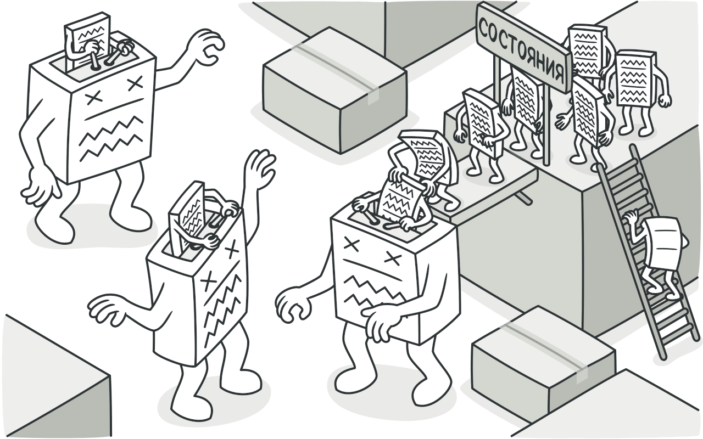
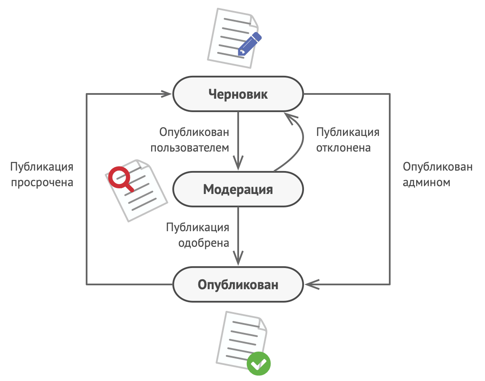
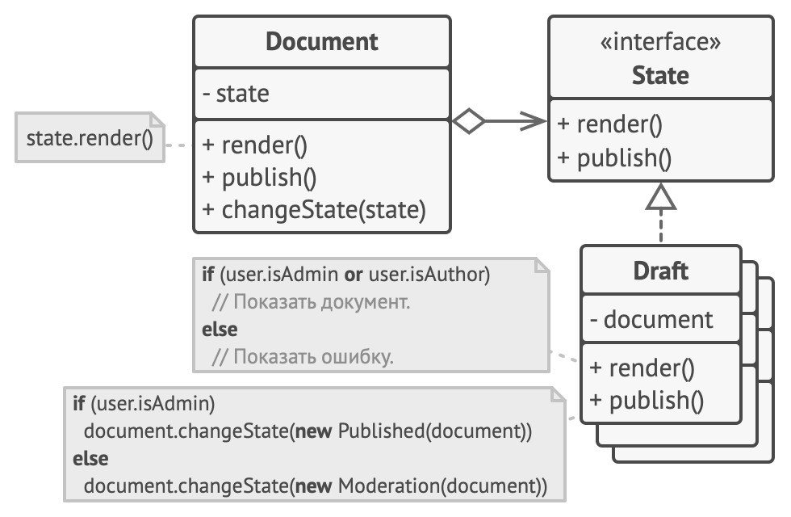
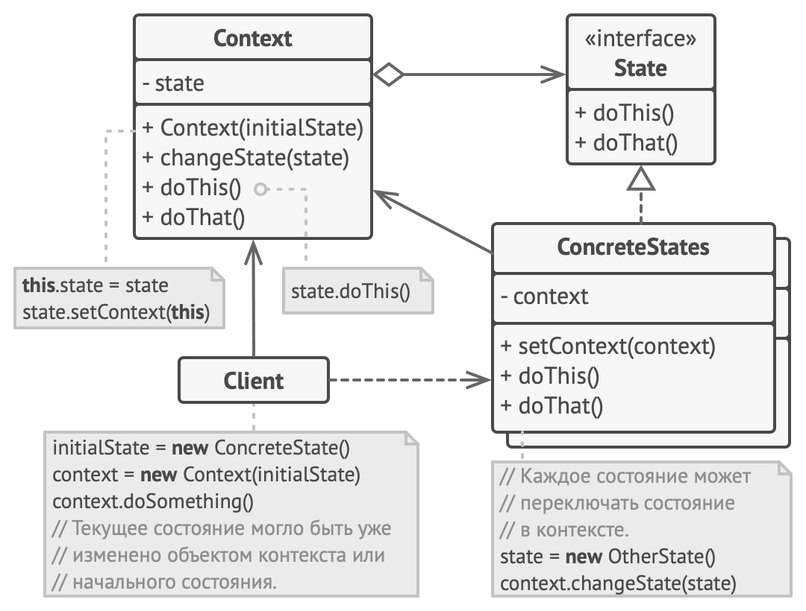

# Состояние

> Также известен как: **State**

## Суть паттерна

**Состояние** — это поведенческий паттерн проектирования, который позволяет объектам менять поведение в зависимости от своего состояния. Извне создаётся впечатление, что изменился класс объекта.



## Проблема

Паттерн **Состояние** невозможно рассматривать в отрыве от концепции машины состояний, также известной как `стейт-машина` или `конечный автомат`.


*Конечный автомат.*

Основная идея в том, что программа может находиться в одном из нескольких состояний, которые всё время сменяют друг друга. Набор этих состояний, а также переходов между ними, предопределён и конечен. Находясь в разных состояниях, программа может по-разному реагировать на одни и те же события, которые происходят с ней.

Такой подход можно применить и к отдельным объектам. Например, объект `Документ` может принимать три состояния: `Черновик`, `Модерация` или `Опубликован`. В каждом из этих состоянии метод `опубликовать` будет работать по-разному:
- Из черновика он отправит документ на модерацию.
- Из модерации — в публикацию, но при условии, что это сделал администратор.
- В опубликованном состоянии метод не будет делать ничего.



*Возможные состояния документа и переходы между ними.*

Машину состояний чаще всего реализуют с помощью множества условных операторов, `if` либо `switch`, которые проверяют текущее состояние объекта и выполняют соответствующее поведение. Наверняка вы уже реализовали хотя бы одну машину состояний в своей жизни, даже не зная об этом. Как насчёт вот такого кода, выглядит знакомо?

```c
class Document is
    field state: string
    // ...
    method publish() is
        switch (state)
            "draft":
                state = "moderation"
                break
            "moderation":
                if (currentUser.role == "admin")
                    state = "published"
                break
            "published":
                // Do nothing.
                break
    // ...
```

Основная проблема такой машины состояний проявится в том случае, если в `Документ` добавить ещё десяток состояний. Каждый метод будет состоять из увесистого условного оператора, перебирающего доступные состояния. Такой код крайне сложно поддерживать. Малейшее изменение логики переходов заставит вас перепроверять работу всех методов, которые содержат условные операторы машины состояний.

Путаница и нагромождение условий особенно сильно проявляется в старых проектах. Набор возможных состояний бывает трудно предопределить заранее, поэтому они всё время добавляются в процессе эволюции программы. Из-за этого решение, которое выглядело простым и эффективным в самом начале разработки, может впоследствии стать проекцией большого макаронного монстра.

## Решение

Паттерн **Состояние** предлагает создать отдельные классы для каждого состояния, в котором может пребывать объект, а затем вынести туда поведения, соответствующие этим состояниям.

Вместо того, чтобы хранить код всех состояний, первоначальный объект, называемый **контекстом**, будет содержать ссылку на один из объектов-состояний и делегировать ему работу, зависящую от состояния.



*Документ делегирует работу своему активному объекту-состоянию.*

Благодаря тому, что объекты состояний будут иметь общий интерфейс, контекст сможет делегировать работу состоянию, не привязываясь к его классу. Поведение контекста можно будет изменить в любой момент, подключив к нему другой объект-состояние.

Очень важным нюансом, отличающим этот паттерн от [**Стратегии**](strategy.md), является то, что и контекст, и сами конкретные состояния могут знать друг о друге и инициировать переходы от одного состояния к другому.

## Аналогия из жизни

Ваш смартфон ведёт себя по-разному, в зависимости от текущего состояния:

- Когда телефон разблокирован, нажатие кнопок телефона приводит к каким-то действиям.
- Когда телефон заблокирован, нажатие кнопок приводит к экрану разблокировки.
- Когда телефон разряжен, нажатие кнопок приводит к экрану зарядки.

## Структура



1. **Контекст** хранит ссылку на объект состояния и делегирует ему часть работы, зависящей от состояний. Контекст работает с этим объектом через общий интерфейс состояний. Контекст должен иметь метод для присваивания ему нового объекта-состояния.
2. **Состояние** описывает общий интерфейс для всех конкретных состояний.
3. **Конкретные состояния** реализуют поведения, связанные с определённым состоянием контекста. Иногда приходится создавать целые иерархии классов состояний, чтобы обобщить дублирующий код. <br/>Состояние может иметь обратную ссылку на объект контекста. Через неё не только удобно получать из контекста нужную информацию, но и осуществлять смену его состояния.
4. И контекст, и объекты конкретных состояний могут решать, когда и какое следующее состояние будет выбрано. Чтобы переключить состояние, нужно подать другой объект-состояние в контекст.

## Псевдокод

В этом примере паттерн **Состояние** изменяет функциональность одних и тех же элементов управления музыкальным проигрывателем, в зависимости от того, в каком состоянии находится сейчас проигрыватель.


*Пример изменение поведения проигрывателя с помощью состояний.*

Объект проигрывателя содержит объект-состояние, которому и делегирует основную работу. Изменяя состояния, можно менять то, как ведут себя элементы управления проигрывателя.

```c
// Общий интерфейс всех состояний.
abstract class State is
    protected field player: AudioPlayer

    // Контекст передаёт себя в конструктор состояния, чтобы
    // состояние могло обращаться к его данным и методам в
    // будущем, если потребуется.
    constructor State(player) is
        this.player = player

    abstract method clickLock()
    abstract method clickPlay()
    abstract method clickNext()
    abstract method clickPrevious()


// Конкретные состояния реализуют методы абстрактного состояния
// по-своему.
class LockedState extends State is

    // При разблокировке проигрователя с заблокированными
    // клавишами он может принять одно из двух состояний.
    method clickLock() is
        if (player.playing)
            player.changeState(new PlayingState(player))
        else
            player.changeState(new ReadyState(player))

    method clickPlay() is
        // Ничего не делать.

    method clickNext() is
        // Ничего не делать.

    method clickPrevious() is
        // Ничего не делать.


// Конкретные состояния сами могут переводить контекст в другое
// состояние.
class ReadyState extends State is
    method clickLock() is
        player.changeState(new LockedState(player))

    method clickPlay() is
        player.startPlayback()
        player.changeState(new PlayingState(player))

    method clickNext() is
        player.nextSong()

    method clickPrevious() is
        player.previousSong()


class PlayingState extends State is
    method clickLock() is
        player.changeState(new LockedState(player))

    method clickPlay() is
        player.stopPlayback()
        player.changeState(new ReadyState(player))

    method clickNext() is
        if (event.doubleclick)
            player.nextSong()
        else
            player.fastForward(5)

    method clickPrevious() is
        if (event.doubleclick)
            player.previous()
        else
            player.rewind(5)


// Проигрыватель выступает в роли контекста.
class AudioPlayer is
    field state: State
    field UI, volume, playlist, currentSong

    constructor AudioPlayer() is
        this.state = new ReadyState(this)

        // Контекст заставляет состояние реагировать на
        // пользовательский ввод вместо себя. Реакция может быть
        // разной, в зависимости от того, какое состояние сейчас
        // активно.
        UI = new UserInterface()
        UI.lockButton.onClick(this.clickLock)
        UI.playButton.onClick(this.clickPlay)
        UI.nextButton.onClick(this.clickNext)
        UI.prevButton.onClick(this.clickPrevious)

    // Другие объекты тоже должны иметь возможность заменять
    // состояние проигрывателя.
    method changeState(state: State) is
        this.state = state

    // Методы UI будут делегировать работу активному состоянию.
    method clickLock() is
        state.clickLock()
    method clickPlay() is
        state.clickPlay()
    method clickNext() is
        state.clickNext()
    method clickPrevious() is
        state.clickPrevious()

    // Сервисные методы контекста, вызываемые состояниями.
    method startPlayback() is
        // ...
    method stopPlayback() is
        // ...
    method nextSong() is
        // ...
    method previousSong() is
        // ...
    method fastForward(time) is
        // ...
    method rewind(time) is
        // ...
```

## Применимость

**Когда у вас есть объект, поведение которого кардинально меняется в зависимости от внутреннего состояния, причём типов состояний много, и их код часто меняется.**

Паттерн предлагает выделить в собственные классы все поля и методы, связанные с определёнными состояниями. Первоначальный объект будет постоянно ссылаться на один из объектов-состояний, делегируя ему часть своей работы. Для изменения состояния в контекст достаточно будет подставить другой объект-состояние.

---

**Когда код класса содержит множество больших, похожих друг на друга, условных операторов, которые выбирают поведения в зависимости от текущих значений полей класса.**

Паттерн предлагает переместить каждую ветку такого условного оператора в собственный класс. Тут же можно поселить и все поля, связанные с данным состоянием.

---

**Когда вы сознательно используете табличную машину состояний, построенную на условных операторах, но вынуждены мириться с дублированием кода для похожих состояний и переходов.**

Паттерн Состояние позволяет реализовать иерархическую машину состояний, базирующуюся на наследовании. Вы можете отнаследовать похожие состояния от одного родительского класса и вынести туда весь дублирующий код.

## Шаги реализации

1. Определитесь с классом, который будет играть роль контекста. Это может быть как существующий класс, в котором уже есть зависимость от состояния, так и новый класс, если код состояний размазан по нескольким классам.
2. Создайте общий интерфейс состояний. Он должен описывать методы, общие для всех состояний, обнаруженных в контексте. Заметьте, что не всё поведение контекста нужно переносить в состояние, а только то, которое зависит от состояний.
3. Для каждого фактического состояния создайте класс, реализующий интерфейс состояния. Переместите код, связанный с конкретными состояниями в нужные классы. В конце концов, все методы интерфейса состояния должны быть реализованы во всех классах состояний.<br/>При переносе поведения из контекста вы можете столкнуться с тем, что это поведение зависит от приватных полей или методов контекста, к которым нет доступа из объекта состояния. Существует парочка способов обойти эту проблему.<br/>Самый простой — оставить поведение внутри контекста, вызывая его из объекта состояния. С другой стороны, вы можете сделать классы состояний вложенными в класс контекста, и тогда они получат доступ ко всем приватным частям контекста. Но последний способ доступен только в некоторых языках программирования (например, Java, C#).
4. Создайте в контексте поле для хранения объектов-состояний, а также публичный метод для изменения значения этого поля.
5. Старые методы контекста, в которых находился зависимый от состояния код, замените на вызовы соответствующих методов объекта-состояния.
6. В зависимости от бизнес-логики, разместите код, который переключает состояние контекста либо внутри контекста, либо внутри классов конкретных состояний.

## Преимущества и недостатки

**Преимущества**

- Избавляет от множества больших условных операторов машины состояний.
- Концентрирует в одном месте код, связанный с определённым состоянием.
- Упрощает код контекста.

**Недостатки**

- Может неоправданно усложнить код, если состояний мало и они редко меняются.

## Примеры реализации паттерна

### Python

- **Сложность**: 1/3
- **Популярность**: 2/3
- **Применимость**: Паттерн Состояние часто используют в Python для превращения в объекты громоздких стейт-машин, построенных на операторах `switch`.
- **Признаки применения паттерна**: Методы класса делегируют работу одному вложенному объекту.

Этот пример показывает структуру паттерна `Состояние`, а именно — из каких классов он состоит, какие роли эти классы выполняют и как они взаимодействуют друг с другом.

**main.py**: Пример структуры паттерна

```python
from __future__ import annotations
from abc import ABC, abstractmethod


class Context:
    """
    Контекст определяет интерфейс, представляющий интерес для
    клиентов. Он также хранит ссылку на экземпляр подкласса Состояния,
    который отображает текущее состояние Контекста.
    """

    _state = None
    """
    Ссылка на текущее состояние Контекста.
    """

    def __init__(self, state: State) -> None:
        self.transition_to(state)

    def transition_to(self, state: State):
        """
        Контекст позволяет изменять объект Состояния во время
        выполнения.
        """

        print(f"Context: Transition to {type(state).__name__}")
        self._state = state
        self._state.context = self

    """
    Контекст делегирует часть своего поведения текущему объекту
    Состояния.
    """

    def request1(self):
        self._state.handle1()

    def request2(self):
        self._state.handle2()


class State(ABC):
    """
    Базовый класс Состояния объявляет методы, которые должны
    реализовать все Конкретные Состояния, а также предоставляет
    обратную ссылку на объект Контекст, связанный с Состоянием.
    Эта обратная ссылка может использоваться Состояниями для
    передачи Контекста другому Состоянию.
    """

    @property
    def context(self) -> Context:
        return self._context

    @context.setter
    def context(self, context: Context) -> None:
        self._context = context

    @abstractmethod
    def handle1(self) -> None:
        pass

    @abstractmethod
    def handle2(self) -> None:
        pass


"""
Конкретные Состояния реализуют различные модели поведения, связанные с
состоянием Контекста.
"""


class ConcreteStateA(State):
    def handle1(self) -> None:
        print("ConcreteStateA handles request1.")
        print("ConcreteStateA wants to change the state of the "
            + "context.")
        self.context.transition_to(ConcreteStateB())

    def handle2(self) -> None:
        print("ConcreteStateA handles request2.")


class ConcreteStateB(State):
    def handle1(self) -> None:
        print("ConcreteStateB handles request1.")

    def handle2(self) -> None:
        print("ConcreteStateB handles request2.")
        print("ConcreteStateB wants to change the state of the "
            + "context.")
        self.context.transition_to(ConcreteStateA())


if __name__ == "__main__":
    # Клиентский код.

    context = Context(ConcreteStateA())
    context.request1()
    context.request2()
```

**Output.txt**: Результат выполнения

```text
Context: Transition to ConcreteStateA
ConcreteStateA handles request1.
ConcreteStateA wants to change the state of the context.
Context: Transition to ConcreteStateB
ConcreteStateB handles request2.
ConcreteStateB wants to change the state of the context.
Context: Transition to ConcreteStateA
```

### PHP

- **Сложность**: 1/3
- **Популярность**: 1/3
- **Применимость**: Паттерн Состояние иногда используют в PHP для превращения громоздких стейт-машин, построенных на операторах `switch`, в объекты.
- **Признаки применения паттерна**: Методы класса делегируют работу одному вложенному объекту.

Этот пример показывает структуру паттерна **Состояние**, а именно — из каких классов он состоит, какие роли эти классы выполняют и как они взаимодействуют друг с другом.

После ознакомления со структурой, вам будет легче воспринимать второй пример, который рассматривает реальный случай использования паттерна в мире PHP.

**index.php**: Пример структуры паттерна

```php
namespace RefactoringGuru\State\Conceptual;

/**
 * Контекст определяет интерфейс, представляющий интерес для клиентов.
 * Он также хранит ссылку на экземпляр подкласса Состояния, который
 * отображает текущее состояние Контекста.
 */
class Context
{
    /**
     * @var State Ссылка на текущее состояние Контекста.
     */
    private $state;

    public function __construct(State $state)
    {
        $this->transitionTo($state);
    }

    /**
     * Контекст позволяет изменять объект Состояния во время
     * выполнения.
     */
    public function transitionTo(State $state): void
    {
        echo "Context: Transition to " . get_class($state) . ".\n";
        $this->state = $state;
        $this->state->setContext($this);
    }

    /**
     * Контекст делегирует часть своего поведения текущему объекту
     * Состояния.
     */
    public function request1(): void
    {
        $this->state->handle1();
    }

    public function request2(): void
    {
        $this->state->handle2();
    }
}

/**
 * Базовый класс Состояния объявляет методы, которые должны
 * реализовать все Конкретные Состояния, а также предоставляет
 * обратную ссылку на объект Контекст, связанный с Состоянием.
 * Эта обратная ссылка может использоваться Состояниями 
 * для передачи Контекста другому Состоянию.
 */
abstract class State
{
    /**
     * @var Context
     */
    protected $context;

    public function setContext(Context $context)
    {
        $this->context = $context;
    }

    abstract public function handle1(): void;

    abstract public function handle2(): void;
}

/**
 * Конкретные Состояния реализуют различные модели поведения,
 * связанные с состоянием Контекста.
 */
class ConcreteStateA extends State
{
    public function handle1(): void
    {
        echo "ConcreteStateA handles request1.\n";
        echo "ConcreteStateA wants to change the state of the "
            . "context.\n";
        $this->context->transitionTo(new ConcreteStateB());
    }

    public function handle2(): void
    {
        echo "ConcreteStateA handles request2.\n";
    }
}

class ConcreteStateB extends State
{
    public function handle1(): void
    {
        echo "ConcreteStateB handles request1.\n";
    }

    public function handle2(): void
    {
        echo "ConcreteStateB handles request2.\n";
        echo "ConcreteStateB wants to change the state of the "
            . "context.\n";
        $this->context->transitionTo(new ConcreteStateA());
    }
}

/**
 * Клиентский код.
 */
$context = new Context(new ConcreteStateA());
$context->request1();
$context->request2();
```

**Output.txt**: Результат выполнения

```text
Context: Transition to RefactoringGuru\State\Conceptual\
ConcreteStateA.
ConcreteStateA handles request1.
ConcreteStateA wants to change the state of the context.
Context: Transition to RefactoringGuru\State\Conceptual\
ConcreteStateB.
ConcreteStateB handles request2.
ConcreteStateB wants to change the state of the context.
Context: Transition to RefactoringGuru\State\Conceptual\
ConcreteStateA.
```