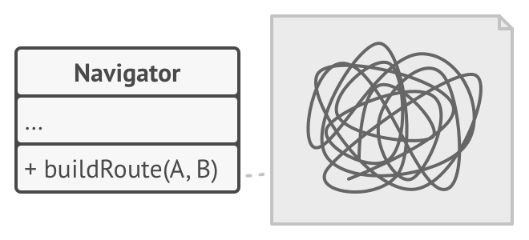

# Стратегия

> Также известен как: **Strategy**

## Суть паттерна
**Стратегия** — это поведенческий паттерн проектирования, который определяет семейство схожих алгоритмов и помещает каждый из них в собственный класс, после чего алгоритмы можно взаимозаменять прямо во время исполнения программы.


## Проблема

Вы решили написать приложение-навигатор для путешественников. Оно должно показывать красивую и удобную карту, позволяющую с лёгкостью ориентироваться в незнакомом городе.

Одной из самых востребованных функций являлся поиск и прокладывание маршрутов. Пребывая в неизвестном ему городе, пользователь должен иметь возможность указать начальную точку и пункт назначения, а навигатор — проложит оптимальный путь.

Первая версия вашего навигатора могла прокладывать маршрут лишь по дорогам, поэтому отлично подходила для путешествий на автомобиле. Но, очевидно, не все ездят в отпуск на машине. Поэтому следующим шагом вы добавили в навигатор прокладывание пеших маршрутов.

Через некоторое время выяснилось, что некоторые люди предпочитают ездить по городу на общественном транспорте. Поэтому вы добавили и такую опцию прокладывания пути.

Но и это ещё не всё. В ближайшей перспективе вы хотели бы добавить прокладывание маршрутов по велодорожкам. А в отдалённом будущем — интересные маршруты посещения достопримечательностей.



*Код навигатора становится слишком раздутым.*

Если с популярностью навигатора не было никаких проблем, то техническая часть вызывала вопросы и периодическую головную боль. С каждым новым алгоритмом код основного класса навигатора увеличивался вдвое. В таком большом классе стало довольно трудно ориентироваться.

Любое изменение алгоритмов поиска, будь то исправление багов или добавление нового алгоритма, затрагивало основной класс. Это повышало риск сделать ошибку, случайно задев остальной работающий код.

Кроме того, осложнялась командная работа с другими программистами, которых вы наняли после успешного релиза навигатора. Ваши изменения нередко затрагивали один и тот же код, создавая конфликты, которые требовали дополнительного времени на их разрешение.

## Решение

Паттерн **Стратегия** предлагает определить семейство схожих алгоритмов, которые часто изменяются или расширяются, и вынести их в собственные классы, называемые **стратегиями**.

Вместо того, чтобы изначальный класс сам выполнял тот или иной алгоритм, он будет играть роль контекста, ссылаясь на одну из стратегий и делегируя ей выполнение работы. Чтобы сменить алгоритм, вам будет достаточно подставить в контекст другой объект-стратегию.

Важно, чтобы все стратегии имели общий интерфейс. Используя этот интерфейс, контекст будет независимым от конкретных классов стратегий. С другой стороны, вы сможете изменять и добавлять новые виды алгоритмов, не трогая код контекста.


*Стратегии построения пути.*

В нашем примере каждый алгоритм поиска пути переедет в свой собственный класс. В этих классах будет определён лишь один метод, принимающий в параметрах координаты начала и конца пути, а возвращающий массив точек маршрута.

Хотя каждый класс будет прокладывать маршрут по-своему, для навигатора это не будет иметь никакого значения, так как его работа заключается только в отрисовке маршрута. Навигатору достаточно подать в стратегию данные о начале и конце маршрута, чтобы получить массив точек маршрута в оговорённом формате.

Класс навигатора будет иметь метод для установки стратегии, позволяя изменять стратегию поиска пути на лету. Такой метод пригодится клиентскому коду навигатора, например, переключателям типов маршрутов в пользовательском интерфейсе.

## Аналогия из жизни


*Различные стратегии попадания в аэропорт.*

Вам нужно добраться до аэропорта. Можно доехать на автобусе, такси или велосипеде. Здесь вид транспорта является стратегией. Вы выбираете конкретную стратегию в зависимости от контекста — наличия денег или времени до отлёта.

## Структура


1. **Контекст** хранит ссылку на объект конкретной стратегии, работая с ним через общий интерфейс стратегий.
2. **Стратегия** определяет интерфейс, общий для всех вариаций алгоритма. Контекст использует этот интерфейс для вызова алгоритма.<br/>Для контекста неважно, какая именно вариация алгоритма будет выбрана, так как все они имеют одинаковый интерфейс.
3. **Конкретные стратегии** реализуют различные вариации алгоритма.
4. Во время выполнения программы контекст получает вызовы от клиента и делегирует их объекту конкретной стратегии.
5. Клиент должен создать объект конкретной стратегии и передать его в конструктор контекста. Кроме этого, клиент должен иметь возможность заменить стратегию на лету, используя сеттер. Благодаря этому, контекст не будет знать о том, какая именно стратегия сейчас выбрана.

## Псевдокод

В этом примере контекст использует Стратегию для выполнения той или иной арифметической операции.

```c
// Общий интерфейс всех стратегий.
interface Strategy is
    method execute(a, b)

// Каждая конкретная стратегия реализует общий интерфейс своим
// способом.
class ConcreteStrategyAdd implements Strategy is
    method execute(a, b) is
        return a + b

class ConcreteStrategySubtract implements Strategy is
    method execute(a, b) is
        return a - b

class ConcreteStrategyMultiply implements Strategy is
    method execute(a, b) is
        return a * b

// Контекст всегда работает со стратегиями через общий
// интерфейс. Он не знает, какая именно стратегия ему подана.
class Context is
    private strategy: Strategy

    method setStrategy(Strategy strategy) is
        this.strategy = strategy

    method executeStrategy(int a, int b) is
        return strategy.execute(a, b)


// Конкретная стратегия выбирается на более высоком уровне,
// например, конфигуратором всего приложения. Готовый объект-
// стратегия подаётся в клиентский объект, а затем может быть
// заменён другой стратегией в любой момент на лету.
class ExampleApplication is
    method main() is
        // 1. Создать объект контекста.
        // 2. Получить первое число (n1).
        // 3. Получить второе число (n2).
        // 4. Получить желаемую операцию.
        // 5. Затем, выбрать стратегию:

        if (action == addition) then
            context.setStrategy(new ConcreteStrategyAdd())

        if (action == subtraction) then
            context.setStrategy(new ConcreteStrategySubtract())

        if (action == multiplication) then
            context.setStrategy(new ConcreteStrategyMultiply())

        // 6. Выполнить операцию с помощью стратегии:
        result = context.executeStrategy(n1, n2)

        // 7. Вывести результат на экран.
```

## Применимость

**Когда вам нужно использовать разные вариации какого-то алгоритма внутри одного объекта.**

Стратегия позволяет варьировать поведение объекта во время выполнения программы, подставляя в него различные объекты-поведения (например, отличающиеся балансом скорости и потребления ресурсов).

---

**Когда у вас есть множество похожих классов, отличающихся только некоторым поведением.**

Стратегия позволяет вынести отличающееся поведение в отдельную иерархию классов, а затем свести первоначальные классы к одному, сделав поведение этого класса настраиваемым.

---

**Когда вы не хотите обнажать детали реализации алгоритмов для других классов.**

Стратегия позволяет изолировать код, данные и зависимости алгоритмов от других объектов, скрыв эти детали внутри классов-стратегий.

---

**Когда различные вариации алгоритмов реализованы в виде развесистого условного оператора. Каждая ветка такого оператора представляет собой вариацию алгоритма.**

Стратегия помещает каждую лапу такого оператора в отдельный класс-стратегию. Затем контекст получает определённый объект-стратегию от клиента и делегирует ему работу. Если вдруг понадобится сменить алгоритм, в контекст можно подать другую стратегию.

## Шаги реализации

1. Определите алгоритм, который подвержен частым изменениям. Также подойдёт алгоритм, имеющий несколько вариаций, которые выбираются во время выполнения программы.
2. Создайте интерфейс стратегий, описывающий этот алгоритм. Он должен быть общим для всех вариантов алгоритма.
3. Поместите вариации алгоритма в собственные классы, которые реализуют этот интерфейс.
4. В классе контекста создайте поле для хранения ссылки на текущий объект-стратегию, а также метод для её изменения. Убедитесь в том, что контекст работает с этим объектом только через общий интерфейс стратегий.
5. Клиенты контекста должны подавать в него соответствующий объект-стратегию, когда хотят, чтобы контекст вёл себя определённым образом.

## Преимущества и недостатки

**Преимущества**

- Горячая замена алгоритмов на лету.
- Изолирует код и данные алгоритмов от остальных классов.
- Уход от наследования к делегированию.
- Реализует [принцип открытости/закрытости](open_close_principle.md).

**Недостатки**

- Усложняет программу за счёт дополнительных классов.
- Клиент должен знать, в чём состоит разница между стратегиями, чтобы выбрать подходящую.

## Примеры реализации паттерна

### Python

- **Сложность**: 1/3
- **Популярность**: 3/3
- **Применимость**: Стратегия часто используется в Python-коде, особенно там, где нужно подменять алгоритм во время выполнения программы. Многие примеры стратегии можно заменить простыми lambda-выражениями.
- **Признаки применения паттерна**: Класс делегирует выполнение вложенному объекту абстрактного типа или интерфейса.

Этот пример показывает структуру паттерна `Стратегия`, а именно — из каких классов он состоит, какие роли эти классы выполняют и как они взаимодействуют друг с другом.

**main.py**: Пример структуры паттерна

```python
from __future__ import annotations
from abc import ABC, abstractmethod
from typing import List


class Context():
    """
    Контекст определяет интерфейс, представляющий интерес для
    клиентов.
    """

    def __init__(self, strategy: Strategy) -> None:
        """
        Обычно Контекст принимает стратегию через конструктор, а также
        предоставляет сеттер для её изменения во время выполнения.
        """

        self._strategy = strategy

    @property
    def strategy(self) -> Strategy:
        """
        Контекст хранит ссылку на один из объектов Стратегии. Контекст
        не знает конкретного класса стратегии. Он должен работать со
        всеми стратегиями через интерфейс Стратегии.
        """

        return self._strategy

    @strategy.setter
    def strategy(self, strategy: Strategy) -> None:
        """
        Обычно Контекст позволяет заменить объект Стратегии во время
        выполнения.
        """

        self._strategy = strategy

    def do_some_business_logic(self) -> None:
        """
        Вместо того, чтобы самостоятельно реализовывать множественные
        версии алгоритма, Контекст делегирует некоторую работу
        объекту Стратегии.
        """

        # ...

        print("Context: Sorting data using the strategy (not sure "
            + "how it'll do it)")
        result = self._strategy.do_algorithm(
            ["a", "b", "c", "d", "e"])
        print(",".join(result))

        # ...


class Strategy(ABC):
    """
    Интерфейс Стратегии объявляет операции, общие для всех
    поддерживаемых версий некоторого алгоритма.

    Контекст использует этот интерфейс для вызова алгоритма,
    определённого Конкретными Стратегиями.
    """

    @abstractmethod
    def do_algorithm(self, data: List):
        pass


"""
Конкретные Стратегии реализуют алгоритм, следуя базовому интерфейсу
Стратегии. Этот интерфейс делает их взаимозаменяемыми в Контексте.
"""


class ConcreteStrategyA(Strategy):
    def do_algorithm(self, data: List) -> List:
        return sorted(data)


class ConcreteStrategyB(Strategy):
    def do_algorithm(self, data: List) -> List:
        return reversed(sorted(data))


if __name__ == "__main__":
    # Клиентский код выбирает конкретную стратегию и передаёт её в
    # контекст. Клиент должен знать о различиях между стратегиями,
    # чтобы сделать правильный выбор.

    context = Context(ConcreteStrategyA())
    print("Client: Strategy is set to normal sorting.")
    context.do_some_business_logic()
    print()

    print("Client: Strategy is set to reverse sorting.")
    context.strategy = ConcreteStrategyB()
    context.do_some_business_logic()
```

**Output.txt**: Результат выполнения

```text
Client: Strategy is set to normal sorting.
Context: Sorting data using the strategy (not sure how it'll do it)
a,b,c,d,e

Client: Strategy is set to reverse sorting.
Context: Sorting data using the strategy (not sure how it'll do it)
e,d,c,b,a
```

### PHP

- **Сложность**: 1/3
- **Популярность**: 3/3
- **Применимость**: Стратегию часто используют в PHP-коде, особенно там, где нужно подменять алгоритм во время выполнения программы. Но у паттерна есть довольно сильный конкурент в лице анонимных функций, которые PHP уже довольно давно поддерживает.
- **Признаки применения паттерна**: Класс делегирует выполнение вложенному объекту абстрактного типа или интерфейса.

<tabs>
<tab title="Концептуальный пример">
<h4 id="strategy-php-concept">Концептуальный пример</h4>
<p>Этот пример показывает структуру паттерна <b>Стратегия</b>, а именно — из каких классов он состоит, какие роли эти классы выполняют и как они взаимодействуют друг с другом.</p>
<p>После ознакомления со структурой, вам будет легче воспринимать второй пример, который рассматривает реальный случай использования паттерна в мире PHP.</p>
<p><b>index.php</b>: Пример структуры паттерна</p>
<code-block lang="php">
<![CDATA[
namespace RefactoringGuru\Strategy\Conceptual;

/**
* Контекст определяет интерфейс, представляющий интерес для клиентов.
*/

class Context
{
    /**
    * @var Strategy Контекст хранит ссылку на один из объектов Стратегии.
    * Контекст не знает конкретного класса стратегии. Он должен работать со
    * всеми стратегиями через интерфейс Стратегии.
    */
    private $strategy;
    
    /**
    * Обычно Контекст принимает стратегию через конструктор, а также
    * предоставляет сеттер для её изменения во время выполнения.
    */
    public function __construct(Strategy $strategy)
    {
        $this->strategy = $strategy;
    }
    
    /**
    * Обычно Контекст позволяет заменить объект Стратегии во время выполнения.
    */
    public function setStrategy(Strategy $strategy)
    {
        $this->strategy = $strategy;
    }
    
    /**
    * Вместо того, чтобы самостоятельно реализовывать множественные версии
    * алгоритма, Контекст делегирует некоторую работу объекту Стратегии.
    */
    public function doSomeBusinessLogic(): void
    {
        // ...
    
        echo "Context: Sorting data using the strategy (not sure how it'll do it)\n";
        $result = $this->strategy->doAlgorithm(["a", "b", "c", "d", "e"]);
        echo implode(",", $result) . "\n";
        // ...
    }
}

/**
* Интерфейс Стратегии объявляет операции, общие для всех поддерживаемых версий
* некоторого алгоритма.
*
* Контекст использует этот интерфейс для вызова алгоритма, определённого
* Конкретными Стратегиями.
*/

interface Strategy
{
    public function doAlgorithm(array $data): array;
}

/**
* Конкретные Стратегии реализуют алгоритм, следуя базовому интерфейсу
* Стратегии. Этот интерфейс делает их взаимозаменяемыми в Контексте.
*/

class ConcreteStrategyA implements Strategy
{
    public function doAlgorithm(array $data): array
    {
        sort($data);
        return $data;
    }
}

class ConcreteStrategyB implements Strategy
{
    public function doAlgorithm(array $data): array
    {
        rsort($data);
        return $data;
    }
}

/**
* Клиентский код выбирает конкретную стратегию и передаёт её в контекст. Клиент
* должен знать о различиях между стратегиями, чтобы сделать правильный выбор.
*/
$context = new Context(new ConcreteStrategyA());
echo "Client: Strategy is set to normal sorting.\n";
$context->doSomeBusinessLogic();

echo "\n";

echo "Client: Strategy is set to reverse sorting.\n";
$context->setStrategy(new ConcreteStrategyB());
$context->doSomeBusinessLogic();

]]>
</code-block>
<p><b>Output.txt</b>: Результат выполнения</p>
<code-block lang="text">
<![CDATA[
Client: Strategy is set to normal sorting.
Context: Sorting data using the strategy (not sure how it'll do it)
a,b,c,d,e

Client: Strategy is set to reverse sorting.
Context: Sorting data using the strategy (not sure how it'll do it)
e,d,c,b,a

]]>
</code-block>
</tab>
<tab title="Пример из реальной жизни">
<h4 id="strategy-php-real">Пример из реальной жизни</h4>
<p>В этом примере паттерн Стратегия используется для представления способов оплаты в приложении электронной коммерции.</p>
<p>Каждый способ оплаты может отображать форму оплаты для сбора надлежащих платёжных реквизитов пользователя и отправки его в компанию по обработке платежей. После того, как компания по обработке платежей перенаправляет пользователя обратно на сайт, метод оплаты проверяет возвращаемые параметры и помогает решить, был ли заказ завершён.</p>
<p><b>index.php</b>: Пример из реальной жизни</p>
<code-block lang="php">
<![CDATA[
namespace RefactoringGuru\Strategy\RealWorld;

/**
* Это роутер и контроллер нашего приложения. Получив запрос, этот класс решает,
* какое поведение должно выполняться. Когда приложение получает требование об
* оплате, класс OrderController также решает, какой способ оплаты следует
* использовать для его обработки. Таким образом, этот класс действует как
* Контекст и в то же время как Клиент.
*/

class OrderController
{
    /**
    * Обрабатываем запросы POST.
    *
    * @param $url
    * @param $data
    * @throws \Exception
    */
    public function post(string $url, array $data)
    {
        echo "Controller: POST request to $url with " . json_encode($data) . "\n";
        $path = parse_url($url, PHP_URL_PATH);
        if (preg_match('#^/orders?$#', $path, $matches)) {
            $this->postNewOrder($data);
        } else {
            echo "Controller: 404 page\n";
        }
    }

    /**
    * Обрабатываем запросы GET.
    *
    * @param $url
    * @throws \Exception
    */
    public function get(string $url): void
    {
        echo "Controller: GET request to $url\n";
        
        $path = parse_url($url, PHP_URL_PATH);
        $query = parse_url($url, PHP_URL_QUERY);
        parse_str($query, $data);
        
        if (preg_match('#^/orders?$#', $path, $matches)) {
            $this->getAllOrders();
        } elseif (preg_match('#^/order/([0-9]+?)/payment/([a-z]+?)(/return)?$#', $path, $matches)) {
            $order = Order::get($matches[1]);
            // Способ оплаты (стратегия) выбирается в соответствии со значением,
            // переданным в запросе.
            $paymentMethod = PaymentFactory::getPaymentMethod($matches[2]); 
            if (!isset($matches[3])) {
                $this->getPayment($paymentMethod, $order, $data);
            } else {
                $this->getPaymentReturn($paymentMethod, $order, $data);
            }
        } else {
            echo "Controller: 404 page\n";
        }
    }

    /**
    * POST /order {data}
    */
    public function postNewOrder(array $data): void
    {
        $order = new Order($data);
        echo "Controller: Created the order #{$order->id}.\n";
    }

    /**
    * GET /orders
    */
    public function getAllOrders(): void
    {
        echo "Controller: Here's all orders:\n";
        foreach (Order::get() as $order) {
            echo json_encode($order, JSON_PRETTY_PRINT) . "\n";
        }
    }

    /**
    * GET /order/123/payment/XX
    */
    public function getPayment(PaymentMethod $method, Order $order, array $data): void
    {
        // Фактическая работа делегируется объекту метода оплаты.
        $form = $method->getPaymentForm($order);
        echo "Controller: here's the payment form:\n";
        echo $form . "\n";
    }

    /**
    * GET /order/123/payment/XXX/return?key=AJHKSJHJ3423&success=true
    */
    public function getPaymentReturn(PaymentMethod $method, Order $order, array $data): void
    {
        try {
            // Другой тип работы, делегированный методу оплаты.
            if ($method->validateReturn($order, $data)) {
                echo "Controller: Thanks for your order!\n";
                $order->complete();
            }
        } catch (\Exception $e) {
            echo "Controller: got an exception (" . $e->getMessage() . ")\n";
        }
    }
}

/**
* Упрощенное представление класса Заказа.
*/

class Order
{
    /**
    * Для простоты, мы будем хранить все созданные заказы здесь...
    */
    private static $orders = [];

    /**
    * ...и получать к ним доступ отсюда.
    *
    * @param int $orderId
    * @return mixed
    */
    public static function get(int $orderId = null)
    {
        if ($orderId === null) {
            return static::$orders;
        } else {
            return static::$orders[$orderId];
        }
    }

    /**
    * Конструктор Заказа присваивает значения полям заказа. Чтобы всё было
    * просто, нет никакой проверки.
    *
    * @param array $attributes
    */
    public function __construct(array $attributes)
    {
        $this->id = count(static::$orders);
        $this->status = "new";
        foreach ($attributes as $key => $value) {
            $this->{$key} = $value;
        }
        static::$orders[$this->id] = $this;
    }

    /**
    * Метод позвонить при оплате заказа.
    */
    public function complete(): void
    {
        $this->status = "completed";
        echo "Order: #{$this->id} is now {$this->status}.";
    }
}

/**
* Этот класс помогает создать правильный объект стратегии для обработки
* платежа.
*/

class PaymentFactory
{
    /**
    * Получаем способ оплаты по его ID.
    *
    * @param $id
    * @return PaymentMethod
    * @throws \Exception
    */
    public static function getPaymentMethod(string $id): PaymentMethod
    {
        switch ($id) {
            case "cc":
                return new CreditCardPayment();
            case "paypal":
                return new PayPalPayment();
            default:
                throw new \Exception("Unknown Payment Method");
        }
    }
}

/**
* Интерфейс Стратегии описывает, как клиент может использовать различные
* Конкретные Стратегии.
*
* Обратите внимание, что в большинстве примеров, которые можно найти в
* интернете, стратегии чаще всего делают какую-нибудь мелочь в рамках одного
* метода.
*/

interface PaymentMethod
{
    public function getPaymentForm(Order $order): string;

    public function validateReturn(Order $order, array $data): bool;
}

/**
* Эта Конкретная Стратегия предоставляет форму оплаты и проверяет результаты
* платежей кредитными картам.
*/

class CreditCardPayment implements PaymentMethod
{
    static private $store_secret_key = "swordfish";
    
    public function getPaymentForm(Order $order): string
    {
        $returnURL = "https://our-website.com/" .
            "order/{$order->id}/payment/cc/return";
        return <<<FORM
<form action="https://my-credit-card-processor.com/charge" method="POST">
    <input type="hidden" id='email' value="{$order->email}">
    <input type="hidden" id='total' value="{$order->total}">
    <input type="hidden" id='returnURL' value="$returnURL">
    <input type="text" id="cardholder-name">
    <input type="text" id="credit-card">
    <input type="text" id="expiration-date">
    <input type="text" id="ccv-number">
    <input type="submit" value="Pay">
</form>
FORM;
    }

    public function validateReturn(Order $order, array $data): bool
    {
        echo "CreditCardPayment: ...validating... ";

        if ($data['key'] != md5($order->id . static::$store_secret_key)) {
            throw new \Exception("Payment key is wrong.");
        }

        if (!isset($data['success']) || !$data['success'] || $data['success'] == 'false') {
            throw new \Exception("Payment failed.");
        }

        // ...

        if (floatval($data['total']) < $order->total) {
            throw new \Exception("Payment amount is wrong.");
        }

        echo "Done!\n";

        return true;
    }
}

/**
* Эта Конкретная Стратегия предоставляет форму оплаты и проверяет результаты
* платежей PayPal.
*/

class PayPalPayment implements PaymentMethod
{
    public function getPaymentForm(Order $order): string
    {
        $returnURL = "https://our-website.com/" .
            "order/{$order->id}/payment/paypal/return";
        return <<<FORM
<form action="https://paypal.com/payment" method="POST">
    <input type="hidden" id='email' value="{$order->email}">
    <input type="hidden" id='total' value="{$order->total}">
    <input type="hidden" id='returnURL' value="$returnURL">
    <input type="submit" value="Pay on PayPal">
</form>
FORM;
    }

    public function validateReturn(Order $order, array $data): bool
    {
        echo "PayPalPayment: ...validating... ";

        // ...

        echo "Done!\n";

        return true;
    }
}

/**
* Клиентский код.
*/

$controller = new OrderController();

echo "Client: Let's create some orders\n";

$controller->post("/orders", [
    "email" => "me@example.com",
    "product" => "ABC Cat food (XL)",
    "total" => 9.95,
]);

$controller->post("/orders", [
    "email" => "me@example.com",
    "product" => "XYZ Cat litter (XXL)",
    "total" => 19.95,
]);

echo "\nClient: List my orders, please\n";

$controller->get("/orders");

echo "\nClient: I'd like to pay for the second, show me the payment form\n";

$controller->get("/order/1/payment/paypal");

echo "\nClient: ...pushes the Pay button...\n";
echo "\nClient: Oh, I'm redirected to the PayPal.\n";
echo "\nClient: ...pays on the PayPal...\n";
echo "\nClient: Alright, I'm back with you, guys.\n";

$controller->get("/order/1/payment/paypal/return" .
    "?key=c55a3964833a4b0fa4469ea94a057152&success=true&total=19.95");

]]>
</code-block>
<p><b>Output.txt</b>: Результат выполнения</p>
<code-block lang="plain text">
<![CDATA[
Client: Let's create some orders
Controller: POST request to /orders with {"email":"me@example.com",
    "product":"ABC Cat food (XL)","total":9.95}
Controller: Created the order #0.
Controller: POST request to /orders with {"email":"me@example.com",
    "product":"XYZ Cat litter (XXL)","total":19.95}
Controller: Created the order #1.

Client: List my orders, please
Controller: GET request to /orders
Controller: Here's all orders:
{
    "id": 0,
    "status": "new",
    "email": "me@example.com",
    "product": "ABC Cat food (XL)",
    "total": 9.95
}
{
    "id": 1,
    "status": "new",
    "email": "me@example.com",
    "product": "XYZ Cat litter (XXL)",
    "total": 19.95
}

Client: I'd like to pay for the second, show me the payment form
Controller: GET request to /order/1/payment/paypal
Controller: here's the payment form:
<form action="https://paypal.com/payment" method="POST">
    <input type="hidden" id="email" value="me@example.com">
    <input type="hidden" id="total" value="19.95">
    <input type="hidden" id="returnURL" value="https://our-website.com/order/1/payment/paypal/return">
    <input type="submit" value="Pay on PayPal">
</form>

Client: ...pushes the Pay button...

Client: Oh, I'm redirected to the PayPal.

Client: ...pays on the PayPal...

Client: Alright, I'm back with you, guys.
Controller: GET request to /order/1/payment/paypal/return?key=c55a3964833a4b0fa4469ea94a057152&success=true&total=19.95
PayPalPayment: ...validating... Done!
Controller: Thanks for your order!
Order: #1 is now completed.

]]>
</code-block>
</tab>
</tabs>