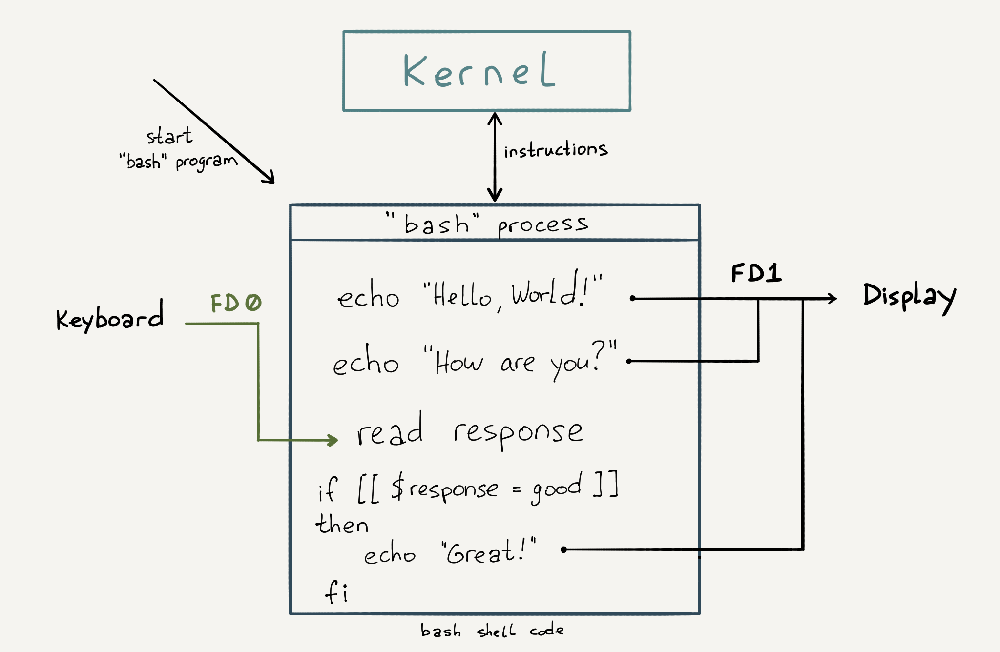

# Потоки

В каждом языке есть свой способ напечатать результат на экран.

Javascript:

```javascript
console.log('hello!');
```

PHP:

```php
<?php

echo 'hello!';
```

Python:

```python
print('hello!')
```

Java:

```java
System.out.print("hello!");
```

Ruby:

```ruby
puts 'hello!'
```

Несмотря на разнообразие языков и способов печати, с точки зрения операционной системы все программы работают абсолютно идентично. При старте любой программы операционная система связывает с ней три потока:

- **STDIN** (Standard Input)
- **STDOUT** (Standard Output)
- **STDERR** (Standard Error)

Для языка программирования эти потоки выглядят как файлы, и взаимодействие с ними происходит как с файлами. В этом уроке мы изучим, как работают потоки на базовом уровне.

Начнем с потока STDOUT. Он отвечает за вывод на экран. Во время каждой печати на экран в программе на любом языке происходит следующие два шага:

- Функция печати записывает данные в поток STDOUT с помощью функции `write`
- Операционная система решает, куда вывести результат. По умолчанию вывод происходит на экран терминала

Чтобы хорошо понять эту тему, нужно подробно изучить устройство операционных систем, в частности подсистемы, отвечающей за процессы и файловую систему. Но мы попробуем кратко рассказать самое важное для понимания.

В двух словах, языки программирования не взаимодействуют с монитором и железом в целом. За взаимодействие с железом целиком и полностью отвечает операционная система. Программы могут только лишь попросить операционную систему выполнить ту или иную задачу.

При таком разделении реализация языков программирования сильно упрощается. Достаточно знать про существование STDOUT и уметь писать в этот поток, а дальше все сделает операционная система.

Именно благодаря такому разделению и потокам, можно написать программу на одном компьютере и без проблем запустить ее на другом компьютере с другой конфигурацией и монитором.

Самое удивительное начинается дальше. Операционные системы позволяют подменять потоки при старте системы, что открывает интересные возможности.

Например, вывод любой команды в bash можно не выводить на экран, а записать в файл:

```bash
ls -la > output
```

Запустив эту команду, вы не увидите на экране ничего нового. Зато в текущей директории появится файл *output*:

```bash
cat output

total 44
drwxr-xr-x 5 kirill.m kirill.m 4096 Aug 29 09:39 .
drwxr-xr-x 8 root     root     4096 Apr 26 10:38 ..
-rw------- 1 kirill.m kirill.m 1822 Aug 29 08:45 .bash_history
-rw-r--r-- 1 kirill.m kirill.m  220 Aug 31  2015 .bash_logout
-rw-r--r-- 1 kirill.m kirill.m 3771 Aug 31  2015 .bashrc
drwx------ 2 kirill.m kirill.m 4096 Mar 30 18:10 .cache
-rw------- 1 kirill.m kirill.m   55 Aug 28 18:49 .lesshst
drwxrwxr-x 2 kirill.m kirill.m 4096 Aug 29 08:35 .nano
-rw-rw-r-- 1 kirill.m kirill.m    0 Aug 29 09:39 output
-rw-r--r-- 1 kirill.m kirill.m  655 May 16  2017 .profile
drwx------ 2 kirill.m kirill.m 4096 Jan 22  2018 .ssh
-rw------- 1 kirill.m kirill.m  513 Aug 29 08:06 .viminfo
```

Операция, которую мы сделали выше, называется **перенаправление потоков**.

Символ `>` означает, что нужно взять вывод из команды слева и отправить его в файл, указанный справа. Этот символ `>` всегда **перезаписывает** файл.

Такое перенаправление работает с абсолютно любой командой, которая выводит результаты своей работы в консоль:

```bash
grep alias .bash_profile > result
cat result

alias fixssh='eval $(tmux showenv -s SSH_AUTH_SOCK)'
```

Если нужно не перезаписывать, а **добавлять**, то используйте `>>`.

Для экспериментов с выводом удобно использовать встроенную команду `echo`. Она принимает на вход строчку и выдает ее в STDOUT, который уже можно перенаправлять:

```bash
# > Заменяет содержимое файла
echo 'hi' > result # Вывод команды echo направляем в файл result
cat result # С помощью команды cat читаем файл result

hi # Содержимое файла result в окне терминала

echo 'hello' > result # Вывод команды echo заменяет содержимое файла result
cat result # С помощью команды cat читаем файл result

hello # Содержимое файла result в окне терминала

# >> Добавляет содержимое в конец файла
echo 'hello' >> result # Вывод команды echo добавляем в конец файла result
cat result # С помощью команды cat читаем файл result

# Так выглядит содержимое файл result в окне терминала:
hello
hello
```

Кроме стандартного вывода, с каждым процессом ассоциируются два дополнительных потока:

- STDERR — вывод ошибок
- STDIN — стандартный ввод

STDIN работает в обратную сторону: через него программа может получать данные на вход.

В *nix-системах встроена утилита `wc` (сокращение от *word count*). Она умеет считать количество слов, строк или символов в файле. Когда мы говорим о файле, то в *nix-системах это почти всегда означает, что данные можно передать и в стандартный поток ввода:

```bash
# Флаг l (буква l, а не цифра 1) указывает, что надо считать количество строк
wc -l < result # Содержимое файла result отправляем в стандартный ввод команды wc

2
```

Выглядит довольно логично — стрелка меняет свое направление в другую сторону и содержимое файла отправляется в поток STDIN запускаемой программы `wc`.

Теперь объединим перенаправление ввода и вывода:

```bash
wc -l < result > output # Содержимое файла result отправляем в стандартный ввод команды wc, а вывод направляем в файл output
cat output # С помощью команды cat читаем файл output

2
```

Кстати, таким же способом можно отправить вывод на печать, но мы оставим эту возможность на самостоятельное изучение.



Последний вопрос связан с тем, зачем нужен поток STDERR.

Поток STDERR позволяет отделить нормальный вывод программы от возникающих ошибок.

Как и STDOUT, он по умолчанию выводит информацию на экран. Такой подход удобен при ведении логов, для реагирования и отладки.

Будьте осторожны, потому что перенаправление вывода в файл перенаправляет только STDOUT. Убедиться в этом очень просто.

Если попробовать отобразить содержимое несуществующей директории, то команда `ls` выдаст ошибку:

```bash
ls lala # Команда ls выводит список файлов и директорий, которые содержит директория lala

ls: cannot access 'lala': No such file or directory # Получаем сообщение об ошибке в окне терминала
```

Теперь попробуем перенаправить вывод в файл *output*:

```bash
ls lala > output # Направляем вывод команды ls в файл output
ls: cannot access 'lala': No such file or directory # Вывод на экран
```

Перенаправление есть, но сообщение вывелось на экран. Это произошло именно по той причине, что STDERR остался привязан к экрану, а внутри файла *output* — пустота. Решить эту задачу можно несколькими способами.

## Перенаправление STDERR в STDOUT {id="stderr-stdout_1"}

В unix-системах за каждым потоком закреплен определенный номер, который называется [файловым дескриптором](https://ru.wikipedia.org/wiki/Файловый_дескриптор). С помощью него можно получить доступ к потокам ввода и вывода.

Существуют следующие стандартные потоки ввода и вывода:

- STDIN — 0
- STDOUT — 1
- STDERR — 2

Первый способ — перенаправить STDERR в STDOUT или отправить оба потока в файл.

Часто стандартный поток ошибок объединяют со стандартным потоком вывода, чтобы можно было обрабатывать ошибки и результат выполнения вместе:

```bash
# Сначала STDOUT перенаправляется в файл output, затем STDERR перенаправляется в STDOUT, запись в файл продолжается
ls lala > output 2>&1
cat output # С помощью команды cat читаем содержимое файла output

ls: cannot access 'lala': No such file or directory # Содержимое файла output в окне терминала
```

В примере выше обратите внимание на `&` после символа перенаправления `>`. По правилам синтаксиса символ `&` нужно ставить, чтобы указать поток, в который осуществляется перенаправление.

В примере ниже `2>&1` написано перед `> output`. Это не будет работать, потому что когда интерпретатор прочитает `2>&1`, он еще не будет знать, куда перенаправлен стандартный поток вывода. Поэтому потоки ошибок и вывода не будут объединены:

```bash
ls lala 2>&1 > output

ls: cannot access 'lala': No such file or directory # Вывод в окне терминала

```

Перенаправление потока STDERR бывает полезно само по себе, без вывода в файл:

```bash
#  STDERR просто перенаправляется в другой поток (STDOUT)
cd lala 2>&1

-bash: cd: lala: No such file or directory
```

## Перенаправление конкретного потока в файл

Чтобы перенаправить конкретный поток, нужно указать его номер перед `>`:

```bash
#  Так можно сразу перенаправить STDERR в файл
cd lala 2> output
cat output

-bash: cd: lala: No such file or directory
```

## Перенаправление обоих потоков в файл

Этот вариант используется чаще всего. Он помогает проводить отладку и подсказывает, почему вообще возникла та или иная ошибка:

```bash
# Оба потока (STDERR и STDOUT) перенаправляются в файл
cd lala &> output
cat output

-bash: cd: lala: No such file or directory
```

### Дополнительные материалы

1. [Bash Reference Manual — redirections](https://www.gnu.org/software/bash/manual/bash.html#Redirections)

### Вопросы для самопроверки

**За что отвечает поток STDIN?**

- Вывод ошибок
- Вывод данных на экран
- Прием входящих данных в процесс

**Какой оператор перенаправляет STDOUT в файл?**

- `>`
- `|`
- Перевод строки
- `<`

**Какой оператор дописывает данные в конец файла?**

- `<`
- `>`
- `>>`