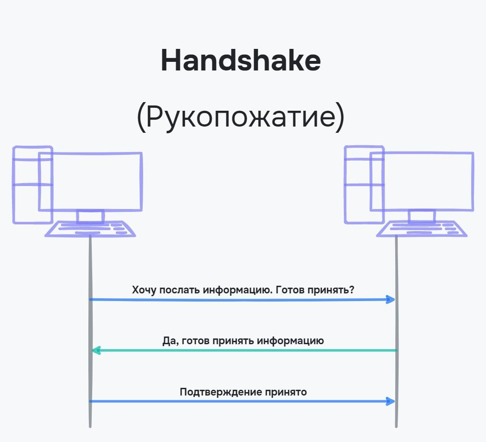
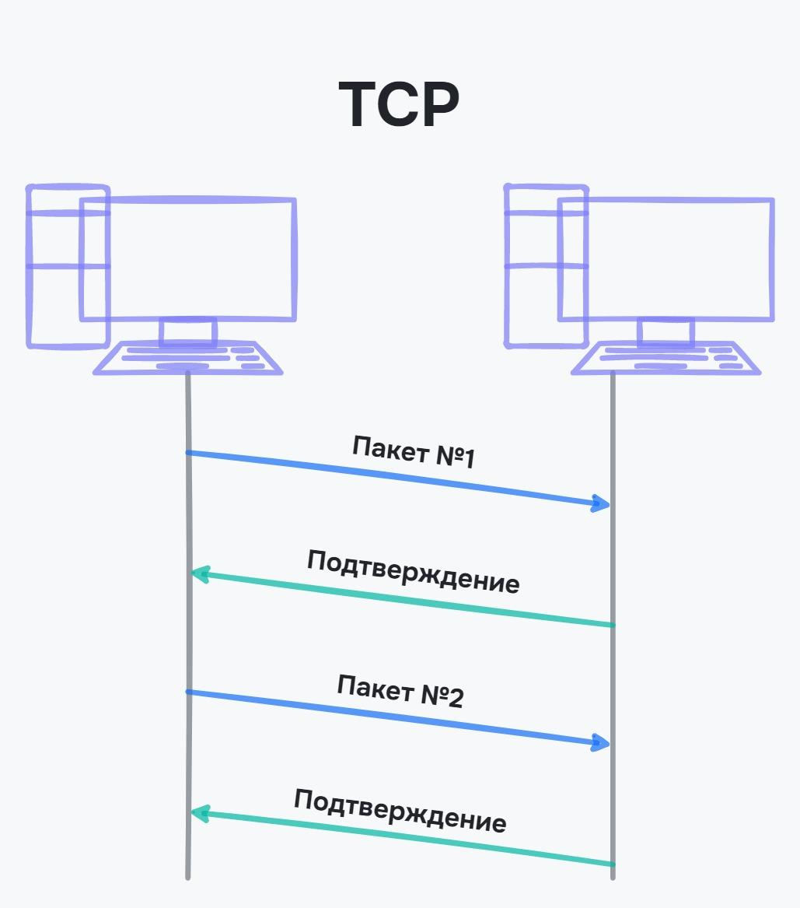
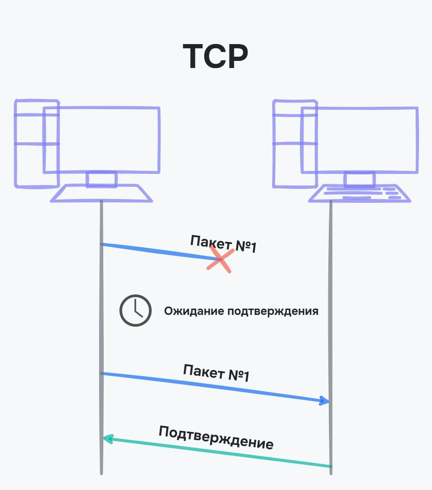
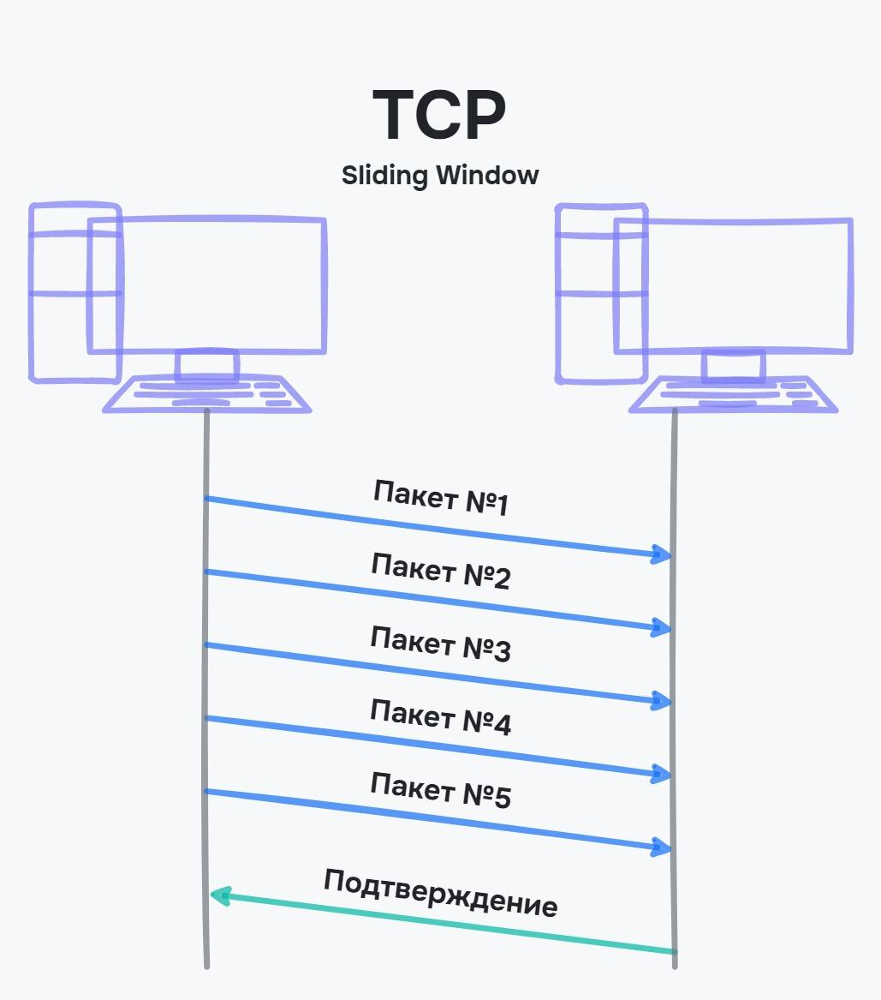
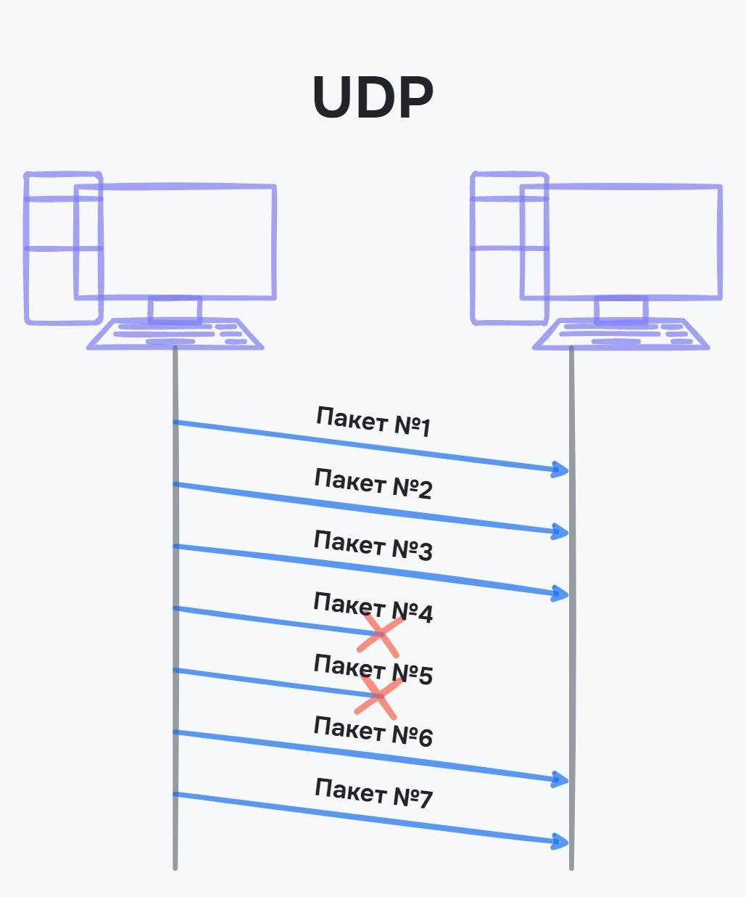

# Обмен информацией между компьютерами

Представим, что нам нужно отправить письмо по почте. В этот процесс вовлечено много людей, и у каждого свои обязанности: сортировка почты, регистрация письма, его отправка и доставка. У каждого звена в этой цепи свои правила работы.

В интернете тоже есть свои правила или соглашения — протоколы. Например, для выдачи адреса используется протокол IP. Он определяет, как именно даются адреса и какой у них вид. Для работы интернета используется много разных протоколов и они образуют стек TCP/IP.

В этом уроке рассмотрим, что такое стек TCP/IP и сколько в нем уровней. Также подробнее разберем транспортный уровень, который отвечает за передачу информации в сети, и познакомимся с протоколами TCP и UDP.

## Стек протоколов TCP/IP

Чтобы интернет мог работать, используется сетевая модель или стек **TCP/IP** — набор правил, которые описывают, как компьютеры соединяются и передают информацию друг другу. Наименование модели состоит из названий двух главных протоколов:

- TCP — протокол, который описывает, как передается информация внутри сети
- IP — протокол, который описывает связь компьютеров друг с другом

Сетевая модель делится на 4 уровня, в каждом из которых применяются протоколы для работы той или иной функции:

- **Канальный уровень** или **Link Layer** — самый низкий уровень. На этом уровне описываются протоколы, которые обеспечивают связь компьютеров в сети, обработка данных устройствами. Проводное, спутниковое, беспроводное соединения, сетевые карты и свитчи — все это относится к канальному уровню
- **Сетевой уровень** или **Network Layer** — протоколы для взаимодействия сетей между собой. В модели TCP/IP на этом уровне используется протокол IP
- **Транспортный уровень** или **Transport Layer** — протоколы для передачи информации. В интернете на этом уровне используются протоколы TCP и UDP, которые мы рассмотрим в этом уроке
- **Прикладной уровень** или **Application Layer** — протоколы для связи сетевых приложений. Эти протоколы позволяют открывать сайты, смотреть онлайн-фильмы. Подробнее прикладной уровень разберем в следующих уроках

|**Уровень**|**Назначение**|**Пример протокола**|
|-|-|--------------------|
|Прикладной|Работа приложений в сети|HTTP, HTTPS, DNS|
|Транспортный|Работа приложений в сети|TCP, UDP|
|Сетевой|Адресация устройств в сети|IPv4, IPv6|
|Канальный|Физическое подключение устройств|Ethernet, IEEE 802.11, Wi-Fi|

Все протоколы зависят друг от друга. Нельзя использовать сетевой уровень, если отсутствует канальный. Например, между компьютерами нет подключения, но мы хотим дать им адреса. Поэтому модель называется стеком — все уровни наслаиваются друг на друга без возможности пропустить какой-то из уровней.

В этом курсе мы уже встречались с канальным и сетевым уровнями. На первом была построена связь компьютеров друг с другом с помощью проводного и беспроводного соединения. На сетевом уровне выдаются IP-адреса и обеспечивается связь нескольких локальных сетей друг с другом.

Для передачи информации используются протоколы UDP и TCP, которые находятся на третьем уровне модели TCP/IP — транспортном.

## Транспортный уровень
Транспортный протокол отвечает за транспортировку информации между компьютерами. Когда между устройствами передается большое количество информации, она разбивается на небольшие части — **пакеты**, которые посылаются поочередно. Компьютер собирает все пакеты вместе и проверяет их целостность по соглашениям, если это определено в протоколе.

Представьте коробки с вещами при переезде. Если вещей много, то их не поместить внутрь одной коробки, поэтому нужно больше коробок. Пакеты в интернете работают по такому же принципу. Например, видео невозможно передать в один прием из-за ограничений на канальном уровне. Поэтому информацию разбивают на несколько пакетов и передают их последовательно.

Размер информации, который можно передать в пакете, зависит от разных обстоятельств, ограничений, соглашений. Например, от способа подключения, ограничений провайдера и особенностей оборудования. В среднем это значение составляет 1500-2000 байт или 1.5-1.9 килобайта. Например, если нам нужно передать музыкальную композицию весом 5120 килобайт, то понадобится пакетов:
```tex
\begin{equation}
\frac{5120}{1.5} ≈ 3414 
\end{equation}
```

Чтобы такое количество информации корректно передавалось, на транспортном уровне определяется:

- Как нумеруются пакеты
- Проверяется ли доставка пакетов
- Проверяется ли целостность пакетов — не содержат ли отправленный и полученный пакеты различий
- Сколько пакетов пришло и сколько еще ожидать

В интернете на транспортном уровне используются два основных протокола:

- **TCP** (Transmission Control Protocol). Гарантирует доставку пакетов и контролирует ее. Информация передается только в том случае, если между компьютерами устанавливается связь и подтверждается готовность к передаче/приему
- **UDP** (User Datagram Protocol). Пакеты пересылаются, но не проверяются. Информация пересылается быстрее, так как нет дополнительных проверок, но возможны потери

Рассмотрим подробнее отличия протоколов TCP и UDP.

## Протокол TCP
Перед тем, как отправить пакеты по протоколу TCP, устанавливается связь между компьютерами. На языке системных администраторов такой процесс называется **рукопожатием** или **handshake**. Связь устанавливается в три этапа:

1. Компьютер, который отправляет данные, посылает запрос на передачу информации
2. В ответ ожидает пакет с подтверждением готовности к приему информации
3. Компьютер отправляет запрос, что получил подтверждение



Это упрощенная схема, но в ней видно, что компьютер, который посылает информацию, не только отправляет запрос на передачу, но и подтверждает, что ему пришло разрешение. Такой способ ненадолго задерживает время до отправки информации, но гарантирует, что оба устройства могут обмениваться информацией.

Пакеты в TCP передаются с постоянным подтверждением. Каждый пакет отправляется и подтверждается по отдельности:



Если при передаче пакета произошла ошибка, например, оборвалась связь, и не было подтверждения, то пакет посылается еще раз. Для этого у каждого пакета есть таймер, в течение которого ожидается подтверждение:



Принимать подтверждение на каждый пакет требуется в условиях плохой связи или при передаче важной информации. Эта процедура не происходит мгновенно, и чем больше данных, тем больше времени уходит на подтверждение пакетов.

Чтобы не подтверждать получение каждого пакета, используется **скользящее окно** или **Sliding Window**. В этом случае подтверждается не один пакет, а сразу несколько. В остальном отличий нет — если пришло подтверждение, то посылаются следующие пакеты, если подтверждения нет, то повторяется пересылка пакетов.



TCP обеспечивает надежность, но на это тратится время. Представим, что мы играем в онлайн-игру, где на счету каждая миллисекунда. В этом случае задержки могут все испортить. Чтобы быстро передавать информацию, используют протокол UDP, который не требует подтверждения получения пакета.

## Протокол UDP

UDP используют в ситуациях, когда нужно быстро отреагировать на полученную информацию. Например, запрос об IP-адресе, действия в игре, потоковая передача видео и аудио. При потоковой передаче не дожидается загрузка файла, а воспроизводится та часть, которая уже загрузилась.

От UDP требуется только отправить информацию. Будет она получена, повреждена или продублирована — не важно. Поэтому протокол используется для передачи информации, для которой не критичны потери. Например, потоковое видео и аудиосвязь.



Если пакет по какой-то причине не дошел, то его повторная отправка не произойдет. По этой причине UDP не используется для передачи важной, требующей целостности.

Представим онлайн-игру, где нашему персонажу нужно прыгать. Если передавать информацию по протоколу TCP, то возникнет задержка между нажатием клавиши и получением об этом информации в игре. Задержка небольшая, но в соревновательных играх она может привести к проигрышу. Информация о действии персонажа небольшая, поэтому ее можно послать при помощи протокола UDP.

Если информация не дойдет, то вообще не будет никакого действия. Но вероятность у этого достаточно маленькая, и разработчики намерено пренебрегают надежностью в угоду скорости.

## Сравнение TCP и UDP

Чтобы было проще понять различия между протоколами TCP и UDP, стоит изучить таблицу:

| **TCP** | **UDP** |
|---------|---------|
|Подходит для передачи важной, требующей целостности информации|Подходит для передачи информации, устойчивой к потерям|
|Долгое время передачи|Быстрая передача пакетов|
|Гарантия передачи пакетов|Отсутствие гарантии передачи пакетов|

## Выводы
В этом уроке мы рассмотрели, что такое стек TCP/IP и сколько в нем уровней. Также подробно разобрали транспортный уровень, который отвечает за передачу информации в сети, и познакомились с протоколами TCP и UDP. Повторим важные мысли урока:

- Стек TCP/IP помогает функционировать интернету и описывает, как компьютеры соединяются и передают информацию друг другу
- Модель TCP/IP делится на 4 уровня:
  - Канальный уровень
  - Сетевой уровень
  - Транспортный уровень
  - Прикладной уровень
- Транспортный уровень определяет правила передачи информации и контроль за ее получением
- Когда информация передается, она разбивается на пакеты. Это связано с ограничениями при подключении компьютеров в сеть
- На транспортном уровне в модели TCP/IP используются два основных протокола: TCP и UDP
- Протокол TCP подходит для передачи большой информации, но требует время
- Протокол UDP подходит для быстрой передачи короткой информации, но не гарантирует ее целостность и надежность

### Дополнительные материалы

1. [Руководство по стеку протоколов TCP/IP для начинающих](https://selectel.ru/blog/tcp-ip-for-beginners/)

### Вопросы для самопроверки

**Что такое стек TCP/IP?**

- Набор правил для передачи информации внутри сети
- Описание протоколов TCP и IP
- Семейство оборудований для передачи информации

**Сколько уровней у стека TCP/IP?**

- 2
- 3
- 4
- 5

**К какому уровню относятся протоколы TCP и UDP?**

- Сетевой
- Транспортный
- Прикладной
- Канальный

**На что разбивается информация при передаче по сети?**

- Барсетки
- Коробки
- Сумки
- Пакеты

**Какие особенности есть у протокола TCP?**

- Подходит для передачи больших объемов информации
- Гарантия передачи пакетов
- Скорость передачи важнее целостности информации
- Целостность информации важнее скорости передачи
- Отсутствие гарантии передачи пакетов
- Установка связи через процесс рукопожатия

**Какие особенности у протокола UDP?**

- Целостность информации важнее скорости передачи
- Отсутствие гарантии передачи пакетов
- Гарантия передачи пакетов
- Скорость передачи важнее целостности информации
- Установка связи через процесс рукопожатия