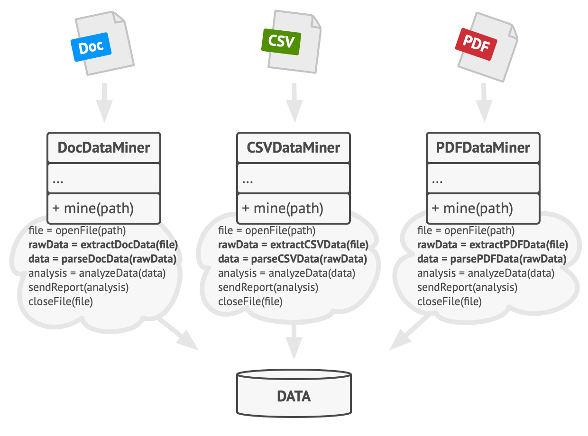

# Шаблонный метод

> Также известен как: **Template Method**

## Суть паттерна

**Шаблонный метод** — это поведенческий паттерн проектирования, который определяет скелет алгоритма, перекладывая ответственность за некоторые его шаги на подклассы. Паттерн позволяет подклассам переопределять шаги алгоритма, не меняя его общей структуры.


## Проблема

Вы пишете программу для дата-майнинга в офисных документах. Пользователи будут загружать в неё документы в разных форматах (PDF, DOC, CSV), а программа должна извлекать из них полезную информацию.

В первой версии вы ограничились только обработкой DOC-файлов. В следующей версии добавили поддержку CSV. А через месяц прикрутили работу с PDF-документами.



*Классы дата-майнинга содержат много дублирования.*

В какой-то момент вы заметили, что код всех трёх классов обработки документов хоть и отличается в части работы с файлами, но содержат довольно много общего в части самого извлечения данных. Было бы здорово избавится от повторной реализации алгоритма извлечения данных в каждом из классов.

К тому же остальной код, работающий с объектами этих классов, наполнен условиями, проверяющими тип обработчика перед началом работы. Весь этот код можно упростить, если слить все три класса воедино либо свести их к общему интерфейсу.

## Решение

Паттерн Шаблонный метод предлагает разбить алгоритм на последовательность шагов, описать эти шаги в отдельных методах и вызывать их в одном шаблонном методе друг за другом.

Это позволит подклассам переопределять некоторые шаги алгоритма, оставляя без изменений его структуру и остальные шаги, которые для этого подкласса не так важны.

В нашем примере с дата-майнингом мы можем создать общий базовый класс для всех трёх алгоритмов. Этот класс будет состоять из шаблонного метода, который последовательно вызывает шаги разбора документов.


*Шаблонный метод разбивает алгоритм на шаги, позволяя подклассам переопределить некоторые из них.*

Для начала шаги шаблонного метода можно сделать абстрактными. Из-за этого все подклассы должны будут реализовать каждый из шагов по-своему. В нашем случае все подклассы и так содержат реализацию каждого из шагов, поэтому ничего дополнительно делать не нужно.

По-настоящему важным является следующий этап. Теперь мы можем определить общее для всех классов поведение и вынести его в суперкласс. В нашем примере шаги открытия, считывания и закрытия могут отличаться для разных типов документов, поэтому останутся абстрактными. А вот одинаковый для всех типов документов код обработки данных переедет в базовый класс.

Как видите, у нас получилось два вида шагов: абстрактные, которые каждый подкласс обязательно должен реализовать, а также шаги с реализацией по умолчанию, которые можно переопределять в подклассах, но не обязательно.

Но есть и третий тип шагов — хуки: их не обязательно переопределять, но они не содержат никакого кода, выглядя как обычные методы. Шаблонный метод останется рабочим, даже если ни один подкласс не переопределит такой хук. Однако, хук даёт подклассам дополнительные точки «вклинивания» в шаблонный метод.

## Аналогия из жизни


*Проект типового дома могут немного изменить по желанию клиента.*

Строители используют подход, похожий на шаблонный метод при строительстве типовых домов. У них есть основной архитектурный проект, в котором расписаны шаги строительства: заливка фундамента, постройка стен, перекрытие крыши, установка окон и так далее.

Но, несмотря на стандартизацию каждого этапа, строители могут вносить небольшие изменения на любом из этапов, чтобы сделать дом чуточку непохожим на другие.

## Структура


1. **Абстрактный класс** определяет шаги алгоритма и содержит шаблонный метод, состоящий из вызовов этих шагов. Шаги могут быть как абстрактными, так и содержать реализацию по умолчанию.
2. **Конкретный класс** переопределяет некоторые (или все) шаги алгоритма. Конкретные классы не переопределяют сам шаблонный метод.

## Псевдокод

В этом примере **Шаблонный метод** используется как заготовка для стандартного искусственного интеллекта в простой игре-стратегии. Для введения в игру новой расы достаточно создать подкласс и реализовать в нём недостающие методы.


*Пример классов искусственного интеллекта для простой игры.*

Все расы игры будут содержать примерно такие же типы юнитов и строений, поэтому структура ИИ будет одинаковой. Но разные расы могут по-разному реализовать эти шаги. Так, например, орки будут агрессивней в атаке, люди — более активны в защите, а дикие монстры вообще не будут заниматься строительством.

```c
class GameAI is
    // Шаблонный метод должен быть задан в базовом классе. Он
    // состоит из вызовов методов в определённом порядке. Чаще
    // всего эти методы являются шагами некоего алгоритма.
    method turn() is
        collectResources()
        buildStructures()
        buildUnits()
        attack()

    // Некоторые из этих методов могут быть реализованы прямо в
    // базовом классе.
    method collectResources() is
        foreach (s in this.builtStructures) do
            s.collect()

    // А некоторые могут быть полностью абстрактными.
    abstract method buildStructures()
    abstract method buildUnits()

    // Кстати, шаблонных методов в классе может быть несколько.
    method attack() is
        enemy = closestEnemy()
        if (enemy == null)
            sendScouts(map.center)
        else
            sendWarriors(enemy.position)

    abstract method sendScouts(position)
    abstract method sendWarriors(position)

// Подклассы могут предоставлять свою реализацию шагов
// алгоритма, не изменяя сам шаблонный метод.
class OrcsAI extends GameAI is
    method buildStructures() is
        if (there are some resources) then
            // Строить фермы, затем бараки, а потом цитадель.

    method buildUnits() is
        if (there are plenty of resources) then
            if (there are no scouts)
                // Построить раба и добавить в группу
                // разведчиков.
            else
                // Построить пехотинца и добавить в группу
                // воинов.

    // ...

    method sendScouts(position) is
        if (scouts.length > 0) then
            // Отправить разведчиков на позицию.

    method sendWarriors(position) is
        if (warriors.length > 5) then
            // Отправить воинов на позицию.

// Подклассы могут не только реализовывать абстрактные шаги, но
// и переопределять шаги, уже реализованные в базовом классе.
class MonstersAI extends GameAI is
    method collectResources() is
        // Ничего не делать.

    method buildStructures() is
        // Ничего не делать.

    method buildUnits() is
        // Ничего не делать.
```

## Применимость

**Когда подклассы должны расширять базовый алгоритм, не меняя его структуры.**

Шаблонный метод позволяет подклассам расширять определённые шаги алгоритма через наследование, не меняя при этом структуру алгоритмов, объявленную в базовом классе.

---

**Когда у вас есть несколько классов, делающих одно и то же с незначительными отличиями. Если вы редактируете один класс, то приходится вносить такие же правки и в остальные классы.**

Паттерн шаблонный метод предлагает создать для похожих классов общий суперкласс и оформить в нём главный алгоритм в виде шагов. Отличающиеся шаги можно переопределить в подклассах.

Это позволит убрать дублирование кода в нескольких классах с похожим поведением, но отличающихся в деталях.

## Шаги реализации

1. Изучите алгоритм и подумайте, можно ли его разбить на шаги. Прикиньте, какие шаги будут стандартными для всех вариаций алгоритма, а какие — изменяющимися.
2. Создайте абстрактный базовый класс. Определите в нём шаблонный метод. Этот метод должен состоять из вызовов шагов алгоритма. Имеет смысл сделать шаблонный метод финальным, чтобы подклассы не могли переопределить его (если ваш язык программирования это позволяет).
3. Добавьте в абстрактный класс методы для каждого из шагов алгоритма. Вы можете сделать эти методы абстрактными или добавить какую-то реализацию по умолчанию. В первом случае все подклассы должны будут реализовать эти методы, а во втором — только если реализация шага в подклассе отличается от стандартной версии.
4. Подумайте о введении в алгоритм хуков. Чаще всего, хуки располагают между основными шагами алгоритма, а также до и после всех шагов.
5. Создайте конкретные классы, унаследовав их от абстрактного класса. Реализуйте в них все недостающие шаги и хуки.

## Преимущества и недостатки

**Преимущества**

- Облегчает повторное использование кода.

**Недостатки**

- Вы жёстко ограничены скелетом существующего алгоритма.
- Вы можете нарушить [принцип подстановки Барбары Лисков](liskov_substitution_principle.md), изменяя базовое поведение одного из шагов алгоритма через подкласс.
- С ростом количества шагов шаблонный метод становится слишком сложно поддерживать.

## Примеры реализации паттерна

### Python

- **Сложность**: 1/3
- **Популярность**: 2/3
- **Применимость**: Шаблонные методы можно встретить во многих библиотечных классах Python. Разработчики создают их, чтобы позволить клиентам легко и быстро расширять стандартный код при помощи наследования.
- **Признаки применения паттерна**: Класс заставляет своих потомков реализовать методы-шаги, но самостоятельно реализует структуру алгоритма.

Этот пример показывает структуру паттерна `Шаблонный метод`, а именно — из каких классов он состоит, какие роли эти классы выполняют и как они взаимодействуют друг с другом.

**main.py**: Пример структуры паттерна

```python
from abc import ABC, abstractmethod


class AbstractClass(ABC):
    """
    Абстрактный Класс определяет шаблонный метод, содержащий скелет
    некоторого алгоритма, состоящего из вызовов (обычно) абстрактных
    примитивных операций.

    Конкретные подклассы должны реализовать эти операции, но оставить
    сам шаблонный метод без изменений.
    """

    def template_method(self) -> None:
        """
        Шаблонный метод определяет скелет алгоритма.
        """

        self.base_operation1()
        self.required_operations1()
        self.base_operation2()
        self.hook1()
        self.required_operations2()
        self.base_operation3()
        self.hook2()

    # Эти операции уже имеют реализации.

    def base_operation1(self) -> None:
        print("AbstractClass says: I am doing the bulk of the work")

    def base_operation2(self) -> None:
        print("AbstractClass says: But I let subclasses override "
            + "some operations")

    def base_operation3(self) -> None:
        print("AbstractClass says: But I am doing the bulk of the "
            + "work anyway")

    # А эти операции должны быть реализованы в подклассах.

    @abstractmethod
    def required_operations1(self) -> None:
        pass

    @abstractmethod
    def required_operations2(self) -> None:
        pass

    # Это «хуки». Подклассы могут переопределять их, но это не
    # обязательно, поскольку у хуков уже есть стандартная (но пустая)
    # реализация. Хуки предоставляют дополнительные точки расширения
    # в некоторых критических местах алгоритма.

    def hook1(self) -> None:
        pass

    def hook2(self) -> None:
        pass


class ConcreteClass1(AbstractClass):
    """
    Конкретные классы должны реализовать все абстрактные операции
    базового класса. Они также могут переопределить некоторые операции
    с реализацией по умолчанию.
    """

    def required_operations1(self) -> None:
        print("ConcreteClass1 says: Implemented Operation1")

    def required_operations2(self) -> None:
        print("ConcreteClass1 says: Implemented Operation2")


class ConcreteClass2(AbstractClass):
    """
    Обычно конкретные классы переопределяют только часть операций
    базового класса.
    """

    def required_operations1(self) -> None:
        print("ConcreteClass2 says: Implemented Operation1")

    def required_operations2(self) -> None:
        print("ConcreteClass2 says: Implemented Operation2")

    def hook1(self) -> None:
        print("ConcreteClass2 says: Overridden Hook1")


def client_code(abstract_class: AbstractClass) -> None:
    """
    Клиентский код вызывает шаблонный метод для выполнения алгоритма.
    Клиентский код не должен знать конкретный класс объекта, с которым
    работает, при условии, что он работает с объектами через интерфейс
    их базового класса.
    """

    # ...
    abstract_class.template_method()
    # ...


if __name__ == "__main__":
    print("Same client code can work with different subclasses:")
    client_code(ConcreteClass1())
    print("")

    print("Same client code can work with different subclasses:")
    client_code(ConcreteClass2())
```

**Output.txt**: Результат выполнения

```text
Same client code can work with different subclasses:
AbstractClass says: I am doing the bulk of the work
ConcreteClass1 says: Implemented Operation1
AbstractClass says: But I let subclasses override some operations
ConcreteClass1 says: Implemented Operation2
AbstractClass says: But I am doing the bulk of the work anyway

Same client code can work with different subclasses:
AbstractClass says: I am doing the bulk of the work
ConcreteClass2 says: Implemented Operation1
AbstractClass says: But I let subclasses override some operations
ConcreteClass2 says: Overridden Hook1
ConcreteClass2 says: Implemented Operation2
AbstractClass says: But I am doing the bulk of the work anyway
```

### PHP

- **Сложность**: 1/3
- **Популярность**: 2/3
- **Применимость**: Шаблонные методы можно встретить во многих PHP-фреймворках. Разработчики создают такие методы, чтобы позволить клиентам легко и быстро расширять стандартный код при помощи наследования.
- **Признаки применения паттерна**: Класс заставляет своих потомков реализовать методы-шаги, но самостоятельно реализует структуру алгоритма.

<tabs>
<tab title="Концептуальный пример">
<h4 id="template-php-concept">Концептуальный пример</h4>
<p>Этот пример показывает структуру паттерна <b>Шаблонный метод</b>, а именно — из каких классов он состоит, какие роли эти классы выполняют и как они взаимодействуют друг с другом.</p>
<p>После ознакомления со структурой, вам будет легче воспринимать второй пример, который рассматривает реальный случай использования паттерна в мире PHP.</p>
<p><b>index.php</b>: Пример структуры паттерна</p>
<code-block lang="php">
<![CDATA[
namespace RefactoringGuru\TemplateMethod\Conceptual;

/**
* Абстрактный Класс определяет шаблонный метод, содержащий скелет некоторого
* алгоритма, состоящего из вызовов (обычно) абстрактных примитивных операций.
*
* Конкретные подклассы должны реализовать эти операции, но оставить сам
* шаблонный метод без изменений.
*/

abstract class AbstractClass
{
    /**
    * Шаблонный метод определяет скелет алгоритма.
    */
    final public function templateMethod(): void
    {
        $this->baseOperation1();
        $this->requiredOperations1();
        $this->baseOperation2();
        $this->hook1();
        $this->requiredOperation2();
        $this->baseOperation3();
        $this->hook2();
    }

    /**
    * Эти операции уже имеют реализации.
    */
    protected function baseOperation1(): void
    {
        echo "AbstractClass says: I am doing the bulk of the work\n";
    }

    protected function baseOperation2(): void
    {
        echo "AbstractClass says: But I let subclasses override some operations\n";
    }
    
    protected function baseOperation3(): void
    {
        echo "AbstractClass says: But I am doing the bulk of the work anyway\n";
    }

    /**
    * А эти операции должны быть реализованы в подклассах.
    */
    abstract protected function requiredOperations1(): void;

    abstract protected function requiredOperation2(): void;

    /**
    * Это «хуки». Подклассы могут переопределять их, но это не обязательно,
    * поскольку у хуков уже есть стандартная (но пустая) реализация. Хуки
    * предоставляют дополнительные точки расширения в некоторых критических
    * местах алгоритма.
    */
    protected function hook1(): void { }

    protected function hook2(): void { }
}

/**
* Конкретные классы должны реализовать все абстрактные операции базового
* класса. Они также могут переопределить некоторые операции с реализацией по
* умолчанию.
*/

class ConcreteClass1 extends AbstractClass
{
    protected function requiredOperations1(): void
    {
        echo "ConcreteClass1 says: Implemented Operation1\n";
    }

    protected function requiredOperation2(): void
    {
        echo "ConcreteClass1 says: Implemented Operation2\n";
    }
}

/**
* Обычно конкретные классы переопределяют только часть операций базового
* класса.
*/ 

class ConcreteClass2 extends AbstractClass
{
    protected function requiredOperations1(): void
    {
        echo "ConcreteClass2 says: Implemented Operation1\n";
    }
    
    protected function requiredOperation2(): void
    {
        echo "ConcreteClass2 says: Implemented Operation2\n";
    }
    
    protected function hook1(): void
    {
        echo "ConcreteClass2 says: Overridden Hook1\n";
    }
}

/**
* Клиентский код вызывает шаблонный метод для выполнения алгоритма. Клиентский
* код не должен знать конкретный класс объекта, с которым работает, при
* условии, что он работает с объектами через интерфейс их базового класса.
*/ 

function clientCode(AbstractClass $class)
{
    // ...
    $class->templateMethod();
    // ...
}

echo "Same client code can work with different subclasses:\n";
clientCode(new ConcreteClass1());
echo "\n";

echo "Same client code can work with different subclasses:\n";
clientCode(new ConcreteClass2());

]]>
</code-block>
<p><b>Output.txt</b>: Результат выполнения</p>
<code-block lang="text">
<![CDATA[
Same client code can work with different subclasses:
AbstractClass says: I am doing bulk of the work
ConcreteClass1 says: Implemented Operation1
AbstractClass says: But I let subclasses to override some operations
ConcreteClass1 says: Implemented Operation2
AbstractClass says: But I am doing bulk of the work anyway

Same client code can work with different subclasses:
AbstractClass says: I am doing bulk of the work
ConcreteClass2 says: Implemented Operation1
AbstractClass says: But I let subclasses to override some operations
ConcreteClass2 says: Overridden Hook1
ConcreteClass2 says: Implemented Operation2
AbstractClass says: But I am doing bulk of the work anyway

]]>
</code-block>
</tab>
<tab title="Пример из реальной жизни">
<h4 id="template-php-real">Пример из реальной жизни</h4>
<p>В этом примере <b>Шаблонный метод</b> определяет общую схему алгоритма отправки сообщений в социальных сетях. Каждый подкласс представляет отдельную социальную сеть и реализует все шаги по-разному, но повторно использует базовый алгоритм.</p>
<p><b>index.php</b>: Пример из реальной жизни</p>
<code-block lang="php">
<![CDATA[
namespace RefactoringGuru\TemplateMethod\RealWorld;

/**
* Абстрактный Класс определяет метод шаблона и объявляет все его шаги.
*/

abstract class SocialNetwork
{
    protected $username;
    
    protected $password;
    
    public function __construct(string $username, string $password)
    {
        $this->username = $username;
        $this->password = $password;
    }

    /**
    * Фактический метод шаблона вызывает абстрактные шаги в определённом
    * порядке. Подкласс может реализовать все шаги, позволяя этому методу
    * реально публиковать что-то в социальной сети.
    */
    public function post(string $message): bool
    {
        // Проверка подлинности перед публикацией. Каждая сеть использует свой
        // метод авторизации.
        if ($this->logIn($this->username, $this->password)) {
            // Отправляем почтовые данные. Все сети имеют разные API.
            $result = $this->sendData($message);
            // ...
            $this->logOut();
            return $result;
        }
        return false;
    }

    /**
    * Шаги объявлены абстрактными, чтобы заставить подклассы реализовать их
    * полностью.
    */
    abstract public function logIn(string $userName, string $password): bool;

    abstract public function sendData(string $message): bool;
    
    abstract public function logOut(): void;
}

/**
* Этот Конкретный Класс реализует API Facebook (ладно, он пытается).
*/

class Facebook extends SocialNetwork
{
    public function logIn(string $userName, string $password): bool
    {
        echo "\nChecking user's credentials...\n";
        echo "Name: " . $this->username . "\n";
        echo "Password: " . str_repeat("*", strlen($this->password)) . "\n";
        simulateNetworkLatency();
        echo "\n\nFacebook: '" . $this->username . "' has logged in successfully.\n";
        return true;
    }

    public function sendData(string $message): bool
    {
        echo "Facebook: '" . $this->username . "' has posted '" . $message . "'.\n";
        return true;
    }

    public function logOut(): void
    {
        echo "Facebook: '" . $this->username . "' has been logged out.\n";
    }
}

/**
* Этот Конкретный Класс реализует API Twitter.
*/

class Twitter extends SocialNetwork
{
    public function logIn(string $userName, string $password): bool
    {
        echo "\nChecking user's credentials...\n";
        echo "Name: " . $this->username . "\n";
        echo "Password: " . str_repeat("*", strlen($this->password)) . "\n";
        simulateNetworkLatency();
        echo "\n\nTwitter: '" . $this->username . "' has logged in successfully.\n";
        return true;
    }

    public function sendData(string $message): bool
    {
        echo "Twitter: '" . $this->username . "' has posted '" . $message . "'.\n";
        return true;
    }

    public function logOut(): void
    {
        echo "Twitter: '" . $this->username . "' has been logged out.\n";
    }
}

/**
* Небольшая вспомогательная функция, которая делает время ожидания похожим на
* реальность.
*/

function simulateNetworkLatency()
{
    $i = 0;
    while ($i < 5) {
        echo ".";
        sleep(1);
        $i++;
    }
}

/**
* Клиентский код.
*/
echo "Username: \n";
$username = readline();
echo "Password: \n";
$password = readline();
echo "Message: \n";
$message = readline();

echo "\nChoose the social network to post the message:\n" .
"1 - Facebook\n" .
"2 - Twitter\n";
$choice = readline();

// Теперь давайте создадим правильный объект социальной сети и отправим
// сообщение.
if ($choice == 1) {
    $network = new Facebook($username, $password);
} elseif ($choice == 2) {
    $network = new Twitter($username, $password);
} else {
    die("Sorry, I'm not sure what you mean by that.\n");
}
$network->post($message);

]]>
</code-block>
<p><b>Output.txt</b>: Результат выполнения</p>
<code-block lang="plain text">
<![CDATA[
Username:
> neo
Password:
> 123123
Message:
> What is the Matrix?

Choose the social network to post the message:
1 - Facebook
2 - Twitter
> 1

Checking user's credentials...
Name: neo
Password: ******
.....

Facebook: 'neo' has logged in successfully.
Facebook: 'neo' has posted 'What is the Matrix?'.
Facebook: 'neo' has been logged out.

]]>
</code-block>
</tab>
</tabs>