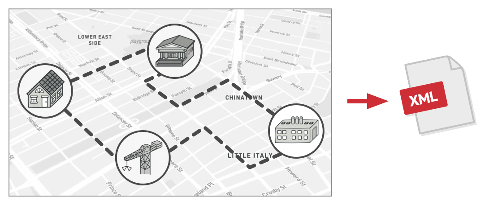

# Посетитель

> Также известен как: **Visitor**

## Суть паттерна

**Посетитель** — это поведенческий паттерн проектирования, который позволяет добавлять в программу новые операции, не изменяя классы объектов, над которыми эти операции могут выполняться.


## Проблема

Ваша команда разрабатывает приложение, работающее с геоданными в виде графа. Узлами графа являются городские локации: памятники, театры, рестораны, важные предприятия и прочее. Каждый узел имеет ссылки на другие, ближайшие к нему узлы. Каждому типу узлов соответствует свой класс, а каждый узел представлен отдельным объектом.



*Экспорт геоузлов в XML.*

Ваша задача — сделать экспорт этого графа в XML. Дело было бы плёвым, если бы вы могли редактировать классы узлов. Достаточно было бы добавить метод экспорта в каждый тип узла, а затем, перебирая узлы графа, вызывать этот метод для каждого узла. Благодаря полиморфизму, решение получилось бы изящным, так как вам не пришлось бы привязываться к конкретным классам узлов.

Но, к сожалению, классы узлов вам изменить не удалось. Системный архитектор сослался на то, что код классов узлов сейчас очень стабилен, и от него многое зависит, поэтому он не хочет рисковать и позволять кому-либо его трогать.


*Код XML-экспорта придётся добавить во все классы узлов, а это слишком накладно.*

К тому же он сомневался в том, что экспорт в XML вообще уместен в рамках этих классов. Их основная задача была связана с геоданными, а экспорт выглядит в рамках этих классов чужеродно.

Была и ещё одна причина запрета. Если на следующей неделе вам бы понадобился экспорт в какой-то другой формат данных, то эти классы снова пришлось бы менять.

## Решение

Паттерн Посетитель предлагает разместить новое поведение в отдельном классе, вместо того чтобы множить его сразу в нескольких классах. Объекты, с которыми должно было быть связано поведение, не будут выполнять его самостоятельно. Вместо этого вы будете передавать эти объекты в методы посетителя.

Код поведения, скорее всего, должен отличаться для объектов разных классов, поэтому и методов у посетителя должно быть несколько. Названия и принцип действия этих методов будут схожи, но основное отличие будет в типе принимаемого в параметрах объекта, например:

```c
class ExportVisitor implements Visitor is
    method doForCity(City c) { ... }
    method doForIndustry(Industry f) { ... }
    method doForSightSeeing(SightSeeing ss) { ... }
    // ...
```

Здесь возникает вопрос: как подавать узлы в объект-посетитель? Так как все методы имеют отличающуюся сигнатуру, использовать полиморфизм при переборе узлов не получится. Придётся проверять тип узлов для того, чтобы выбрать соответствующий метод посетителя.

```c
foreach (Node node in graph)
    if (node instanceof City)
        exportVisitor.doForCity((City) node)
    if (node instanceof Industry)
        exportVisitor.doForIndustry((Industry) node)
    // ...
```

Тут не поможет даже механизм перегрузки методов (доступный в Java и C#). Если назвать все методы одинаково, то неопределённость реального типа узла всё равно не даст вызвать правильный метод. Механизм перегрузки всё время будет вызывать метод посетителя, соответствующий типу `Node`, а не реального класса поданного узла.

Но паттерн Посетитель решает и эту проблему, используя механизм двойной диспетчеризации. Вместо того, чтобы самим искать нужный метод, мы можем поручить это объектам, которые передаём в параметрах посетителю. А они уже вызовут правильный метод посетителя.

```c
// Client code
foreach (Node node in graph)
    node.accept(exportVisitor)

// City
class City is
    method accept(Visitor v) is
        v.doForCity(this)
    // ...

// Industry
class Industry is
    method accept(Visitor v) is
        v.doForIndustry(this)
    // ...

```

Как видите, изменить классы узлов всё-таки придётся. Но это простое изменение позволит применять к объектам узлов и другие поведения, ведь классы узлов будут привязаны не к конкретному классу посетителей, а к их общему интерфейсу. Поэтому если придётся добавить в программу новое поведение, вы создадите новый класс посетителей и будете передавать его в методы узлов.

## Аналогия из жизни


*У страхового агента приготовлены полисы для разных видов организаций.*

Представьте начинающего страхового агента, жаждущего получить новых клиентов. Он беспорядочно посещает все дома в округе, предлагая свои услуги. Но для каждого из посещаемых **типов** домов у него имеется особое предложение.
- Придя в дом к обычной семье, он предлагает оформить медицинскую страховку.
- Придя в банк, он предлагает страховку от грабежа.
- Придя на фабрику, он предлагает страховку предприятия от пожара и наводнения.

## Структура


1. **Посетитель** описывает общий интерфейс для всех типов посетителей. Он объявляет набор методов, отличающихся типом входящего параметра, которые нужны для запуска операции для всех типов конкретных элементов. В языках, поддерживающих перегрузку методов, эти методы могут иметь одинаковые имена, но типы их параметров должны отличаться.
2. **Конкретные посетители** реализуют какое-то особенное поведение для всех типов элементов, которые можно подать через методы интерфейса посетителя.
3. **Элемент** описывает метод принятия посетителя. Этот метод должен иметь единственный параметр, объявленный с типом интерфейса посетителя.
4. **Конкретные элементы** реализуют методы принятия посетителя. Цель этого метода — вызвать тот метод посещения, который соответствует типу этого элемента. Так посетитель узнает, с каким именно элементом он работает.
5. **Клиентом** зачастую выступает коллекция или сложный составной объект, например, дерево Компоновщика. Зачастую клиент не привязан к конкретным классам элементов, работая с ними через общий интерфейс элементов.

## Псевдокод

В этом примере **Посетитель** добавляет в существующую иерархию классов геометрических фигур возможность экспорта в XML.


*Пример организации экспорта объектов в XML через отдельный класс-посетитель.*

```c
// Сложная иерархия элементов.
interface Shape is
    method move(x, y)
    method draw()
    method accept(v: Visitor)

// Метод принятия посетителя должен быть реализован в каждом
// элементе, а не только в базовом классе. Это поможет программе
// определить, какой метод посетителя нужно вызвать, если вы не
// знаете тип элемента.
class Dot implements Shape is
    // ...
    method accept(v: Visitor) is
        v.visitDot(this)

class Circle implements Shape is
    // ...
    method accept(v: Visitor) is
        v.visitCircle(this)

class Rectangle implements Shape is
    // ...
    method accept(v: Visitor) is
        v.visitRectangle(this)

class CompoundShape implements Shape is
    // ...
    method accept(v: Visitor) is
        v.visitCompoundShape(this)


// Интерфейс посетителей должен содержать методы посещения
// каждого элемента. Важно, чтобы иерархия элементов менялась
// редко, так как при добавлении нового элемента придётся менять
// всех существующих посетителей.
interface Visitor is
    method visitDot(d: Dot)
    method visitCircle(c: Circle)
    method visitRectangle(r: Rectangle)
    method visitCompoundShape(cs: CompoundShape)

// Конкретный посетитель реализует одну операцию для всей
// иерархии элементов. Новая операция = новый посетитель.
// Посетитель выгодно применять, когда новые элементы
// добавляются очень редко, а новые операции — часто.
class XMLExportVisitor implements Visitor is
    method visitDot(d: Dot) is
        // Экспорт id и координат центра точки.

    method visitCircle(c: Circle) is
        // Экспорт id, кординат центра и радиуса окружности.

    method visitRectangle(r: Rectangle) is
        // Экспорт id, кординат левого-верхнего угла, ширины и
        // высоты прямоугольника.

    method visitCompoundShape(cs: CompoundShape) is
        // Экспорт id составной фигуры, а также списка id
        // подфигур, из которых она состоит.


// Приложение может применять посетителя к любому набору
// объектов элементов, даже не уточняя их типы. Нужный метод
// посетителя будет выбран благодаря проходу через метод accept.
class Application is
    field allShapes: array of Shapes

    method export() is
        exportVisitor = new XMLExportVisitor()

        foreach (shape in allShapes) do
            shape.accept(exportVisitor)
```
Вам не кажется, что вызов метода `accept` — это лишнее звено? Если так, то ещё раз рекомендую вам ознакомиться с проблемой раннего и позднего связывания в статье [Посетитель и Double Dispatch](https://refactoring.guru/ru/design-patterns/visitor-double-dispatch).

## Применимость

**Когда вам нужно выполнить какую-то операцию над всеми элементами сложной структуры объектов, например, деревом.**

Посетитель позволяет применять одну и ту же операцию к объектам различных классов.

---

**Когда над объектами сложной структуры объектов надо выполнять некоторые не связанные между собой операции, но вы не хотите «засорять» классы такими операциями.**

Посетитель позволяет извлечь родственные операции из классов, составляющих структуру объектов, поместив их в один класс-посетитель. Если структура объектов является общей для нескольких приложений, то паттерн позволит в каждое приложение включить только нужные операции.

---

**Когда новое поведение имеет смысл только для некоторых классов из существующей иерархии.**

Посетитель позволяет определить поведение только для этих классов, оставив его пустым для всех остальных.

## Шаги реализации

1. Создайте интерфейс посетителя и объявите в нём методы «посещения» для каждого класса элемента, который существует в программе.
2. Опишите интерфейс элементов. Если вы работаете с уже существующими классами, то объявите абстрактный метод принятия посетителей в базовом классе иерархии элементов.
3. Реализуйте методы принятия во всех конкретных элементах. Они должны переадресовывать вызовы тому методу посетителя, в котором тип параметра совпадает с текущим классом элемента.
4. Иерархия элементов должна знать только о базовом интерфейсе посетителей. С другой стороны, посетители будут знать обо всех классах элементов.
5. Для каждого нового поведения создайте конкретный класс посетителя. Приспособьте это поведение для работы со всеми типами элементов, реализовав все методы интерфейса посетителей.<br/>Вы можете столкнуться с ситуацией, когда посетителю нужен будет доступ к приватным полям элементов. В этом случае вы можете либо раскрыть доступ к этим полям, нарушив инкапсуляцию элементов, либо сделать класс посетителя вложенным в класс элемента, если вам повезло писать на языке, который поддерживает вложенность классов.
6. Клиент будет создавать объекты посетителей, а затем передавать их элементам, используя метод принятия.

## Преимущества и недостатки

**Преимущества**

- Упрощает добавление операций, работающих со сложными структурами объектов.
- Объединяет родственные операции в одном классе.
- Посетитель может накапливать состояние при обходе структуры элементов.

**Недостатки**

- Паттерн не оправдан, если иерархия элементов часто меняется.
- Может привести к нарушению инкапсуляции элементов.

## Примеры реализации паттерна

### Python

- **Сложность**: 3/3
- **Популярность**: 1/3
- **Применимость**: Посетитель нечасто встречается в Python-коде из-за своей сложности и нюансов реализазации.

Этот пример показывает структуру паттерна `Посетитель`, а именно — из каких классов он состоит, какие роли эти классы выполняют и как они взаимодействуют друг с другом.

**main.py**: Пример структуры паттерна

```python
from __future__ import annotations
from abc import ABC, abstractmethod
from typing import List


class Component(ABC):
    """
    Интерфейс Компонента объявляет метод accept, который в качестве
    аргумента может получать любой объект, реализующий интерфейс
    посетителя.
    """

    @abstractmethod
    def accept(self, visitor: Visitor) -> None:
        pass


class ConcreteComponentA(Component):
    """
    Каждый Конкретный Компонент должен реализовать метод accept таким
    образом, чтобы он вызывал метод посетителя, соответствующий классу
    компонента.
    """

    def accept(self, visitor: Visitor) -> None:
        """
        Обратите внимание, мы вызываем visitConcreteComponentA, что
        соответствует названию текущего класса. Таким образом мы
        позволяем посетителю узнать, с каким классом компонента он
        работает.
        """

        visitor.visit_concrete_component_a(self)

    def exclusive_method_of_concrete_component_a(self) -> str:
        """
        Конкретные Компоненты могут иметь особые методы, не
        объявленные в их базовом классе или интерфейсе. Посетитель всё
        же может использовать эти методы, поскольку он знает о
        конкретном классе компонента.
        """

        return "A"


class ConcreteComponentB(Component):
    """
    То же самое здесь: visitConcreteComponentB => ConcreteComponentB
    """

    def accept(self, visitor: Visitor):
        visitor.visit_concrete_component_b(self)

    def special_method_of_concrete_component_b(self) -> str:
        return "B"


class Visitor(ABC):
    """
    Интерфейс Посетителя объявляет набор методов посещения,
    соответствующих классам компонентов. Сигнатура метода посещения
    позволяет посетителю определить конкретный класс компонента, с
    которым он имеет дело.
    """

    @abstractmethod
    def visit_concrete_component_a(self,
      element: ConcreteComponentA) -> None:
        pass

    @abstractmethod
    def visit_concrete_component_b(self,
      element: ConcreteComponentB) -> None:
        pass


"""
Конкретные Посетители реализуют несколько версий одного и того же
алгоритма, которые могут работать со всеми классами конкретных
компонентов.

Максимальную выгоду от паттерна Посетитель вы почувствуете, используя
его со сложной структурой объектов, такой как дерево Компоновщика. В
этом случае было бы полезно хранить некоторое промежуточное состояние
алгоритма при выполнении методов посетителя над различными объектами
структуры.
"""


class ConcreteVisitor1(Visitor):
    def visit_concrete_component_a(self, element) -> None:
        print(element.exclusive_method_of_concrete_component_a()
            + " + ConcreteVisitor1")

    def visit_concrete_component_b(self, element) -> None:
        print(element.special_method_of_concrete_component_b()
            + " + ConcreteVisitor1")


class ConcreteVisitor2(Visitor):
    def visit_concrete_component_a(self, element) -> None:
        print(element.exclusive_method_of_concrete_component_a()
            + " + ConcreteVisitor2")

    def visit_concrete_component_b(self, element) -> None:
        print(element.special_method_of_concrete_component_b()
            + " + ConcreteVisitor2")


def client_code(components: List[Component],
  visitor: Visitor) -> None:
    """
    Клиентский код может выполнять операции посетителя над любым
    набором элементов, не выясняя их конкретных классов. Операция
    принятия направляет вызов к соответствующей операции в объекте
    посетителя.
    """

    # ...
    for component in components:
        component.accept(visitor)
    # ...


if __name__ == "__main__":
    components = [ConcreteComponentA(), ConcreteComponentB()]

    print("The client code works with all visitors via the base "
        + "Visitor interface:")
    visitor1 = ConcreteVisitor1()
    client_code(components, visitor1)

    print("It allows the same client code to work with different "
        + "types of visitors:")
    visitor2 = ConcreteVisitor2()
    client_code(components, visitor2)
```

**Output.txt**: Результат выполнения

```text
The client code works with all visitors via the base Visitor
interface:
A + ConcreteVisitor1
B + ConcreteVisitor1
It allows the same client code to work with different types of
visitors:
A + ConcreteVisitor2
B + ConcreteVisitor2
```

### PHP

- **Сложность**: 3/3
- **Популярность**: 1/3
- **Применимость**: Посетитель нечасто встречается в PHP-коде из-за своей сложности и нюансов реализазации.

<tabs>
<tab title="Концептуальный пример">
<h4 id="visitor-php-concept">Концептуальный пример</h4>
<p>Этот пример показывает структуру паттерна <b>Посетитель</b>, а именно — из каких классов он состоит, какие роли эти классы выполняют и как они взаимодействуют друг с другом.</p>
<p>После ознакомления со структурой, вам будет легче воспринимать второй пример, который рассматривает реальный случай использования паттерна в мире PHP.</p>
<p><b>index.php</b>: Пример структуры паттерна</p>
<code-block lang="php">
<![CDATA[
namespace RefactoringGuru\Visitor\Conceptual;

/**
* Интерфейс Компонента объявляет метод accept, который в качестве аргумента
* может получать любой объект, реализующий интерфейс посетителя.
*/

interface Component
{
    public function accept(Visitor $visitor): void;
}

/**
* Каждый Конкретный Компонент должен реализовать метод accept таким образом,
* чтобы он вызывал метод посетителя, соответствующий классу компонента.
*/

class ConcreteComponentA implements Component
{
    /**
    * Обратите внимание, мы вызываем visitConcreteComponentA, что соответствует
    * названию текущего класса. Таким образом мы позволяем посетителю узнать, с
    * каким классом компонента он работает.
    */
    public function accept(Visitor $visitor): void
    {
        $visitor->visitConcreteComponentA($this);
    }

    /**
    * Конкретные Компоненты могут иметь особые методы, не объявленные в их
    * базовом классе или интерфейсе. Посетитель всё же может использовать эти
    * методы, поскольку он знает о конкретном классе компонента.
    */
    public function exclusiveMethodOfConcreteComponentA(): string
    {
        return "A";
    }
}

class ConcreteComponentB implements Component
{
    /**
    * То же самое здесь: visitConcreteComponentB => ConcreteComponentB
    */
    public function accept(Visitor $visitor): void
    {
        $visitor->visitConcreteComponentB($this);
    }

    public function specialMethodOfConcreteComponentB(): string
    {
        return "B";
    }
}

/**
* Интерфейс Посетителя объявляет набор методов посещения, соответствующих
* классам компонентов. Сигнатура метода посещения позволяет посетителю
* определить конкретный класс компонента, с которым он имеет дело.
*/

interface Visitor
{
    public function visitConcreteComponentA(ConcreteComponentA $element): void;

    public function visitConcreteComponentB(ConcreteComponentB $element): void;
}

/**
* Конкретные Посетители реализуют несколько версий одного и того же алгоритма,
* которые могут работать со всеми классами конкретных компонентов.
*
* Максимальную выгоду от паттерна Посетитель вы почувствуете, используя его со
* сложной структурой объектов, такой как дерево Компоновщика. В этом случае
* было бы полезно хранить некоторое промежуточное состояние алгоритма при
* выполнении методов посетителя над различными объектами структуры.
*/

class ConcreteVisitor1 implements Visitor
{
    public function visitConcreteComponentA(ConcreteComponentA $element): void
    {
        echo $element->exclusiveMethodOfConcreteComponentA() . " + ConcreteVisitor1\n";
    }
    
    public function visitConcreteComponentB(ConcreteComponentB $element): void
    {
        echo $element->specialMethodOfConcreteComponentB() . " + ConcreteVisitor1\n";
    }
}

class ConcreteVisitor2 implements Visitor
{
    public function visitConcreteComponentA(ConcreteComponentA $element): void
    {
        echo $element->exclusiveMethodOfConcreteComponentA() . " + ConcreteVisitor2\n";
    }

    public function visitConcreteComponentB(ConcreteComponentB $element): void
    {
        echo $element->specialMethodOfConcreteComponentB() . " + ConcreteVisitor2\n";
    }
}

/**
* Клиентский код может выполнять операции посетителя над любым набором
* элементов, не выясняя их конкретных классов. Операция принятия направляет
* вызов к соответствующей операции в объекте посетителя.
*/
  
function clientCode(array $components, Visitor $visitor)
{
    // ...
    foreach ($components as $component) {
        $component->accept($visitor);
    }
    // ...
}

$components = [
    new ConcreteComponentA(),
    new ConcreteComponentB(),
];

echo "The client code works with all visitors via the base Visitor interface:\n";
$visitor1 = new ConcreteVisitor1();
clientCode($components, $visitor1);
echo "\n";

echo "It allows the same client code to work with different types of visitors:\n";
$visitor2 = new ConcreteVisitor2();
clientCode($components, $visitor2);

]]>
</code-block>
<p><b>Output.txt</b>: Результат выполнения</p>
<code-block lang="text">
<![CDATA[
The client code works with all visitors via the base Visitor
interface:
A + ConcreteVisitor1
B + ConcreteVisitor1

It allows the same client code to work with different types of visitors:
A + ConcreteVisitor2
B + ConcreteVisitor2

]]>
</code-block>
</tab>
<tab title="Пример из реальной жизни">
<h4 id="visitor-php-real">Пример из реальной жизни</h4>
<p>В этом примере паттерн <b>Посетитель</b> помогает внедрить функцию отчётности в существующую иерархию классов:
<code>Компания > Отдел > Сотрудник</code></p>
<p>После реализации Посетителя вы можете легко добавлять в приложение другие подобные поведения без изменения существующих классов.</p>
<p><b>index.php</b>: Пример из реальной жизни</p>
<code-block lang="php">
<![CDATA[
namespace RefactoringGuru\Visitor\RealWorld;

/**
* Интерфейс Компонента объявляет метод принятия объектов-посетителей.
*
* В этом методе Конкретный Компонент вызывает конкретный метод Посетителя, с
* тем же типом параметра, что и у компонента.
*/

interface Entity
{
    public function accept(Visitor $visitor): string;
}

/**
* Конкретный Компонент Компании.
*/

class Company implements Entity
{
    private $name;

    /**
    * @var Department[]
    */
    private $departments;

    public function __construct(string $name, array $departments)
    {
        $this->name = $name;
        $this->departments = $departments;
    }

    public function getName(): string
    {
        return $this->name;
    }

    public function getDepartments(): array
    {
        return $this->departments;
    }

    // ...

    public function accept(Visitor $visitor): string
    {
        // Смотрите, Компонент Компании должен вызвать метод visitCompany. Тот
        // же принцип применяется ко всем компонентам.
        return $visitor->visitCompany($this);
    }
}

/**
* Конкретный Компонент Отдела.
*/

class Department implements Entity
{
    private $name;

    /**
    * @var Employee[]
    */
    private $employees;

    public function __construct(string $name, array $employees)
    {
        $this->name = $name;
        $this->employees = $employees;
    }

    public function getName(): string
    {
        return $this->name;
    }

    public function getEmployees(): array
    {
        return $this->employees;
    }
    
    public function getCost(): int
    {
        $cost = 0;
        foreach ($this->employees as $employee) {
            $cost += $employee->getSalary();
        }
        return $cost;
    }

    // ...

    public function accept(Visitor $visitor): string
    {
        return $visitor->visitDepartment($this);
    }
}

/**
* Конкретный Компонент Сотрудника.
*/

class Employee implements Entity
{
    private $name;
    
    private $position;
    
    private $salary;
    
    public function __construct(string $name, string $position, int $salary)
    {
        $this->name = $name;
        $this->position = $position;
        $this->salary = $salary;
    }
    
    public function getName(): string
    {
        return $this->name;
    }
    
    public function getPosition(): string
    {
        return $this->position;
    }
    
    public function getSalary(): int
    {
        return $this->salary;
    }
    
    // ...
    
    public function accept(Visitor $visitor): string
    {
        return $visitor->visitEmployee($this);
    }
}

/**
* Интерфейс Посетителя объявляет набор методов посещения для каждого класса
* Конкретного Компонента.
*/

interface Visitor
{
    public function visitCompany(Company $company): string;
    
    public function visitDepartment(Department $department): string;
    
    public function visitEmployee(Employee $employee): string;
}

/**
* Конкретный Посетитель должен предоставить реализации для каждого из классов
* Конкретных Компонентов.
*/

class SalaryReport implements Visitor
{
    public function visitCompany(Company $company): string
    {
        $output = "";
        $total = 0;

        foreach ($company->getDepartments() as $department) {
            $total += $department->getCost();
            $output .= "\n--" . $this->visitDepartment($department);
        }

        $output = $company->getName() .
            " (" . money_format("%i", $total) . ")\n" . $output;
        return $output;
    }

    public function visitDepartment(Department $department): string
    {
        $output = "";

        foreach ($department->getEmployees() as $employee) {
            $output .= "   " . $this->visitEmployee($employee);
        }

        $output = $department->getName() .
            " (" . money_format("%i", $department->getCost()) . ")\n\n" .
            $output;

        return $output;
    }

    public function visitEmployee(Employee $employee): string
    {
        return money_format("%#6n", $employee->getSalary()) .
        " " . $employee->getName() .
        " (" . $employee->getPosition() . ")\n";
    }
}

/**
* Клиентский код.
*/

$mobileDev = new Department("Mobile Development", [
    new Employee("Albert Falmore", "designer", 100000),
    new Employee("Ali Halabay", "programmer", 100000),
    new Employee("Sarah Konor", "programmer", 90000),
    new Employee("Monica Ronaldino", "QA engineer", 31000),
    new Employee("James Smith", "QA engineer", 30000),
]);
$techSupport = new Department("Tech Support", [
    new Employee("Larry Ulbrecht", "supervisor", 70000),
    new Employee("Elton Pale", "operator", 30000),
    new Employee("Rajeet Kumar", "operator", 30000),
    new Employee("John Burnovsky", "operator", 34000),
    new Employee("Sergey Korolev", "operator", 35000),
]);
$company = new Company("SuperStarDevelopment", [$mobileDev, $techSupport]);

setlocale(LC_MONETARY, 'en_US');
$report = new SalaryReport();

echo "Client: I can print a report for a whole company:\n\n";
echo $company->accept($report);

echo "\nClient: ...or for different entities " .
"such as an employee, a department, or the whole company:\n\n";
$someEmployee = new Employee("Some employee", "operator", 35000);
$differentEntities = [$someEmployee, $techSupport, $company];
foreach ($differentEntities as $entity) {
    echo $entity->accept($report) . "\r\n";
}

// $export = new JSONExport();
// echo $company->accept($export);

]]>
</code-block>
<p><b>Output.txt</b>: Результат выполнения</p>
<code-block lang="plain text">
<![CDATA[
Client: I can print a report for a whole company:

SuperStarDevelopment (USD550,000.00)

--Mobile Development (USD351,000.00)

    $100,000.00 Albert Falmore (designer)
    $100,000.00 Ali Halabay (programmer)
    $ 90,000.00 Sarah Konor (programmer)
    $ 31,000.00 Monica Ronaldino (QA engineer)
    $ 30,000.00 James Smith (QA engineer)

--Tech Support (USD199,000.00)

    $ 70,000.00 Larry Ulbrecht (supervisor)
    $ 30,000.00 Elton Pale (operator)
    $ 30,000.00 Rajeet Kumar (operator)
    $ 34,000.00 John Burnovsky (operator)
    $ 35,000.00 Sergey Korolev (operator)


Client: ...or for different entities such as an employee,
a department, or the whole company:

    35000 Some employee (operator)

Tech Support (199000)

    70000 Larry Ulbrecht (supervisor)
    30000 Elton Pale (operator)
    30000 Rajeet Kumar (operator)
    34000 John Burnovsky (operator)
    35000 Sergey Korolev (operator)

SuperStarDevelopment (550000)

--Mobile Development (351000)

    100000 Albert Falmore (designer)
    100000 Ali Halabay (programmer)
    90000 Sarah Konor (programmer)
    31000 Monica Ronaldino (QA engineer)
    30000 James Smith (QA engineer)

--Tech Support (199000)

    70000 Larry Ulbrecht (supervisor)
    30000 Elton Pale (operator)
    30000 Rajeet Kumar (operator)
    34000 John Burnovsky (operator)
    35000 Sergey Korolev (operator)

]]>
</code-block>
</tab>
</tabs>