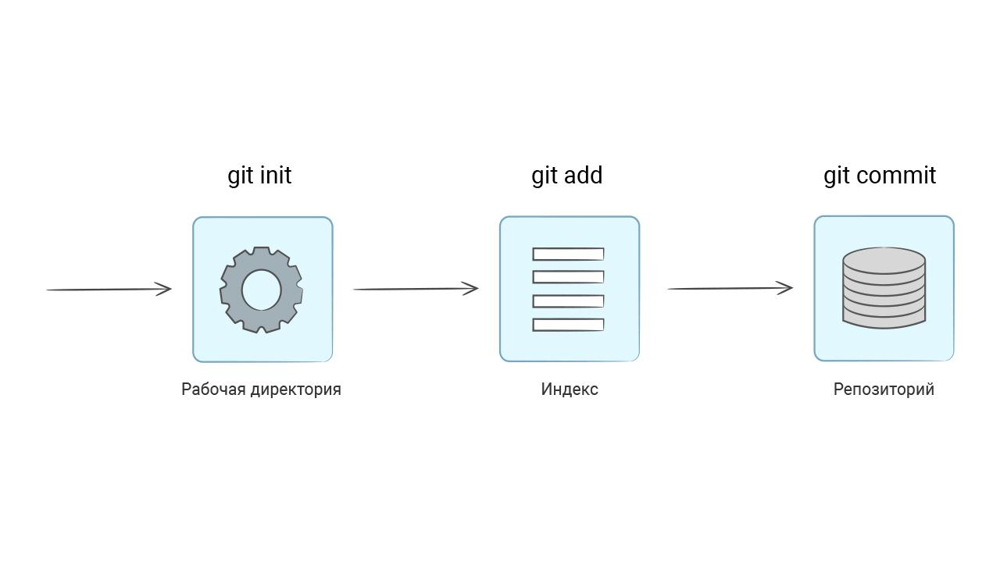

# Рабочий процесс

Давайте начнем с обзора всего процесса - от создания проекта в Git до начала отслеживания изменений. Этой теме мы уделим внимание в этом уроке, а в последующих уроках более подробно рассмотрим каждый этап. В ходе обучения мы узнаем множество новых терминов и команд, необходимых для понимания работы с Git.

## Основные команды

Git способен отслеживать файлы проекта только в том случае, если они находятся под контролем версий. Для этого необходимо зайти в директорию проекта и выполнить команду инициализации ```git init```.

Этот подход применим как к новым проектам, так и к уже существующим. Процесс инициализации остается одинаковым в обоих случаях.

```bash
# Создаем новый проект
mkdir my-git

# Переходим в созданную директорию
cd my-git

# Выполняем инициализацию
git init

Initialized empty Git repository in /private/tmp/my-git/.git/
```

Команда ```git init``` создает репозиторий, то есть директорию **.git**, внутри которой находятся все необходимые файлы для работы Git.

Чтобы узнать текущий статус репозитория, используется команда ```git status```.

```bash
git status

On branch main
No commits yet
nothing to commit (create/copy files and use "git add" to track)
```

В этом выводе указано, что репозиторий пустой (```No commits yet```) — в нем нет новых или измененных файлов.

Давайте попробуем добавить несколько файлов:

```bash
# Создаем файл README.md со строкой текста
echo 'Hello, my dear Friend!' > README.md
echo 'Haskell Curry' > PEOPLE.md
```

Теперь снова смотрим на статус:

```bash
git status

# Часть вывода убрана
Untracked files:
  (use "git add <file>..." to include in what will be committed)
    PEOPLE.md
    README.md
```

Git обнаружил появление новых файлов в проекте, о которых ему ничего не известно. Они отмечаются как **неотслеживаемые файлы** (*untracked files*).

Поскольку эти файлы не были добавлены в репозиторий, Git не отслеживает изменения в них.

Добавление файлов в репозиторий происходит в два этапа. На первом этапе выполняется команда подготовки файлов с помощью ```git add <путь до файла>```:

```bash
# Для каждого нового или измененного файла
git add README.md
```

Смотрим, что произошло:

```bash
git status

Changes to be committed:
  (use "git rm --cached <file>..." to unstage)
    new file:   README.md

Untracked files:
  (use "git add <file>..." to include in what will be committed)
    PEOPLE.md
```

Файл *README.md* теперь находится в состоянии «подготовлен к коммиту» — другими словами, файл **попал в индекс**.

Следующий шаг — это **коммит**. Под этим термином понимается окончательное добавление в репозиторий, когда Git запоминает файл навсегда и следит за всеми последующими изменениями.

Во время коммита мы берем все подготовленные изменения (они могут включать любое количество файлов) и отправляем их в репозиторий как единое целое. Вот, как он выполняется:

```bash
git commit -m 'add README.md'

[main (root-commit) 3c5d976] add README.md
1 file changed, 1 insertion(+)
create mode 100644 README.md
```

Флаг ```-m``` означает *message*, то есть описание коммита. Коммит можно выполнять и без него, но тогда откроется редактор, в котором нужно будет ввести описание коммита.

Мы рекомендуем делать осмысленные описания — это хороший тон. Пример соглашения по именованию коммитов приведен в дополнительных материалах к уроку.

Перейдем к процессу работы с Git:



Может возникнуть вопрос: зачем так сложно? Зачем отдельно отправлять файлы в индекс командой ```git add```? Почему нельзя добавлять все измененные файлы сразу в коммит?

Как ни странно, такой процесс создан как раз для удобства программистов. Дело в том, что во время разработки может меняться и добавляться много файлов. Но это не значит, что мы хотим добавить все эти изменения в один коммит.

Со смысловой точки зрения, коммит — это какое-то логически завершенное изменение внутри проекта. Его размер бывает очень разным:

- Маленьким, если мы исправляем одну опечатку в одном файле
- Большим, если мы внедряем новую функциональность

Главное в коммите — его **атомарность**. Другими словами, он должен выполнять ровно одну задачу.

Теперь файл *README*.md находится внутри репозитория. Убедиться в этом можно, запустив команду ```git status```:

```bash
git status

Untracked files:
  (use "git add <file>..." to include in what will be committed)
    PEOPLE.md
```
Команда ```git status``` не выводит файлы, которые добавлены в репозиторий и не содержат изменений. При этом сам файл *README.md* находится внутри директории *my-git*.

### Самостоятельная работа
1. Установите Git по [инструкции](https://github.com/Hexlet/ru-instructions/blob/main/git.md)
2. Выполните все шаги из урока
3. Добавьте файл *PEOPLE.md* в репозиторий

После добавления команда ```git status``` покажет такой вывод:

```bash
git status

On branch main
nothing to commit, working tree clean
```

### Дополнительные материалы
- [Git Cheatsheet](https://about.gitlab.com/images/press/git-cheat-sheet.pdf)
- [Соглашение об именовании коммитов](https://www.conventionalcommits.org/ru/v1.0.0/)
- [Что такое Git?](https://git-scm.com/book/ru/v2/Введение-Что-такое-Git%3F)